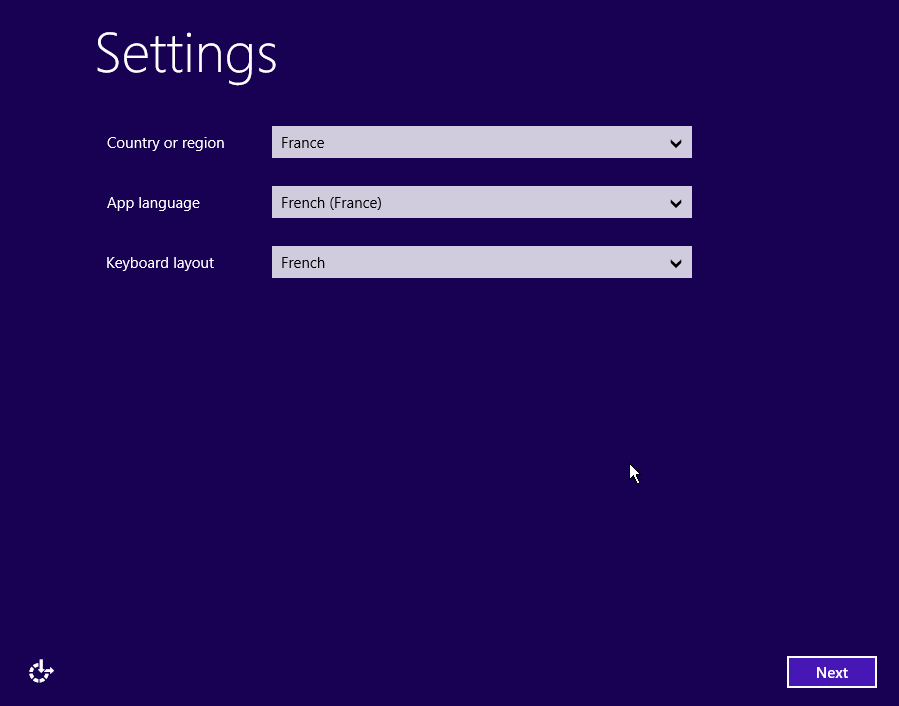

## Prerequisiti
Durante l’installazione su un VPS di un Windows Server 2012, 2012 R2 o 2016, è possibile che la connessione al desktop remoto e la risposta al protocollo ICMP non siano attive. In tal caso, questa guida ti mostra le modifiche da apportare.

Per poter effettuare queste operazioni, è necessario:

- Un VPS con Windows Server 2012, 2012 R2 o 2016
- Avere accesso allo Spazio Cliente OVH

## Procedura

### Step 1&#58; accedi al KVM
Per accedere al Keyboard Video Mouse (KVM), accedi alla sezione `Dedicato`{.action} del tuo `Spazio Cliente OVH`{.action} e seleziona il tuo VPS.

Clicca poi sul pulsante `KVM`{.action} in alto a destra.

{.thumbnail}

In questo modo, attivi tastiera e mouse virtuali sul tuo VPS.

### Step 2&#58; prime impostazioni di Windows
Sullo schermo KVM potrai riscontrare l’avvio di Windows. A questo punto, sarà necessario configurare la lingua della tastiera Windows e impostare la password **Administrator**.

{.thumbnail}

{.thumbnail}

### Step 3&#58; modifica il firewall Windows
Una volta completata l’installazione, accedi a `Strumenti di amministrazione`{.action}, poi a `Windows Firewall con sicurezza avanzata`{.action}.

{.thumbnail}

Infine, attiva l’ICMP e la connessione al desktop remoto *(click con il tasto destro -> Abilita regola)*.

{.thumbnail}