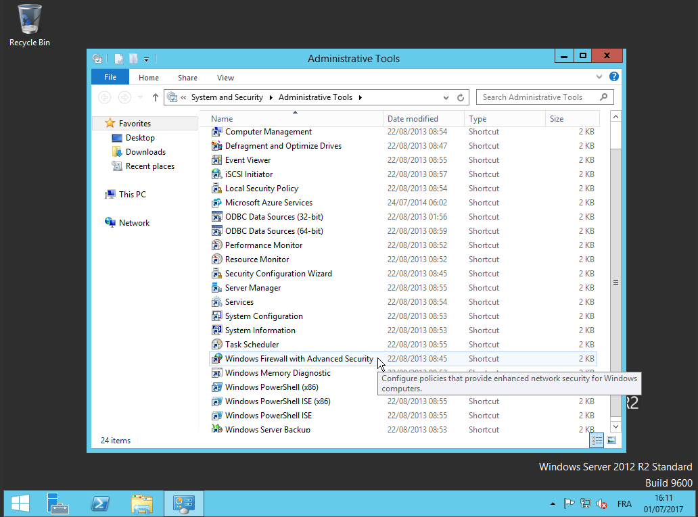

## Wymagania
Podczas instalacji systemu Windows Server 2012, 2012 R2 lub 2016 na serwerze VPS może się okazać, że połączenie ze zdalnym pulpitem, jak również protokół ICMP są wyłączone. Przewodnik ten wyjaśnia, co zrobić w takiej sytuacji.

Musisz posiadać:

- Serwer VPS z systemem Windows Server 2012, 2012 R2 lub 2016.
- Dostęp do panelu klienta OVH.

## Procedura

### Etap 1&#58; Dostep do narzedzia KVM
Aby uzyskać dostęp do narzędzia KVM, należy zalogować się do `panelu klienta OVH`{.action}, przejść do zakładki `Dedykowane`{.action} i wybrać swój serwer VPS.

Następnie należy kliknąć na przycisk `KVM`{.action} w górnym prawym rogu.

{.thumbnail}

Otrzymasz dostęp do wirtualnej klawiatury i myszy dla swojego serwera VPS.

### Etap 2&#58; Pierwsze ustawienia w systemie Windows
Na ekranie KVM zauważysz uruchamianie się systemu Windows. Na tym etapie będziesz musiał skonfigurować język klawiatury Windows oraz hasło **Administratora**.

{.thumbnail}

{.thumbnail}

### Etap 3&#58; Modyfikacja w ramach firewalla w systemie Windows
Po zakończeniu instalacji należy przejść do `Narzędzi administracyjnych`{.action} i wybrać `Firewall Windows z zaawansowanym bezpieczeństwem`{.action}.

{.thumbnail}

Następnie należy włączyć ICMP oraz połączenie ze zdalnym pulpitem *(kliknij prawym przyciskiem -> Włącz regułę)*.

{.thumbnail}