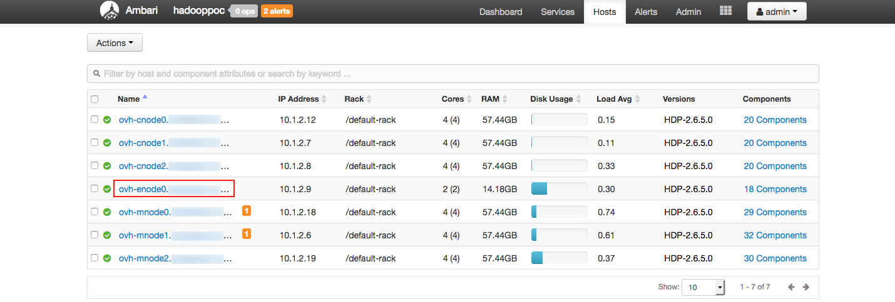
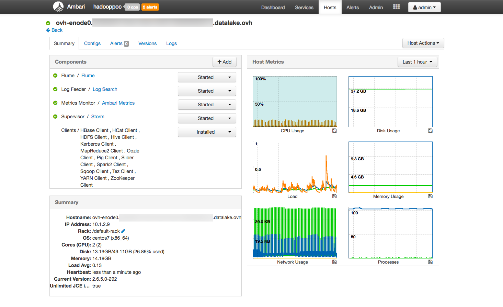

### What is an edge node

Edge nodes are instances of the cluster between the user and cluster's machines. Users can run their jobs on the edge node instead of doing it directly on the master nodes, which are critical for the overall functioning.
This way you can prevent capacity losses on these nodes.

Since every application of the cluster has its client installed on every single edge node, you can use these services without connecting to any other instance. So the edge nodes are the only machines whose potential can be affected by users' behaviours.

It enables you to provide a personal node to use the cluster for every user. It also allows to re-spawn a new edge node if the last one is too altered whereas an altered master can damage the whole cluster.

### Connect to edge nodes

To connect to the edge nodes, you can follow the instructions of the [Using SSH](../connect-using-ssh/guide.en-gb.md) section.

As the edge node is synchronized with the FreeIPA users, you must connect by SSH as one of these. You also need to authenticate yourself with the SSH key associated to your user and with your password when prompted.

### Use services

From the edge node, you can use any service on to any instance thanks to the clients of these applications that are installed, configured on it and synchronized by Ambari.

> [!primary]
>
> Once connected to edge node, you can see every services you can use in the `/usr/hdp/current`.
> There are all the binary files and symbolic links to configurations.
>

You can have further information about your edge node through the Apache Ambari interface, to see it :

1. Connect to Ambari UI ( `knox.{your_cluster_id}.datalake.ovh/gateway/default/ambari` )
2. Click on the "Hosts" button on the top binary
3. Click on the edge node you want to see ( `edge-nodeX.{your_cluster_id}...` )

In the Ambari interface, you can see metrics about your edge node and the list of the services installed and the applications runnig on it.

