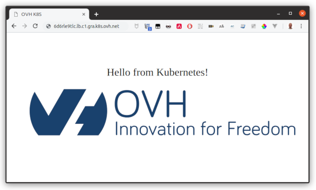

**Last updated 29th January, 2019.**


## Objective

The OVH Managed Kubernetes service provides you with access to Kubernetes clusters, without the hassle of installing or operating them. 

**Find out how to deploy a simple *Hello World* application on an OVH Managed Kubernetes cluster.**


## Requirements

- an OVH Managed Kubernetes cluster
- at least one active node on the cluster.
- a well-configured  *kubectl* file (see our guide to [Configuring default settings for `kubectl`](../configuring_default_settings_for_kubectl/configuring_default_settings_for_kubectl) for details) 


## Instructions


### Step 1 - Deploy the application

The following instructions will deploy a simple application (nginx image) using a *Kubernetes Deployment* and a *Kubernetes Service* .

First, create a `hello.yaml` file for our `ovhplatform/hello` Docker image:

```yaml
apiVersion: v1
kind: Service
metadata:
  name: hello-world
  labels:
    app: hello-world
spec:
  type: NodePort
  ports:
  - port: 80
    targetPort: 80
    protocol: TCP
    name: http
  selector:
    app: hello-world
---
apiVersion: apps/v1
kind: Deployment
metadata:
  name: hello-world-deployment
  labels:
    app: hello-world
spec:
  replicas: 1
  selector:
    matchLabels:
      app: hello-world
  template:
    metadata:
      labels:
        app: hello-world
    spec:
      containers:
      - name: hello-world
        image: ovhplatform/hello
        ports:
        - containerPort: 80
```

Next, apply the file, using the following command:

```bash
kubectl apply -f hello.yml
```

After applying the YAML file, a new `hello-world` service and the corresponding `hello-world-deployment` deployment are created:

```bash
$ kubectl apply -f  hello.yml
service/hello-world created
deployment.apps/hello-world-deployment created
```
> [!primary]
> The application you have just deployed is a simple nginx server with a single static *Hello World* page. 
> In simple terms, it just deploys the Docker image [`ovhplatform/hello`](https://hub.docker.com/r/ovhplatform/hello/){.external}.


### Step 2 - List the pods

A `hello-world` service has just been deployed in a pod in your worker node. Let's verify that everything is correct by listing the pods:

```bash
kubectl -n=default get pods
```

You should see your newly-created pod:

```bash
$ kubectl -n=default get pods
NAME                                           READY     STATUS    RESTARTS   AGE
hello-world-deployment-d98c6464b-7jqvg         1/1       Running   0          47s
```


### Step 3 - List the deployments

Check if the deployment is active:

```
kubectl -n=default get deploy
```

You should see the `hello-world-deployment`:

```
$ kubectl -n=default get deploy
NAME                          DESIRED   CURRENT   UP-TO-DATE   AVAILABLE   AGE
hello-world-deployment        1         1         1            1           1m
```

### Step 4 - List the services

Now, use `kubectl` to view your services:

```
kubectl -n=default get services
```

You should see your newly created service:

```
$ kubectl -n=default get services
NAME                          TYPE        CLUSTER-IP     EXTERNAL-IP   PORT(S)                                   AGE
hello-world                   NodePort    10.3.15.215    &lt;none>        80:31987/TCP                              2m
```

Your service URL will be composed of your node url as the hostname, and the listed port (`80:<PORT>/TCP`) as the port. 

In this example, the URL would therefore be: `http://******.nodes.c1.gra.k8s.ovh.net:31987`


### Step 5 - Test your service

If you enter the service URL in your web browser, the `hello-world` service will answer you:




### Step 6 - Clean up

At the end you can clean up by deleting the service and the deployment.

Let's begin by deleting the service:

```
kubectl delete service hello-world
```

If you list the services again, you will see that `hello-world` doesn't exist anymore:

```
$ kubectl delete service hello-world
service "hello-world" deleted
$ kubectl get services
No resources found.
```

You can then delete the deployment:

```
kubectl delete deploy hello-world-deployment
```

If you list you deployments again, you will find no resources:

```
$ kubectl delete deploy hello-world-deployment
deployment.extensions "hello-world-deployment" deleted
$ kubectl get deployments
No resources found.
```


If now you list the pods:

```
kubectl get pods
```

You will see that the pod created for `hello-world` has also been deleted:

```
$ kubectl -n=default get pods
No resources found
```


## Go further

To learn more about using your Kubernetes clusters the practical way, we invite you to explore our related tutorials.

Join our community of users on [https://community.ovh.com/en/](https://community.ovh.com/en/){.external}.