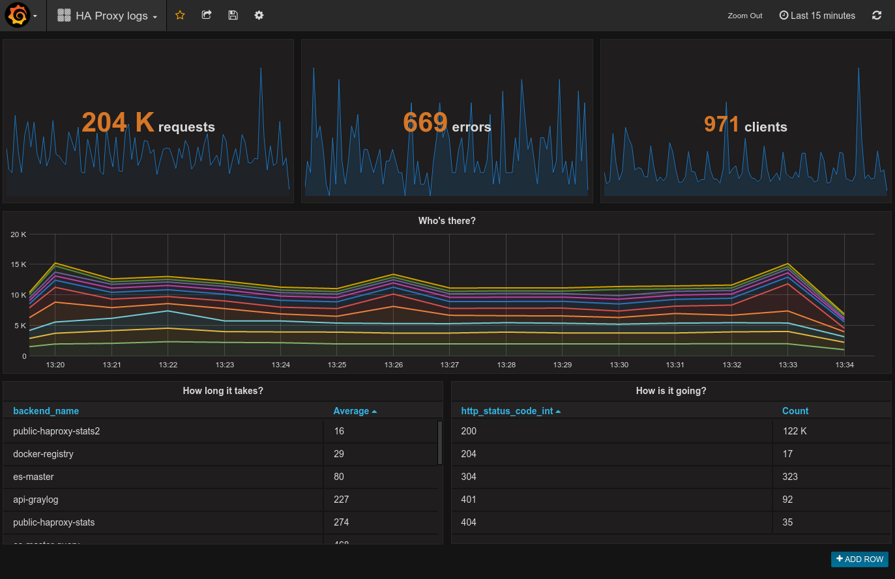
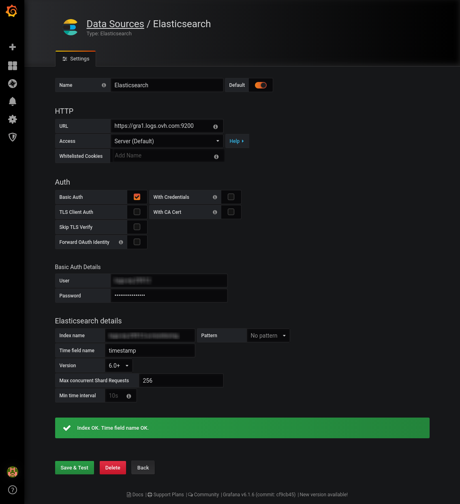

**Last updated 27th February, 2018**

## Objective

[Grafana](http://grafana.org/){.external} provides a powerful and elegant way to create, explore, and share dashboards and data with your team and the world. Since release 2.5, Grafana is able to communicate with Elasticsearch and so allow you to mix data from Logs Data Platforms and other data sources like IoT at the same place. This guide will show you how to achieve this.

## Requirements

This is what you need to know to get you started:

- you are already sending logs on a stream you own [see the quick start tutorial](https://docs.ovh.com/gb/en/logs-data-platform/quick-start/){.external}
- You have ordered the Kibana pack Option or the Alias Option.
- Your have access to the port 9200 to your cluster (head to the **About** page in manager to know the address of your cluster).

After some training you will be able to create this kind of dashboard: 

## Instructions

### Select your Stream Alias

To access your logs from Grafana, you will need to setup an Elasticsearch Alias and link them to your Graylog streams, so here we go again :

1. Go back to your manager.
2. In the alias panel, click on the **Add a new alias**  button
3. Choose a name and define a description for your alias
4. Save the entry by clicking the floppy disk button
5. Once the alias has been created. Use the **...** menu at the right and select **Link the alias to a Stream** option.
6. Define there the graylog streams you want to associate to your alias
7. That's it.

{.thumbnail}

So here you go, now Logs Data Platform knows what is the stream you want to browse. Now let’s configure Grafana and see if it works!

### Setup your own grafana

Get the latest Grafana release here: [http://grafana.org/download/](http://grafana.org/download/){.external} (v4.6.2 2017-11-16 at the time of writing). Here are some direct links for your convenience.

- [DEB (Ubuntu / Debian 64 bit)](https://s3-us-west-2.amazonaws.com/grafana-releases/release/grafana_4.6.2_amd64.deb){.external}
- [RPM (Fedora / RHEL 64 bit)](https://s3-us-west-2.amazonaws.com/grafana-releases/release/grafana-4.6.2-1.x86_64.rpm){.external}
- [Binary TAR (Linux 64 bit)](https://s3-us-west-2.amazonaws.com/grafana-releases/release/grafana-4.6.2.linux-x64.tar.gz){.external}
- [Binary ZIP (Windows 64 bit)](https://s3-us-west-2.amazonaws.com/grafana-releases/release/grafana-4.6.2.windows-x64.zip){.external}

Then follow the Grafana installation guide according your platform: [http://docs.grafana.org/installation/](http://docs.grafana.org/installation/){.external}

### Launch it!

If everything is setup properly, launch your favorite browser, and point it to [http://localhost:3000](http://localhost:3000){.external} Once logged in with your grafana credentials, reach data sources panel to setup your Logs Data Platforms datasource:

{.thumbnail}

> [!warning]
>
> To make the magic happens, please ensure to:
> 
> - Set `https://<your_cluster>.logs.ovh.com:9200` as Url value
> - Set your Logs Data Platforms credentials for Basic auth values
> - Set your Logs Data Platforms alias name as Grafana Index name value
> - Change default Time field name to timestamp
> - Set **5.x** as Elasticsearch version
> - Register your data source and test it.
> 

### Test it!

Now let's add a simple counter of your logs to a new dashboard.

1. On dashboard page, click on the green left button and select Add panel => Singlestat
1. On the bottom right, select your datasource.
1. That's it :)

If you want to know what you can do with Grafana and Elasticsearch, you can fly to the [official documentation](http://docs.grafana.org/datasources/elasticsearch/){.external} or to this very good resource: [How to effectively use the Elasticsearch
data source in Grafana and solutions to common pitfalls](https://blog.raintank.io/how-to-effectively-use-the-elasticsearch-data-source-and-solutions-to-common-pitfalls/){.external}

## Go further

- Join our community of users on <https://community.ovh.com/en/>
- Getting Started: [Quick Start](https://docs.ovh.com/gb/en/logs-data-platform/quick-start/){.external}
- Documentation: [Guides](https://docs.ovh.com/gb/en/logs-data-platform/){.external}
- Community hub: [https://community.ovh.com](https://community.ovh.com/c/platform/data-platforms-lab){.external}
- Mailing List: [paas.logs-subscribe@ml.ovh.net](mailto:paas.logs-subscribe@ml.ovh.net){.external}
- Create an account: [Try it free!](https://www.ovh.com/fr/order/express/#/new/express/resume?products=~%28~%28planCode~%27logs-basic~productId~%27logs%29){.external}