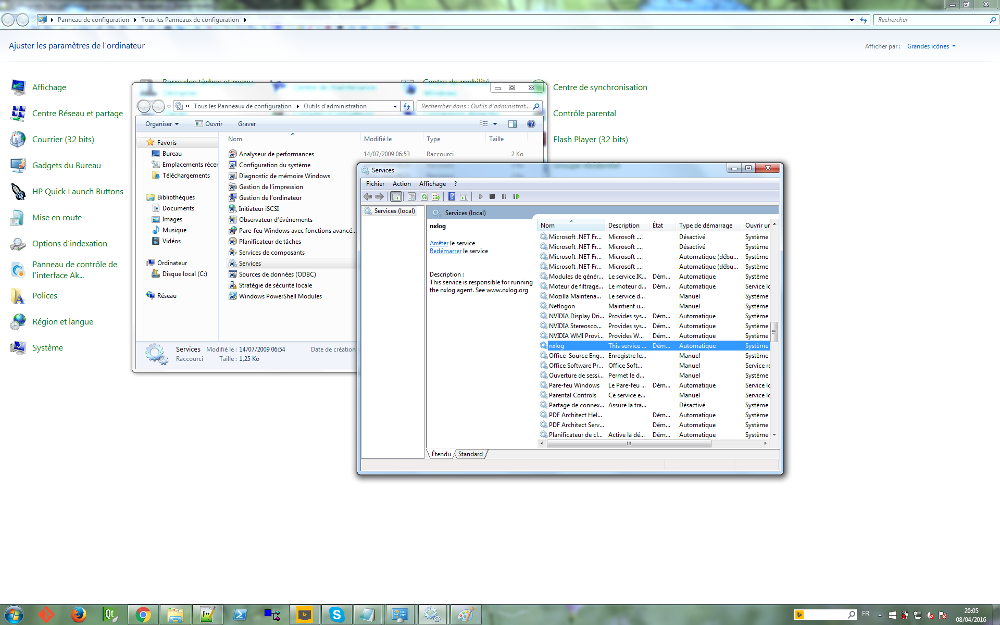

> [!note] 
> 
> At OVH, we love Microsoft products too. So it is important for us to provide you a way to send your Windows Logs to Logs Data Platform. All you need is 15 minutes and one software : [NXLog](http://nxlog.co){.external}. NXLog is one of the leader of the log management tools. Its configuration is fairly simple and can get you started in a few minutes.
> 

For this tutorial you will need to have completed the following steps :

- [Activate the Logs Data Platform and create an account.](../quick_start/guide.en-gb.md){.ref}
- [To create at least one Stream and get its token.](../quick_start/guide.en-gb.md){.ref}

## NXLog

You can find NXLog, at its official website [nxlog.co](http://nxlog.co){.external}. Please go to the official website and download the latest version for Windows (2.9.1504 at the time of writing). Be sure to have Administrator rights before proceding. Once you have it, install it on your system. By default the program will install itself in **C:\\Program Files(x86)\\nxlog\\**. Navigate to this folder to edit the configuration file **nxlog.conf** present in the folder **conf**.


## Configuration

To configure NXLog, you will need to download the Comodo root certificate of our main inputs. You can find it here [support.comodo.com](https://support.comodo.com/index.php?/Knowledgebase/Article/View/945/0/root-addtrust-external-ca-root){.external} (use the link at the bottom of the page). Please put this file under the **C:\\Program Files(x86)\\nxlog\\cert** folder. For reference this is the root certificate issued :

```
 -----BEGIN CERTIFICATE-----
 MIIENjCCAx6gAwIBAgIBATANBgkqhkiG9w0BAQUFADBvMQswCQYDVQQGEwJTRTEU
 MBIGA1UEChMLQWRkVHJ1c3QgQUIxJjAkBgNVBAsTHUFkZFRydXN0IEV4dGVybmFs
 IFRUUCBOZXR3b3JrMSIwIAYDVQQDExlBZGRUcnVzdCBFeHRlcm5hbCBDQSBSb290
 MB4XDTAwMDUzMDEwNDgzOFoXDTIwMDUzMDEwNDgzOFowbzELMAkGA1UEBhMCU0Ux
 FDASBgNVBAoTC0FkZFRydXN0IEFCMSYwJAYDVQQLEx1BZGRUcnVzdCBFeHRlcm5h
 bCBUVFAgTmV0d29yazEiMCAGA1UEAxMZQWRkVHJ1c3QgRXh0ZXJuYWwgQ0EgUm9v
 dDCCASIwDQYJKoZIhvcNAQEBBQADggEPADCCAQoCggEBALf3GjPm8gAELTngTlvt
 H7xsD821+iO2zt6bETOXpClMfZOfvUq8k+0DGuOPz+VtUFrWlymUWoCwSXrbLpX9
 uMq/NzgtHj6RQa1wVsfwTz/oMp50ysiQVOnGXw94nZpAPA6sYapeFI+eh6FqUNzX
 mk6vBbOmcZSccbNQYArHE504B4YCqOmoaSYYkKtMsE8jqzpPhNjfzp/haW+710LX
 a0Tkx63ubUFfclpxCDezeWWkWaCUN/cALw3CknLa0Dhy2xSoRcRdKn23tNbE7qzN
 E0S3ySvdQwAl+mG5aWpYIxG3pzOPVnVZ9c0p10a3CitlttNCbxWyuHv77+ldU9U0
 WicCAwEAAaOB3DCB2TAdBgNVHQ4EFgQUrb2YejS0Jvf6xCZU7wO94CTLVBowCwYD
 VR0PBAQDAgEGMA8GA1UdEwEB/wQFMAMBAf8wgZkGA1UdIwSBkTCBjoAUrb2YejS0
 Jvf6xCZU7wO94CTLVBqhc6RxMG8xCzAJBgNVBAYTAlNFMRQwEgYDVQQKEwtBZGRU
 cnVzdCBBQjEmMCQGA1UECxMdQWRkVHJ1c3QgRXh0ZXJuYWwgVFRQIE5ldHdvcmsx
 IjAgBgNVBAMTGUFkZFRydXN0IEV4dGVybmFsIENBIFJvb3SCAQEwDQYJKoZIhvcN
 AQEFBQADggEBALCb4IUlwtYj4g+WBpKdQZic2YR5gdkeWxQHIzZlj7DYd7usQWxH
 YINRsPkyPef89iYTx4AWpb9a/IfPeHmJIZriTAcKhjW88t5RxNKWt9x+Tu5w/Rw5
 6wwCURQtjr0W4MHfRnXnJK3s9EK0hZNwEGe6nQY1ShjTK3rMUUKhemPR5ruhxSvC
 Nr4TDea9Y355e6cJDUCrat2PisP29owaQgVR1EX1n6diIWgVIEM8med8vSTYqZEX
 c4g/VhsxOBi0cQ+azcgOno4uG+GMmIPLHzHxREzGBHNJdmAPx/i9F4BrLunMTA5a
 mnkPIAou1Z5jJh5VkpTYghdae9C8x49OhgQ=
 -----END CERTIFICATE-----
```

The configuration is pretty much straightforward. Here is the configuration file that allows you to configure your NXLog.

```
 ## This is a sample configuration file. See the nxlog reference manual about the
 ## configuration options. It should be installed locally and is also available
 ## online at http://nxlog.org/nxlog-docs/en/nxlog-reference-manual.html
 
 ## Please set the ROOT to the folder your nxlog was installed into,
 ## otherwise it will not start.
 
 #define ROOT C:\Program Files\nxlog
 define ROOT C:\Program Files (x86)\nxlog
 define CERTDIR %ROOT%\cert
 
 Moduledir %ROOT%\modules
 CacheDir %ROOT%\data
 Pidfile %ROOT%\data\nxlog.pid
 SpoolDir %ROOT%\data
 LogFile %ROOT%\data\nxlog.log
 
 <Input in>
     Module      im_msvistalog
 # For windows 2003 and earlier use the following:
 #   Module      im_mseventlog
 </Input>
 
 <Processor OVH_TOKEN>
     Module      pm_null
     Exec        $TOKEN='XXXXXXX-XXXX-XXXX-XXXX-XXXXXXXXXXXX';
     Exec        rename_field("TOKEN","X-OVH-TOKEN");
 </Processor>
 
 <Extension gelf>
     Module xm_gelf
 </Extension>
 
 <Output out>
     Module      om_ssl
     Host        <your_cluster>.logs.ovh.com
     Port        12202
     CAFile      %CERTDIR%\comodorsaaddtrustca.crt
     AllowUntrusted FALSE
     OutputType      GELF_TCP
 </Output>
 
 <Route 1>
     Path        in => OVH_TOKEN => out
 </Route>
```

Let's explain the few important points in this configuration :

- The line **define CERTDIR %ROOT%\cert** is mandatory to indicate to NXLog where it will find the certificate of Logs Data Platform.
- The **Input** part is the same as the default configuration. Do not touch it ;-).
- The **Processor** module is where the OVH Token magic happens : Replace your token here.
- The **Extension** activate the built-in GELF module that encode the log in the GELF format
- The **Output** module is the one that will send the logs to Logs Data Platform by defining the CA certificate used to trust the server and the encoding used. Note that you will have to use the address of your assigned cluster. This is also where you use the path of the certificate downloaded just before. This module also define that we use the Gelf Encoding.
- The **Route** setting put all these things together by building a pipeline using the source, processing and the ouput modules.

## Start NXLog

You have two ways to start NXLog. The first one is to launch the main Executable : **C:\Program Files(x86)\nxlog\nxlog.exe**. This is convenient when you are pretty sure that your configuration is correct. But if you want to be able to start, stop or restart the nxlog service, It would be better to use the Windows Service Manager. This Manager is located deep in the Configuration Panel of Windows.

Go to **Control Panel**, then locate **Administrative Tools** and then double-click on **Services** to display the manager. In this menu you should find the service nxlog in the list. There is a start, stop and restart action available in the contextual menu (Right-click on it).

Excuse my French screenshot detailing where to find it:

{.thumbnail}

If something bad happens, you will find the logs and a pretty good explanation in the file : **C:\Program Files(x86)\nxlog\data\nxlog.log**. If everything is correct you should find these kind of lines in the same file :

```
 2016-04-08 19:53:26 INFO connecting to <your_cluster>.logs.ovh.com:12202
 2016-04-08 19:53:26 INFO successfully connected to <your_cluster>.logs.ovh.com:12202
```

Jump to Graylog (use the Graylog access button in the Manager) and to the stream associated to your token to display your logs. As you can see, The Event Log format of windows is already structured and allows you immediately to analyze your services and processes.

{.thumbnail}

I think that's pretty much it. I know, it didn't even take 10 minutes :-).

If you want to go further, don't hesitate to fly to the [NXlog documentation](https://nxlog.co/docs/){.external}

---

## Getting Help

- Getting Started: [Quick Start](../quick_start/guide.en-gb.md){.ref}
- Documentation: [Guides](../product.en-gb.md){.ref}
- Community hub: [https://community.ovh.com](https://community.ovh.com/c/platform/data-platforms-lab){.external}
- Mailing List: [paas.logs-subscribe@ml.ovh.net](mailto:paas.logs-subscribe@ml.ovh.net){.external}
- Create an account: [Try it free!](https://www.ovh.com/fr/order/express/#/new/express/resume?products=~%28~%28planCode~%27logs-basic~productId~%27logs%29){.external}