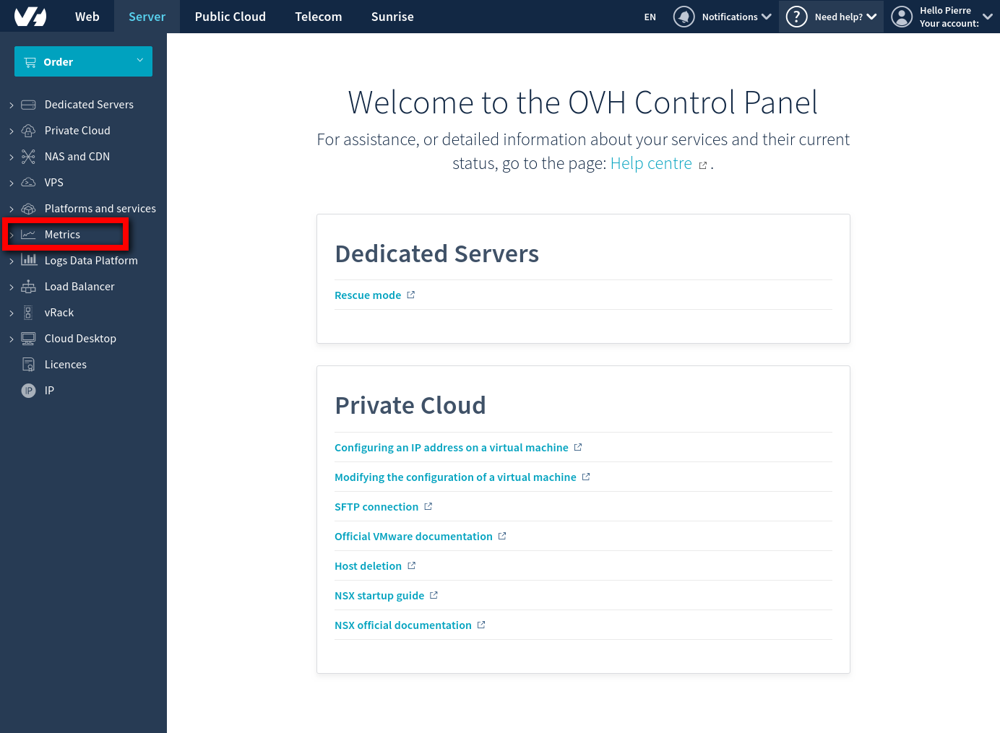
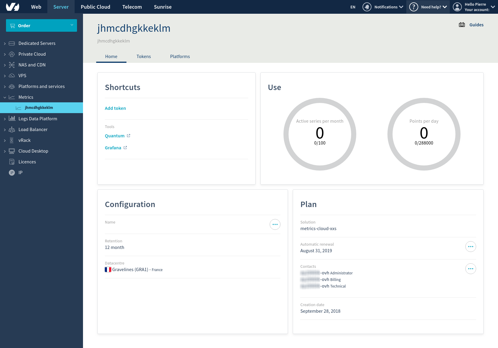
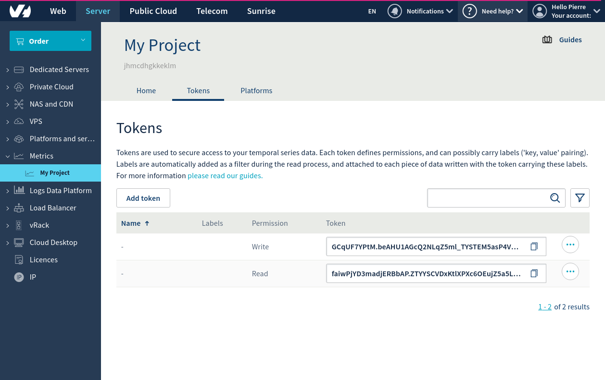
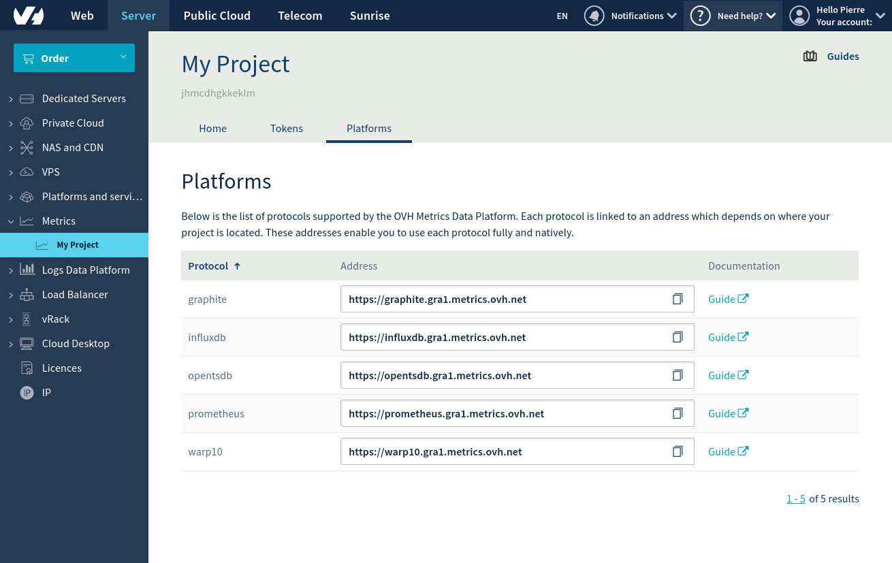

**Last updated 23th August, 2019**

## Objective

Metrics is a platform that can be used to **collect**, **store** and **analyse** Time Series data. This guide will cover the very first step to get started with Metrics: **ordering an account**.

## Requirements

- a valid OVH account.

If you haven't one already, you will be able to create one directly in the [metrics product page](https://www.ovh.com/fr/data-platforms/metrics/){.external} during the order process.

## Instructions

### Order a Metrics Cloud plan

If you don't already have a Metrics Cloud plan, you can start by choose one according to your need.

> [!primary]
>
> Note that while choosing, a metric is a kind of measurement plus its dimensions. For example, *temperature* could be your metric, and you could set the room as tags. This way, you would need as much metrics as the total number of room which will be measured.
>

#### Step 1. Choose a plan

A plan mostly depends on the number of Time Series that you need, for example, with a `small` plan, you can push *datapoints for 1000 time series.*

[Please reach the product page](https://www.ovh.com/fr/data-platforms/metrics/){.external} for more details between plans. On this page you can for example order a try account. Once you complete all the steps and purchase an account, you should received a mail which will allow you to access the Metrics menu.

#### Step 2. Go to Metrics's manager

Once the chosen plan has been purchased, go to the `Server`{.action} section of your control panel. Select the `Metrics`{.action} menu from the left side of the control panel.

{.thumbnail}

You can now select your new account from the list on the left.

{.thumbnail}

#### Step 3. (Optional) Change name of the account

In the `Configuration` section, click on the dotted button to set up a proper name on your account.

{.thumbnail}

Your account is good to go!

Let's stay on this page for a couple of second to continue the visit.

#### Step 4. Grab your tokens or create new ones

Now go to the Tokens tab :

{.thumbnail}

Here you can grab two defaults read and write tokens. You can use them or decide to create new ones.

Once done, click to the `Platforms`{.action} tab.

#### Step 5. Grab your endpoints

Metrics is protocol agnostic. It means you can push with one protocols, and query the same data with another one. 

[Click here, to learn how to used the supported protocols with metrics and their corresponding endpoints](../protocol_overview/guide.en-gb.md){.ref}. 

{.thumbnail}

If you don't want to push your data by yourself, you can use a software that will support one of these protocols. Here is a short list : 

- [Telegraf](../source_telegraf/guide.en-gb.md){.ref}
- [Beamium](../source_beamium/guide.en-gb.md){.ref}
- [Scollector](../source_scollector/guide.en-gb.md){.ref}
- [Snap](http://snap-telemetry.io/){.external}
- [Collectd](../source_collectd/guide.en-gb.md){.ref}

## Go further

- To push your first points and query them with OpentSDQB and Grafana, we invite you to follow our guide to [Push and vizualize your first datapoints with OpenTSDB](../metrics_opentsdb/guide.en-gb.md){.ref}.
- Documentation: [Guides](../product.en-gb.md){.ref}
- Vizualize your data: [https://grafana.metrics.ovh.net/login](https://grafana.metrics.ovh.net/login){.external}
- Community hub: [https://community.ovh.com](https://community.ovh.com/en/c/Platform){.external}
- Create an account: [Try it free!](https://www.ovh.com/fr/order/express/#/new/express/resume?products=~%28~%28planCode~%27metrics-free-trial~configuration~%28~%28label~%27region~values~%28~%27gra1%29%29%29~option~%28~%29~quantity~1~productId~%27metrics%29%29&paymentMeanRequired=0){.external}
