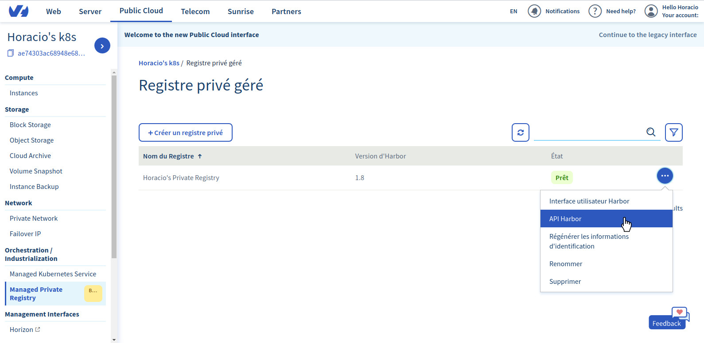
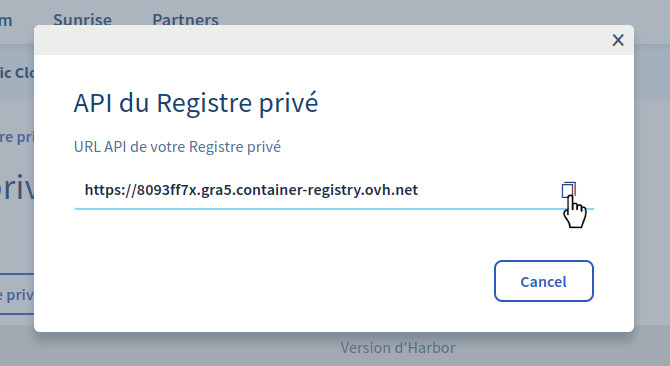
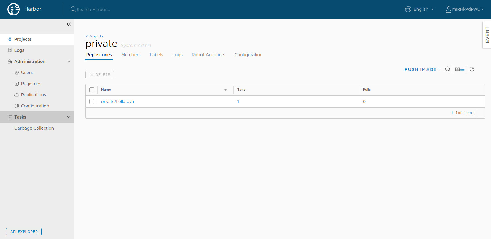
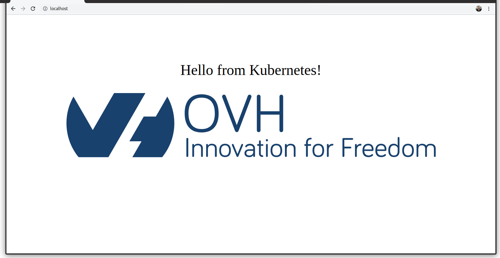

**Last updated 19<sup>th</sup> February, 2020.**

<style>
 pre {
     font-size: 14px;
 }
 pre.console {
   background-color: #300A24; 
   color: #ccc;
   font-family: monospace;
   padding: 5px;
   margin-bottom: 5px;
 }
 pre.console code {
   border: solid 0px transparent;
   color: #ccc;
   font-family: monospace !important;
   font-size: 0.75em;
 }
 .small {
     font-size: 0.75em;
 }
</style>


## Objective

OVHcloud Managed Private Registry service provides you a managed, authenticated Docker registry where you can privately store your Docker images. This guide will explain how create a Docker image, store it in the OVHcloud Managed Private Registry service and using it from a Docker client.


## Requirements

- An OVHcloud Managed Private Registry (see the [creating a private registry](../creating-a-private-registry/) guide for more information)
- An access to the Harbor UI to operate the private registry (see the [connecting to the UI](../connecting-to-the-ui/) guide for more information)
- A private project and an user with the right to read and write on the project (see the [managing users and projects](../managing-users-and-projects/) guide for more information)


## Instructions

### Get your OVHcloud Managed Private Registry API URL

Go to your private registry section on the OVHcloud Public Cloud Manager, and in the *more options* (*...*) button at the right, click on API Harbor.

{.thumbnail}

Copy the URL of the API Harbor, it's the URL of your private registry and we are going to use it several times in this guide.

> In fact when you click to copy button as mentioned by an hand icon in the image, the copied string begins with `https://`. Please remove the `https://` part.

{.thumbnail}


### Creating a Docker image

You're going to create a Docker image using the a very simple Dockerfile and some resource files.
create a `hello-ovh` folder and inside create:

- A `Dockerfile` file:

    ```
    FROM nginx:1.15-alpine

    COPY index.html /usr/share/nginx/html/index.html
    COPY ovh.svg /usr/share/nginx/html/ovh.svg
    ```

- A `index.html` file:

    ```html
    <!doctype html>
    <html>
      <head>
        <title>OVHcloud K8S</title>
        <style>
          .title {
          font-size: 3em;
          padding: 2em;
          text-align: center;
          }
        </style>
      </head>
      <body>
        <div class="title">
          <p>Hello from Kubernetes!</p>
          
        </div>
      </body>
    </html>
    ```

- A `ovh.svg` file (right click and save it):

    <img src="" alt="ovh.svg">


1. Go into the `hello-ovh` folder with the three files and do a `docker build`.
  You will need to tag your build using your private registry URL, the project within the registry (*private* if you followed the [managing users and projects](../managing-users-and-projects/) guide), and the image name (*hello-ovh*):

    ```bash
    docker build --tag [YOUR_PRIVATE_REGISTRY_URL]/private/hello-ovh:1.0.0 .
    ```

  In my private registry example:

  <pre class="console"><code>
    $ docker build --tag 8093ff7x.gra5.container-registry.ovh.net/private/hello-ovh:1.0.0 .
    Sending build context to Docker daemon  14.34kB
    Step 1/3 : FROM nginx:1.15-alpine
    1.15-alpine: Pulling from library/nginx
    e7c96db7181b: Pull complete 
    264026bbe255: Pull complete 
    a71634c55d29: Pull complete 
    5595887beb81: Pull complete 
    Digest: sha256:57a226fb6ab6823027c0704a9346a890ffb0cacde06bc19bbc234c8720673555
    Status: Downloaded newer image for nginx:1.15-alpine
    ---> dd025cdfe837
    Step 2/3 : COPY index.html /usr/share/nginx/html/index.html
    ---> f1f2487532bc
    Step 3/3 : COPY ovh.svg /usr/share/nginx/html/ovh.svg
    ---> 3f803b45da18
    Successfully built 3f803b45da18
    Successfully tagged 8093ff7x.gra5.container-registry.ovh.net/private/hello-ovh:1.0.0
  </code></pre>

1. Login to your private registry, using a user with write rights to the project (*private-user* if you followed the [managing users and projects](../managing-users-and-projects/) guide)

    ```bash
    docker login [YOUR_PRIVATE_REGISTRY_URL]
    ```

    In my private registry example:

    <pre class="console"><code>$ docker login 8093ff7x.gra5.container-registry.ovh.net
    Username: private-user
    Password: 
    Login Succeeded
    </code></pre>

1. Upload the image to the private registry

    ```bash
    docker push [YOUR_PRIVATE_REGISTRY_URL]/private/hello-ovh:1.0.0
    ```

    In my private registry example:

    <pre class="console"><code>
    $ docker push 8093ff7x.gra5.container-registry.ovh.net/private/hello-ovh:1.0.0
    The push refers to repository [8093ff7x.gra5.container-registry.ovh.net/private/hello-ovh]
    369ed87ef8b1: Pushed 
    d2220a0eb85b: Pushed 
    a521e1bbddf5: Pushed 
    bf381a670956: Pushed 
    a61993362baf: Pushed 
    f1b5933fe4b5: Pushed 
    1.0.0: digest: sha256:f5a6a8f0d7c95cf3926b504a7949c8575e478106b59d8913ab947729aa5bd075 size: 1568
    /code></pre>

If you go to your Harbor UI, you will see that a `hello-ovh` repository in the  *private* project:

{.thumbnail}

This repository will store all the versions of the `hello-ovh` image (right now only the *1.0.0*):

{.thumbnail}


### Deploy the private image


Now you can use `docker pull` (preceded by a `docker login` on your private registry if you're doing it from a different computer) to deploy the image from the OVHcloud Managed Private Registry.

```bash
docker pull [YOUR_PRIVATE_REGISTRY_URL]/private/hello-ovh:1.0.0 
```

In my private registry example:

<pre class="console"><code>
  $ docker pull 8093ff7x.gra5.container-registry.ovh.net/private/hello-ovh:1.0.0
  1.0.0: Pulling from private/hello-ovh
  e7c96db7181b: Already exists 
  264026bbe255: Already exists 
  a71634c55d29: Already exists 
  5595887beb81: Already exists 
  4c1b9819c67d: Pull complete 
  5df2876c6416: Pull complete 
  Digest: sha256:f5a6a8f0d7c95cf3926b504a7949c8575e478106b59d8913ab947729aa5bd075
  Status: Downloaded newer image for 8093ff7x.gra5.container-registry.ovh.net/private/hello-ovh:1.0.0
</code></pre>

And then you can run it:

```bash
docker run -d -p 80:80 [YOUR_PRIVATE_REGISTRY_URL]/private/hello-ovh:1.0.0 
```


In my private registry example:

<pre class="console"><code>
  $ docker run -d -p 80:80 8093ff7x.gra5.container-registry.ovh.net/private/hello-ovh:1.0.0
c18f071c3c8c10ca636ed9be84878c12f3a270b6def131eb756f69435b978da1
</code></pre>

And now you can test it with `curl`:

<pre class="console"><code>
$ curl localhost:80
&lt;!doctype html>

&lt;html>
&lt;head>
&lt;title>OVHcloud K8S&lt;/title>
&lt;/head>
&lt;style>
.title {
font-size: 3em;
padding: 2em;
text-align: center;
}
&lt;/style>
&lt;body>
&lt;div class="title">
&lt;p>Hello from Kubernetes!&lt;/p>
&lt;img src="./ovh.svg">
&lt;/div>
&lt;/body>
&lt;/html>
</code></pre>

Or in your browser:

{.thumbnail}

### Go further

To go further you can look at our guide on [Using your private registry with Kubernetes](../using-private-registry-with-kubernetes/).