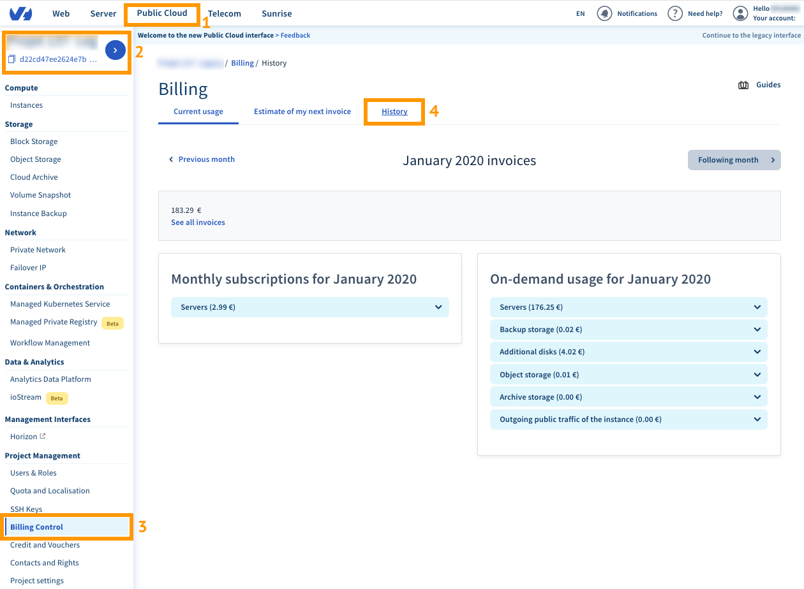
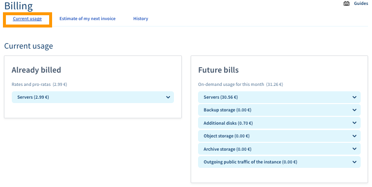

**Ostatnia aktualizacja z dnia 2020-01-16**

## Wstęp
Jeden z modeli rozliczania usług w chmurze to **Pay as you go**, czyli płatność za zużycie zasobów.

Tradycyjna metoda rozliczenia zasobów opiera się zazwyczaj na zobowiązaniu umownym zawartym między stronami na z góry określony czas  (zazwyczaj 12 miesięcy). Tymczasem chmura obliczeniowa oferuje bardziej elastyczne rozwiązanie - **płacisz pod koniec miesiąca za czas, w którym zasoby zostały wykorzystane**.

Przypomina to model rozliczenia stosowany przez niektórych operatorów telefonii, którzy wystawiają faktury za wykorzystane minuty pod koniec miesiąca. OVHcloud wystawia faktury za godziny wykorzystania serwera, przestrzeni dyskowej lub innego elementu usługi.  

Ten przewodnik opisuje metody rozliczania należności za usługę Public Cloud.

## Ogólna zasada
Celem jest zapewnienie rozliczenia jak najlepiej dopasowanego do sposobu wykorzystania usługi przez klienta. Dlatego niezbędne jest rozliczenie z zastosowaniem odpowiednich jednostek zużycia usługi. Najczęstszą jednostką będzie czas wyrażony w godzinach.

W przypadku każdego zasobu, który podlega fakturowaniu odliczanie godzin rozpoczyna się w momencie utworzenia zasobu i kończy się w momencie jego usunięcia, z zachowaniem zasady: "każda rozpoczęta godzina jest płatna jako pełna godzina".

Pod koniec miesiąca liczba godzin mnożona jest przez stawkę godzinową należną za dany zasób. Aby otrzymać całkowitą kwotę należności, należy zsumować wszystkie naliczone wcześniej kwoty cząstkowe.

Każdy projekt w chmurze jest fakturowany oddzielnie. Faktura obejmuje należności za wszystkie zasoby wykorzystane w ciągu miesiąca i jest wystawiana pierwszego dnia następnego miesiąca.

## Przykład
Poniższy przykład pozwoli lepiej zrozumieć, jak to działa.

- użytkownik uruchamia instancję B2-15 czwartego dnia danego miesiąca o godz. 9:40
- ósmego dnia miesiąca o godz. 10:00 dodaje 250 GB  dodatkowej przestrzeni dyskowej (Classic Volume) 
- usuwa wszystkie zasoby dwunastego dnia tego samego miesiąca o 16:30 po zakończeniu zadań, do których tych zasobów potrzebował

W przypadku instancji działającej od czwartego dnia miesiąca od 9:40 do 12 dnia tego samego miesiąca do 16:30 otrzymujemy 176 rozpoczętych godzin. Podlegają one opłacie 0,111 EUR za godzinę. 

W przypadku przestrzeni dyskowej, od ósmego dnia miesiące od godz. 10:00 do dwunastego dnia tego samego miesiąca do godz. 16:30, otrzymujemy 103 rozpoczęte godziny. Opłata za 1 GB Classic Volume to 0,04 EUR/m-c (0,0000555556 EUR/godz.).

Na koniec miesiąca faktura będzie wyglądała następująco:

- 176 x 0,111
- 103 x 250 x 0,0000555556

czyli 20,97 EUR.

> [!primary]
>
> Powyższe ceny zostały podane tytułem przykładu, nie są to ceny obowiązujące.
> 
> 

## Wyświetlanie faktur
Aby wyświetlić faktury za dany projekt, przejdź do Panelu klienta OVHcloud > zakładka `Public Cloud`{.action}(1), następnie wybierz odpowiedni projekt z menu po lewej stronie (2), po czym kliknij `Billing Control`{.action} (3), a następnie `Historia`{.action}(4).

{.thumbnail}

Możesz teraz:

- sprawdzić szczegóły dotyczące zasobów, rozwijając każdą sekcję
- przeszukiwać historię, cofając się do wcześniejszego miesiąca lub przechodząc do następnego

## sprawdzić obecne zużycie
Obecne zużycie (z bieżącego miesiąca) możesz również sprawdzić, klikając zakładkę `Moje obecne zużycie`{.action}.

{.thumbnail}

Pierwsza część **„Zafakturowane”** dotyczy zasobów rozliczanych w trybie miesięcznym (w szczególności patrz poniżej instancje fakturowane w modelu miesięcznym). Zasoby te są wyjątkiem od zasady „Pay as you go”. Umowa terminowa obejmuje rozliczenie za jeden miesiąc, a należność za wykorzystanie zasobów w ciągu najbliższych 30 dni płatna jest z góry, czyli pierwszego dnia danego miesiąca. Celem jest uzyskanie korzyści handlowej. Na ekranie ukazującym bieżące zużycie zasoby zostały już opłacone pierwszego dnia bieżącego miesiąca.

Druga część **„Do zafakturowania”** dotyczy wszystkich zasobów „Pay as you go”. W części tej sprawdzisz wykorzystanie zasobów od początku miesiąca do bieżącego dnia.

Otrzymasz również `Prognozę kwoty Twojej następnej faktury`{.action} (pierwszego dnia następnego miesiąca) przygotowaną na podstawie wcześniejszego zużycia. 

> [!primary]
>
> Informacje te podane są jako przykład, ponieważ sytuacja może się zmienić w każdym momencie w zależności od podjętych przez Ciebie działań (dodanie lub usunięcie zasobów).
> 
> 
> 

{.thumbnail}

Jeśli chcesz otrzymywać powiadomienia, kiedy prognozowany poziom zużycia zasobów zostanie przekroczony, możesz zaznaczyć to w tym oknie. Kiedy prognozowany poziom zużycia zasobów zostanie przekroczony, otrzymasz e-mail z powiadomieniem.

## Instancje
Ceny instancji cloud (lub serwerów cloud) możesz sprawdzić w interfejsie OVHcloud przed wdrożeniem instancji. Możesz sprawdzić je również dodatkowo na [stronie z cennikiem](https://www.ovh.com/fr/public-cloud/instances/tarifs/){.external}.

> [!primary]
>
> Przepustowość instancji nie jest fakturowana.
> 

Każdy model instancji jest dostępny w dwóch trybach rozliczenia: godzinowym lub miesięcznym.

### Rozliczenie godzinowe
Rozliczenie godzinowe odpowiada opisanemu wyżej modelowi „Pay as you go”.

Płatności za instancje objęte takim rozliczeniem realizowane są pierwszego dnia następnego miesiąca za godziny zużyte w bieżącym miesiącu.

### Rozliczenie miesięczne
Zaletą rozliczenia miesięcznego jest cena niższa o około 50% w porównaniu do stawki godzinowej, co stanowi wyjątek od typowego rozliczenia usług w chmurze.

Płatność za instancje realizowana jest pierwszego dnia każdego miesiąca za dzierżawę do pierwszego dnia kolejnego miesiąca. Instancje są zatem opłacane z góry za cały miesiąc, nawet jeśli któraś instancja zostanie usunięta przed zakończeniem miesiąca.

W przypadku zamówienia instancji z rozliczeniem miesięcznym generowana jest pierwsza faktura opiewająca na kwotę odpowiadającą liczbie dni od złożenia zamówienia do końca miesiąca.

> [!alert]
>
> Fakturowanie instancji zostaje wyłączone po jej ostatecznym usunięciu.
>  Statusy „zatrzymana”, „pauza” lub podobne powodują dalsze naliczanie opłat, do momentu, kiedy instancja zostanie usunięta.
> 
> W przypadku obydwu modeli rozliczenia, zostaje zafakturowana rozpoczęta jednostka czasu.
> 

## Przestrzeń dyskowa
Przestrzeń dyskowa jest zazwyczaj rozliczana za liczbę wykorzystanych GB miesięcznie. Aby obliczyć cenę za GB za godzinę, należy cenę za liczbę GB wykorzystanych w danym miesiącu podzielić przez 720, czyli przez średnią liczbą godzin w miesiącu. Wynik tej kalkulacji pokazuje, ile kosztuje godzina przechowywania danego elementu.

Obliczenie wygląda następująco: (Cena za liczbę GB w danym miesiącu / 720 ) x liczba godzin x liczba GB

Liczba GB za godzinę odpowiada maksymalnej liczbie GB przechowywanych w czasie jednej godziny. Na przykład, jeśli o 16:20 przechowywałeś 15 GB, o 16:40 - 17 GB, a o 16:50 - 14 GB, OVHcloud przyjmie na potrzeby kalkulacji 17 GB za przedział czasowy 16:00-17:00.

Ceny za przechowywanie danych podane są na [stronie OVHcloud](https://www.ovh.com/fr/public-cloud/storage/){.external}.

### Dodatkowe dyski
Dodatkowe dyski rozliczane są za każdy zaksięgowany GB z uwzględnieniem różnych stawek w zależności od gamy.

### Dodatkowe dyski
Dodatkowe dyski są fakturowane w taki sam sposób jak dyski standardowe.

### Snapshoty dodatkowych dysków
Snapshoty dodatkowych dysków są fakturowane w taki sam sposób jak dyski standardowe.

### Snapshoty i obrazy instancji
Snapshoty instancji, podobnie jak obrazy (spoza katalogu obrazów dostarczanych przez OVHcloud) są rozliczane według stałego cennika za liczbę GB wykorzystanych w miesiącu, niezależnie od oryginalnej instancji czy typu obrazu. Przejdź do [strony z cennikiem](https://www.ovh.com/fr/public-cloud/instances/tarifs/){.external}.

### Object Storage
W przypadku Object Storage fakturowane są dwa elementy:

- przechowywanie obiektów, czyli faktycznie wykorzystana przestrzeń w GB
- ruch wychodzący, czyli ilość danych wychodzących w ramach usługi zawarta w ciele zapytań (body HTTP)

> [!primary]
>
> Ruch wychodzący między usługą Object Storage a instancjami jest fakturowany w taki sam sposób, jak gdyby miejscem docelowym był Internet.
> 
> 

> [!alert]
>
> Przeglądanie obiektów w Panelu klienta OVHcloud jest traktowane tak samo, jak ruch wychodzący.
> 
> 

### Archiwa
W przypadku Cloud Archive fakturowane są trzy elementy:

- przechowywanie archiwów, czyli faktycznie wykorzystana przestrzeń w GB
- ruch przychodzący, czyli ilość danych przychodzących w ramach usługi zawarta w ciele zapytań (body HTTP)
- ruch wychodzący, czyli ilość danych wychodzących w ramach usługi zawarta w ciele zapytań (body HTTP)

> [!primary]
>
> Ruch wychodzący między usługą Cloud Archive a instancjami fakturowany jest w takich sam sposób, jak gdyby miejscem docelowym był Internet.
> 
> 

## Sprawdź również
Przyłącz się do społeczności naszych użytkowników na stronie <https://community.ovh.com>https://community.ovh.com</https://community.ovh.com>{.external}
