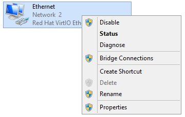
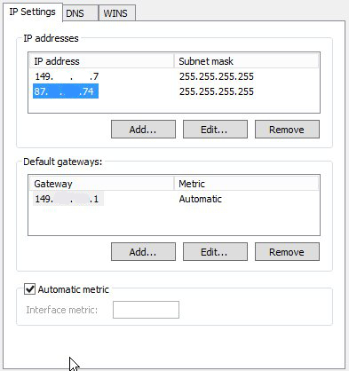

**Dernière mise à jour le 31/07/2019**

## Objectif

Vous devrez peut-être configurer une adresse IP fail-over sur vos instances pour l'une des raisons suivantes :

* vous avez un grand nombre de sites web sur votre instance ;
* vous hébergez des projets internationaux.

Pour ce faire, vous pouvez acheter ou [importer une adresse IP fail-over](https://docs.ovh.com/fr/public-cloud/importer-une-ip-fail-over/){.external} pour vos [instances Public Cloud](https://www.ovh.com/fr/public-cloud/){.external}.

Toutefois, les adresses IP fail-over ne seront pas automatiquement configurées sur votre instance.

**Ce guide vous explique comment configurer une IP fail-over sur plusieurs distributions Linux et Windows.**

## Prérequis

* Avoir accès à votre [espace client OVH](https://www.ovh.com/auth/?action=gotomanager){.external}.
* Bénéficier d’une [instance Public Cloud](https://www.ovh.com/fr/public-cloud/){.external} dans votre compte OVH.
* Posséder une [adresse IP fail-over](https://www.ovh.com/fr/serveurs_dedies/ip_failover.xml){.external} sur votre compte OVH.
* Disposer d’un accès root à votre instance en SSH (pour Linux uniquement).
* Disposer d’un accès administrateur à votre instance via RDP (pour Windows uniquement).

## Instructions

### Sous Linux

#### Configurer une IP fail-over avec CentOS

##### Configuration de l’interface réseau

> [!primary]
>
À titre d’exemple, nous utilisons les variables suivantes :
>
Network interface = eth0
>
Fail-over IP address = your_ip_address
>
IP alias = 1
>

Dans un premier temps, connectez-vous à votre instance en ligne de commande et ouvrez votre fichier de configuration réseau.

```
vi /etc/sysconfig/network-scripts/ifcfg-eth0:1
```

Ensuite, modifiez le fichier de configuration réseau et ajoutez ces lignes :

```
DEVICE="eth0:1"
BOOTPROTO=static
IPADDR="your_ip_address"
NETMASK="255.255.255.255"
BROADCAST="your_ip_address"
ONBOOT=yes
```

##### Redémarrage du service réseau

Enfin, redémarrez le service réseau avec la commande suivante :

```
ifup ethX:1
```

#### Configurer une IP fail-over avec Debian

##### Configuration de l’interface réseau

> [!primary]
>
À titre d’exemple, nous utilisons les variables suivantes :
>
Network interface = ens3
>
Fail-over IP address = your_ip_address
>
IP alias = 1
>

Connectez-vous d'abord à votre instance en ligne de commande et ouvrez votre fichier de configuration réseau.

```
# nano /etc/cloud/cloud.cfg.d/99-disable-network-config.cfg
```

Ensuite, modifiez le fichier avec la configuration indiquée ci-dessous. Cela empêchera les modifications apportées automatiquement à la configuration de votre réseau.

```
network: {config: disabled}
```

Ensuite, ouvrez le fichier de configuration réseau pour le modifier avec la commande suivante :

```
# nano /etc/network/interfaces.d/50-cloud-init.cfg
```

Modifiez maintenant le fichier avec la configuration suivante :

```
auto ens3
iface ens3 inet dhcp

auto ens3:0
iface ens3:0 inet static
address your_ip_address 0
netmask 255.255.255.255

auto ens3:1
iface ens3:1 inet static
address your_ip_address 1
netmask 255.255.255.255
```

##### Redémarrage du service réseau

Enfin, redémarrez le service réseau avec la commande suivante :

```
service networking restart
```

#### Configurer une IP fail-over avec Fedora

##### Configuration de l’interface réseau

> [!primary]
>
À titre d’exemple, nous utilisons les variables suivantes :
>
Network interface = eth0
>
Fail-over IP address = your_ip_address
>
IP alias = 1
>

Connectez-vous d'abord à votre instance en ligne de commande et ouvrez votre fichier de configuration réseau.

```
vi /etc/sysconfig/network-scripts/ifcfg-eth0:1
```

Ensuite, modifiez le fichier de configuration réseau et ajoutez les lignes suivantes :

```
DEVICE="eth0:1"
BOOTPROTO=static
IPADDR="your_ip_address"
NETMASK="255.255.255.255"
BROADCAST="your_ip_address"
ONBOOT=yes
```

##### Redémarrage du service réseau

Enfin, redémarrez le service réseau avec cette commande :

```
ifup eth0:1
```

### Sous Windows

##### Configuration de l’interface réseau

> [!warning]
>
Windows ne vous permet pas de configurer une adresse IP fail-over en plus d'une adresse IP principale dans DHCP. Vous devez donc reconfigurer votre carte réseau avec une adresse IP attribuée manuellement.
>

Tout d'abord, connectez-vous à votre serveur à l'aide de RDP. Ouvrez ensuite  l'invite de commande et exécutez la commande suivante pour récupérer vos informations réseau :

```
C:\>ipconfig

Windows IP Configuration

Ethernet adapter Ethernet:

   Connection-specific DNS Suffix  . : 
   Link-local IPv6 Address . . . . . : your_ipv6_address
   IPv4 Address. . . . . . . . . . . : your_ipv4_address
   Subnet Mask . . . . . . . . . . . : 255.255.255.255
   Default Gateway . . . . . . . . . : your_gateway_address
```
Notez votre adresse IPv4 et votre masque de sous-réseau.

Allez dans le panneau de configuration de votre serveur et cliquez sur `Network and Sharing Centre`{.action}.

{.thumbnail}

Cliquez alors sur `Modifier les paramètres de l’adaptateur`{.action}.

{.thumbnail}

Faites maintenant un clic droit sur votre interface réseau, puis cliquez sur `Propriétés`{.action}.

{.thumbnail}

Sélectionnez `Internet Protocol Version 4`{.action}, puis cliquez sur `OK`{.action}.

{.thumbnail}

Modifiez manuellement votre configuration IP, en utilisant les détails que vous avez notés dans la commande « ipconfig » précédemment. Lorsque vous avez terminé, cliquez sur `Avancé`{.action}.

{.thumbnail}

Enfin, ajoutez votre adresse IP fail-over à la configuration.

{.thumbnail}

## Aller plus loin

[Importer une IP fail-over](https://docs.ovh.com/fr/public-cloud/importer-une-ip-fail-over/){.external}

[Migration de l’IP fail-over](https://docs.ovh.com/fr/public-cloud/basculer-une-ip-fail-over/){.external}

Échangez avec notre communauté d'utilisateurs sur <https://community.ovh.com/>.
