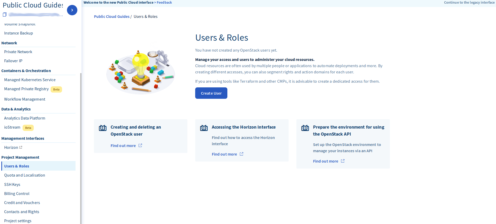
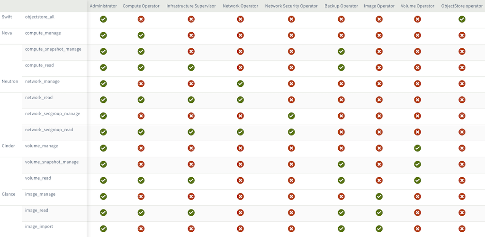
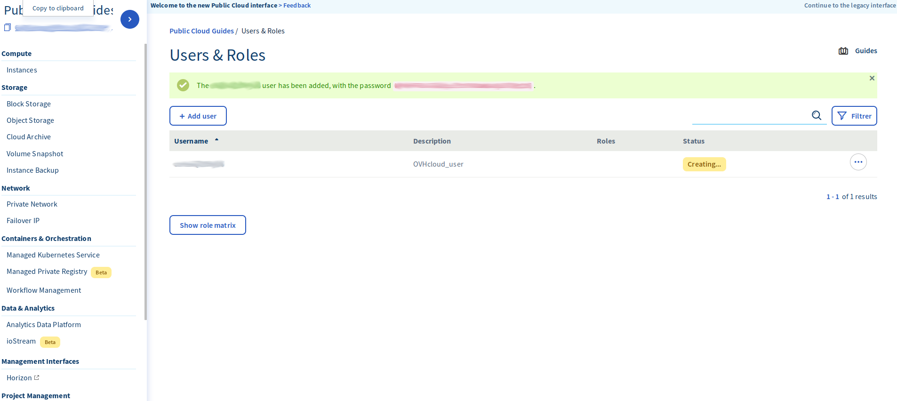

**Letzte Aktualisierung am 06.12.2019**

## Einführung

Um die APIs für Horizon oder OpenStack verwenden zu können, müssen Sie einen Benutzer erstellen. Die Anzahl der OpenStack User ist nicht begrenzt.

**Diese Anleitung erklärt, wie Sie OpenStack User im OVHcloud Kundencenter erstellen und löschen.**

## Voraussetzungen

- Sie haben ein [Public Cloud Projekt](https://www.ovhcloud.com/de/public-cloud) in Ihrem Kunden-Account. (Es muss älter als 7 Tage sein, wenn es Ihr erstes Projekt ist. Wenden Sie sich über eine Support-Anfrage an das Cloud Team, um zu prüfen, ob Sie das Projekt frühzeitig entsperren können. Für andere Projekte gilt diese Einschränkung nicht.)
- Sie haben Zugriff auf Ihr [OVHcloud Kundencenter](https://www.ovh.com/auth/?action=gotomanager).

## In der praktischen Anwendung

### Einen OpenStack-Benutzer erstellen

Loggen Sie sich in Ihrem [OVHcloud Kundencenter](https://www.ovh.com/auth/?action=gotomanager) ein. Klicken Sie oben auf der Seite auf `Public Cloud`{.action} und wählen Sie anschließend über die blaue die Pfeilschaltfläche Ihr Projekt aus.

Klicken im linken Menü auf `Users & Roles`{.action} unter "Project Management".

{.thumbnail}

Klicken Sie auf `Benutzer hinzufügen`{.action}, um das folgende Popup zu öffnen:

{.thumbnail}

Die „Beschreibung des Benutzers“ ist nicht der Benutzername für den neuen User. Es handelt sich nur um eine beschreibende Bezeichnung, die Ihnen hilft, sich daran zu erinnern, um welche Art von Benutzer es sich handelt. Im nächsten Interface können Sie Benutzerberechtigungen erteilen. Für jede von Ihnen angehakte Benutzerrolle erhält der Benutzer die entsprechenden Berechtigungen gemäß der Darstellung in der folgenden Tabelle:

{.thumbnail}

Klicken Sie auf die Schaltfläche `Bestätigen`{.action}, wenn Sie fertig sind. Sie erhalten die folgende Anzeige:

{.thumbnail}

Achten Sie darauf, Ihr Passwort jetzt zu speichern, da es nur einmalig in dieser Ansicht angezeigt wird. Andernfalls können Sie jederzeit ein neues erstellen, indem Sie auf `...`{.action} rechts des Benutzers klicken und `Passwort neu generieren`{.action} auswählen.

{.thumbnail}

Sobald Sie Ihren Benutzer erstellt haben, können Sie sich mit diesen Anmeldeinformationen über `Horizon`{.action} in der linken Seitenleiste im Horizon Interface anmelden.

### Einen OpenStack Benutzer löschen

Sie können einen OpenStack Benutzer direkt im OVHcloud Kundencenter löschen, indem Sie auf `...`{.action} rechts des Benutzers klicken und `Löschen`{.action} auswählen.

{.thumbnail}

Der Benutzer wird in wenigen Sekunden gelöscht.

> [!warning]
>
> Jede Benutzerlöschung ist endgültig und macht alle zugehörigen Token ungültig, auch diejenigen mit einem noch nicht überschrittenen Ablaufdatum.
> 

## Weiterführende Informationen

Für den Austausch mit unserer User Community gehen Sie auf <https://community.ovh.com/en/>.

