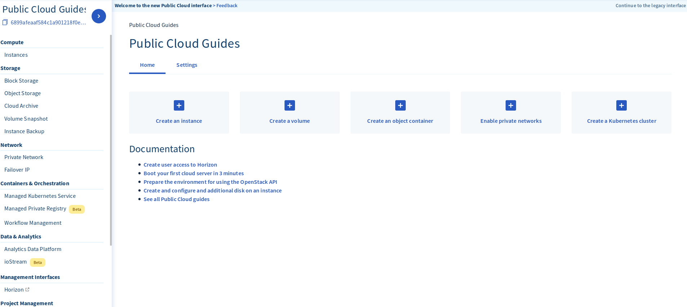
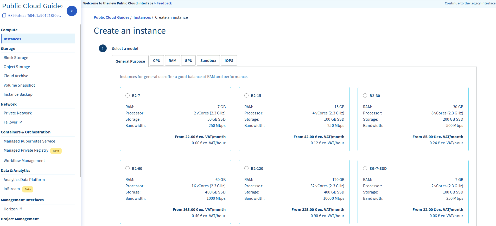

**Letzte Aktualisierung am 03.12.2019**

## Ziel

Sie können die OVHcloud [Public Cloud](https://www.ovh.co.uk/public-cloud/instances) nutzen, um Instanzen (d.h. virtuelle Server) schnell und einfach mit nur wenigen Klicks zu erstellen.

**In dieser Anleitung erfahren Sie, wie Sie eine Instanz in der Public Cloud Oberfläche des OVHcloud Kundencenters erzeugen und konfigurieren.**

## Voraussetzungen

- Sie haben Zugriff auf Ihr [OVHcloud Kundencenter](https://www.ovh.com/auth/?action=gotomanager).
- Sie haben bereits ein [Public Cloud-Projekt](https://www.ovhcloud.com/de/public-cloud) in Ihrem Kunden-Account angelegt.
- Sie haben im OVHcloud Kundencenter einen SSH-Schlüssel hinzugefügt.

## In der praktischen Anwendung

### Eine Public Cloud-Instanz bereitstellen

Um eine Public Cloud-Instanz bereitzustellen, loggen Sie sich in Ihrem [OVHcloud Kundencenter](https://www.ovh.com/auth/?action=gotomanager&from=https://www.ovh.de/&ovhSubsidiary=de) ein. Klicken Sie oben auf der Seite auf `Public Cloud`{.action}. Klicken Sie dann im folgenden Bereich auf die Pfeilschaltfläche neben Ihrem Standardprojektnamen in der oberen linken Ecke der Anzeige. Wählen Sie nun das Projekt aus, für das Sie eine neue Instanz erstellen möchten.

{.thumbnail}

Sobald Sie das richtige Projekt ausgewählt haben, klicken Sie auf `Instances`{.action} im Abschnitt „Compute“ in der linken Seitenleiste.

{.thumbnail}

Als Nächstes klicken Sie auf die Schaltfläche `Instanz erstellen`{.action}. Sie gelangen in das folgende Menü, wo Sie die Instanz konfigurieren können, die Sie erstellen möchten:

{.thumbnail}

Die folgende Tabelle enthält eine kurze Erläuterung der Unterschiede zwischen den Instanz-Arten:

| Server-Art | Garantierte Ressourcen | Nutzung |
| :---         |     :---:      |          ---: |
| Allgemeine Verwendung   | ✓     | Entwicklungsserver, Web- oder Geschäftsanwendungen    |
| CPU     | ✓       | Videokodierung oder andere Hochleistungsberechnungen      |
| RAM   | ✓     | Datenbanken, Analysen und In-Memory Prozesse    |
| Geteilte Ressourcen    | -       | Test- und Entwicklungsumgebungen      |

> [!primary]
>
Sie werden anfangs auf 20 Instanzen, 20 vCores und 40 GB RAM pro Projekt beschränkt. Eine Erhöhung des Ressourcenlimits kann über eine [Support-Anfrage](https://www.ovh.com/manager/dedicated/index.html#/ticket) an unser Cloud-Team beantragt werden.
>

Folgen Sie dem Menü, um die Region auszuwählen, in der sich Ihre Public Cloud-Instanz befinden soll. Im dritten Schritt wählen Sie Ihr Betriebssystem aus.

> [!primary]
>
Wenn Sie ein Windows-Betriebssystem auswählen, wird automatisch eine Lizenz aktiviert, die Ihnen monatlich in Rechnung gestellt wird.
>

{.thumbnail}

> [!primary]
>
Für Public Cloud-Instanzen, auf denen ein Unix-basiertes Betriebssystem ausgeführt wird, muss ein SSH-Schlüssel zum Server hinzugefügt werden. Weitere Informationen zum Generieren eines SSH-Schlüssels finden Sie in unserer Anleitung [SSH-Schlüssel erstellen](https://docs.ovh.com/de/public-cloud/create-ssh-keys).
>

Im vierten Teil des Menüs können Sie die Anzahl der zu erstellenden Instanzen auswählen, Ihre Instanz benennen und gegebenenfalls ein privates Netzwerk oder ein Post-Installationsskript hinzufügen.

{.thumbnail}

Wählen Sie abschließend, ob Sie eine monatliche oder stündliche Abrechnung erhalten möchten.

> [!warning]
>
>Wenn Sie sich für eine stündliche Abrechnung entscheiden, wird die Abrechnung für das gesamte Bestehen der Instanz fortgesetzt. Es spielt keine Rolle, ob die Instanz gerade verwendet wird oder nicht.
>

Nachdem Sie bestätigt haben, dass alle von Ihnen eingegebenen Informationen korrekt sind, klicken Sie auf die Schaltfläche `Instanz erstellen`{.action} um die Konfiguration Ihrer neuen Instanz abzuschließen. Es kann einige Minuten dauern, bis Ihre Instanz bereitgestellt werden kann.

### Fazit

Nachdem Sie diesen Artikel gelesen haben, sollten Sie in der Lage sein, eine Instanz in Ihrem Public Cloud-Projekt über das OVHcloud Kundencenter bereitzustellen. Weitere Informationen zur Nutzung Ihrer Instanz finden Sie in unseren Artikeln auf der Anleitungsseite für [Public Cloud-Dienste](https://docs.ovh.com/de/public-cloud).

## Weiterführende Informationen

Für den Austausch mit unserer User Community gehen Sie auf  <https://community.ovh.com/en/>.