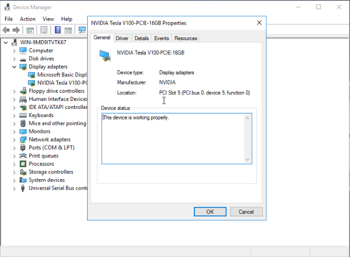

**Last updated 6th December 2019**

## Objective

GPU instances are technically similar to the instances from the 2017 range, but they also have a graphics card (Graphic Processing Unit or GPU). The technology used (*pci_passthrough*) allows the instance’s operating system to control the GPU in exactly the same way a physical machine would.

The GPUs offered are the NVIDIA Tesla V100. 

> [!warning]
>
> At the moment, GPU instances are only available in the GRA3, GRA5, GRA7 and BHS3 datacentres. You may have to create a new project and choose the new 2017 range. [Find out more.](https://docs.ovh.com/gb/en/public-cloud/faq-how-to-understand-the-new-flavor-naming-rules-for-the-2017-range/)
> 

**This guide explains how to deploy a GPU instance on Linux or Windows**

## Requirements

- a Public Cloud project with access to the regions where GPUs are available (GRA3, GRA5, GRA7 and BHS3)

## Instructions

You will find the information needed to deploy a GPU instance on Linux or Windows below.
Please bear in mind that you cannot change the Instance OS from Linux to Windows or vice-versa. Therefore, please be sure that you create the instance with the correct OS by default.


### On Linux

All the images we offer can be used on a GPU instance.

> [!primary]
>
> If you don’t feel comfortable with manually compiling a kernel module, we recommend using a distribution that is officially supported by Nvidia and for which they provide *turnkey* drivers: <https://developer.nvidia.com/cuda-downloads>.
> 

Once you are logged in to the [OVH Control Panel](https://www.ovh.com/auth/?action=gotomanager){.external}, in your Public Cloud project, click on `Create an instance`{.action}and choose a GPU instance:

{.thumbnail}

The, select the Linux OS of your choise:

{.thumbnail}

The instance will start a few seconds later. You can then log in and check for the graphics card: 

```ssh
lspci | grep -i nvidia
00:05.0 3D controller: NVIDIA Corporation GV100GL [Tesla V100 PCIe 16GB] (rev a1)
```

The graphics card is there, but cannot be used yet. To do so, you must first install the NVIDIA driver. You can find the list of packages at this address: [List of available Linux packages](http://developer.download.nvidia.com/compute/cuda/repos/){.external}.

You will then need to enter the following commands:

```sh
wget URL_of_packet_to_download
sudo dpkg -i cuda-repo-XXXX-XXXXXX
sudo apt-get update
sudo apt-get upgrade
sudo apt-get install cuda
sudo reboot
```

> [!primary]
>
> The Linux command can vary based on your distribution. If in doubt, please check the official guide for your version of Linux.
> 


Once the instance has been rebooted, the graphics card will appear in the NVIDIA utility program:

```sh
nvidia-smi
Fri Dec  6 12:32:25 2019       
+-----------------------------------------------------------------------------+
| NVIDIA-SMI 418.67       Driver Version: 418.67       CUDA Version: 10.1     |
|-------------------------------+----------------------+----------------------+
| GPU  Name        Persistence-M| Bus-Id        Disp.A | Volatile Uncorr. ECC |
| Fan  Temp  Perf  Pwr:Usage/Cap|         Memory-Usage | GPU-Util  Compute M. |
|===============================+======================+======================|
|   0  Tesla V100-PCIE...  On   | 00000000:00:05.0 Off |                    0 |
| N/A   26C    P0    35W / 250W |      0MiB / 16130MiB |      5%      Default |
+-------------------------------+----------------------+----------------------+
                                                                               
+-----------------------------------------------------------------------------+
| Processes:                                                       GPU Memory |
|  GPU       PID   Type   Process name                             Usage      |
|=============================================================================|
|  No running processes found                                                 |
+-----------------------------------------------------------------------------+
```

The GPU instance is now fully functional and usable.


### On Windows

There are incompatibilities between the NVIDIA driver and the *KVM/pci_passthrough* virtualisation solution. **Windows standard images do not work.**
Due to that, we offer special images, based on a virtual UEFI BIOS, which allow the driver to function correctly (this is only the case for G1, G2 and G3 instances - range 2017 and before).

Once you are logged in to the [OVH Control Panel](https://www.ovh.com/auth/?action=gotomanager){.external}, in your Public Cloud project, click on `Create an instance`{.action}and choose a GPU instance:

{.thumbnail}

Then, select the Windows of your choise: 

{.thumbnail}

Once your GPU instance has started, you will need to install the NVIDIA driver from the [official website](https://www.nvidia.com/Download/index.aspx){.external}.

Start an instance using one of the available GPU types (t1-45, t1-90, t1-180...). This should only take a few minutes.

Afterwards, all that’s left to do is to install the required driver, which will then be displayed here:

{.thumbnail}

{.thumbnail}


## Going further

Join our community of users on <https://community.ovh.com/en/>.
