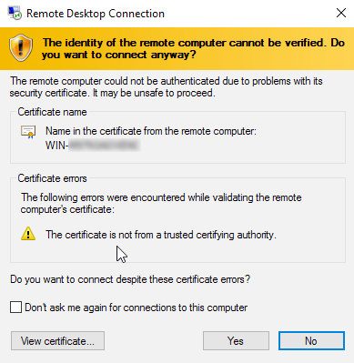

**Última actualización: 27/03/2020**

## Objetivo

Para conectarse a una instancia de Public Cloud, el procedimiento es similar a una conexión convencional a un servidor (VPS, servidor dedicado...), pero en este caso tiene un usuario específico.

**Esta guía explica cómo conectarse a una instancia de Public Cloud Linux o Windows.**


## Requisitos

- Estar conectado al [área de cliente de OVH](https://ca.ovh.com/auth/?action=gotomanager){.external}.
- Haber creado una [instancia de Public Cloud]({ovh_www}/public-cloud/){.external}.


## Procedimiento

### Iniciar sesión en una instancia de Linux utilizando un sistema operativo Linux/Mac

Ejecute el siguiente comando SSH para iniciar sesión en su instancia Public Cloud de OVHcloud. Para ello, sustituya «usuario» según sea necesario e «instance_IP» por la dirección IP de su instancia:

```sh
ssh user@instance_IP
```

El usuario de Public Cloud será diferente en función del sistema operativo que esté utilizando. La tabla siguiente muestra una lista (no exhaustiva) de usuarios por sistema operativo:

|Sistema operativo|Usuario|
|---|---|
|Arch Linux|arch|
|CentOS 6|centos|
|CentOS 7|centos|
|CoreOS|core|
|Debian 7|debian|
|Debian 8|debian|
|Debian 9|debian|
|Fedora 25|fedora|
|Fedora 26|fedora|
|FreeBSD 11.0 ZFS|FreeBSD|
|Ubuntu 14.04|ubuntu|
|Ubuntu 16.04|ubuntu|
|Ubuntu 16.10|ubuntu|
|Ubuntu 17.04|ubuntu|

> [!primary]
>
> Si inicia sesión directamente, tendrá los derechos de usuario tipo. Si quiere ser un usuario raíz, puede utilizar el comando sudo -i o sudo su.
>


**Aviso relativo a la huella digital del servidor SSH remoto:**

Al iniciar sesión por primera vez, es necesario confirmar la autenticidad del host haciendo clic en `«Sí»`.

```sh
The authenticity of host 217.xxx.xxx.98 (217.xxx.xx.98) cant be established.
ECDSA key fingerprint is f4:95:09:ce:b6:63:73:ea:54:db:76:5e:64:f1:5e:6d.
Are you sure you want to continue connecting (yes/no)?`
```


### Iniciar sesión en una instancia de Linux utilizando un sistema operativo Windows

Para iniciar sesión en una instancia de Linux utilizando Windows, puede utilizar un programa como [PuTTY](https://www.putty.org/){.external} o —para las últimas versiones de Windows 10— las [características nativas](https://docs.microsoft.com/es-es/windows/wsl/about){.external}. A continuación, puede seguir las mismas instrucciones anteriores.


### Iniciar sesión en una instancia de Windows

#### Finalizar la instalación

Una vez que haya creado su instancia, deberá finalizar algo denominado *sysrep*. Para hacerlo, acceda al [área de cliente de OVHcloud](https://ca.ovh.com/auth/?action=gotomanager){.external} y ejecute la consola VNC desde el panel de la instancia:


En el primer paso, seleccione el país, el idioma y la distribución del teclado. Seguidamente, haga clic en `«Siguiente»`{.action}:


A continuación, deberá seleccionar la contraseña de *administrador*:


Por último, confirme los cambios realizados haciendo clic en `«Finalizar»`{.action}. La instancia se reiniciará y entonces podrá conectarse a su servidor de Windows.


#### Iniciar sesión en Windows

Deberá iniciar sesión directamente en su instancia de Windows desde su PC Windows utilizando la función `«Escritorio remoto»`:


En los próximos pasos, deberá introducir la dirección IP de su instancia (primer paso de inicio de sesión a través del escritorio remoto) y, a continuación, su nombre de usuario (administrador) y la contraseña que estableció:


Entonces aparecerá un mensaje en el que se pide confirmar las credenciales de inicio de sesión. Haga clic en `«Sí»`{.action}:



Entonces habrá iniciado sesión en su instancia.

> [!primary]
>
> Si tiene algún problema para iniciar sesión en su instancia de Windows, asegúrese de que el cortafuegos de Windows autorice las conexiones RDP. Si necesita más información, consulte nuestra guía [«Configuración del servidor de Windows»](../../vps/windows-first-config/){.external}.
> 


## Más información

Interactúe con nuestra comunidad de usuarios en <https://community.ovh.com/en/>.
