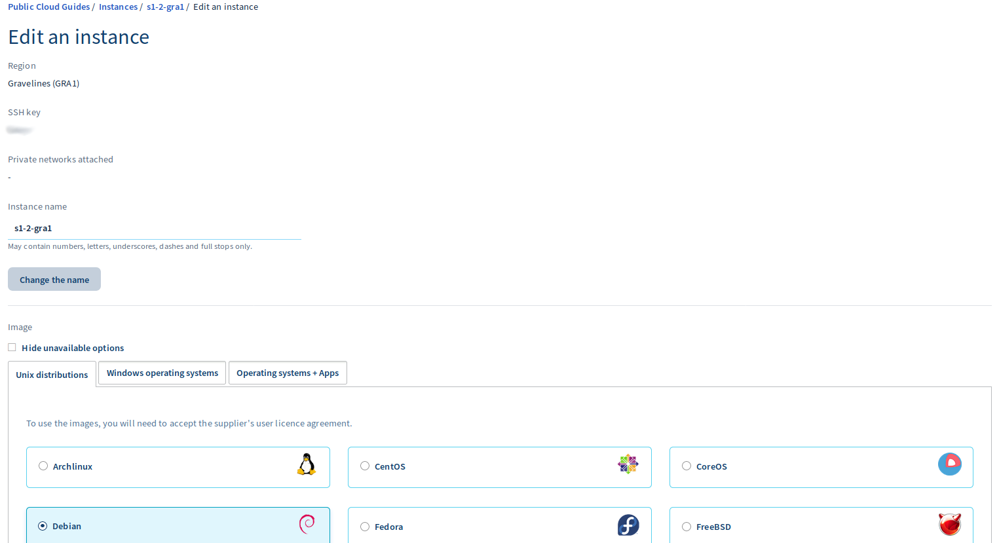
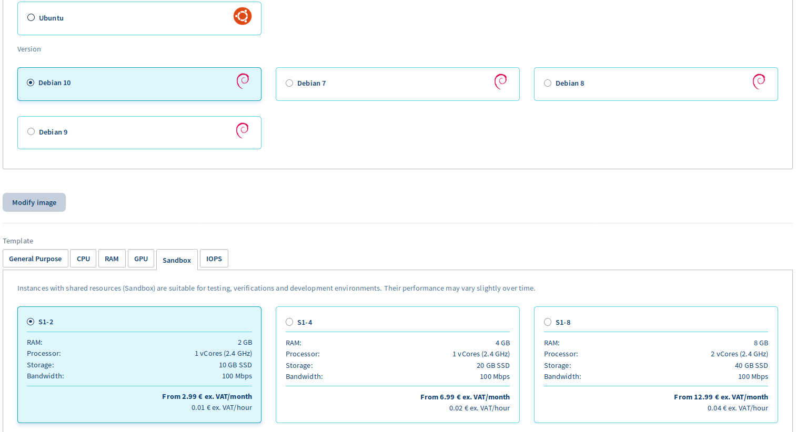
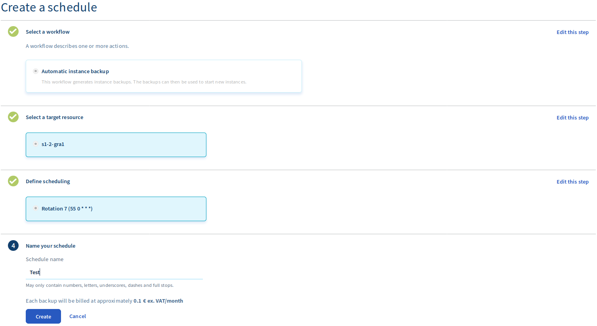
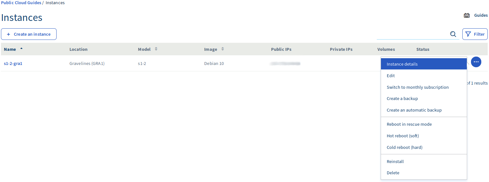
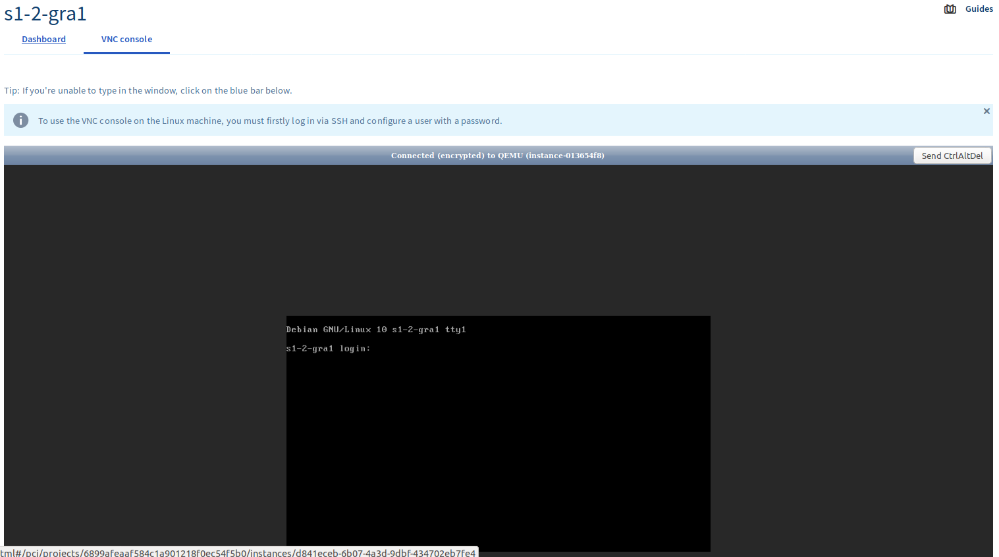
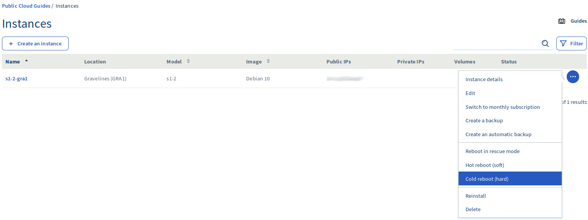
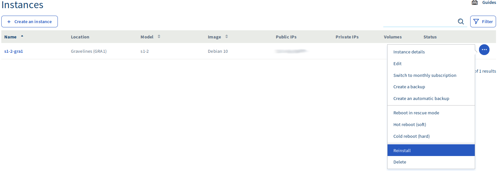
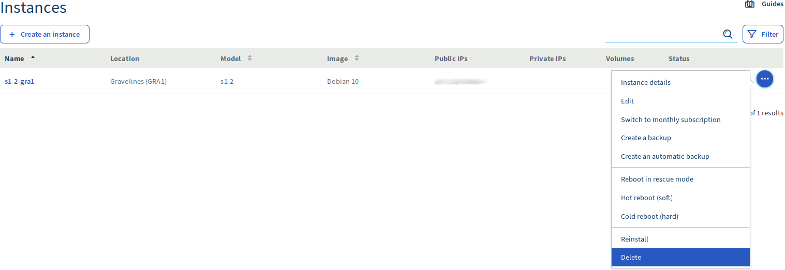

**Last updated 4th December 2019**

## Objective

You can manage OVH Public Cloud easily via the [OVH Control Panel](https://www.ovh.com/auth/?action=gotomanager){.external}. You will find all of your infrastructure (Instances, backups, disks, SSH keys, etc.) and storage projects there (including the list of your containers).

**Find out how to get started with a Public Cloud Instance.**

### Requirements

- an [OVH Public Cloud Instance](../create_an_instance_in_your_ovh_customer_account/)
- [an SSH key](../create-ssh-keys/)

### Instructions

### Access the management interface for the Instance.

First, log in to the [OVH Control Panel](https://www.ovh.com/auth/?action=gotomanager){.external}, go to the ‘Public Cloud’ section and select the Public Cloud service concerned. Then, click in the `Compute`{.action} tab on your left.

On that page you will see a summary of all your Instances. There will be several pieces of information displayed here:

- the model your Instance
- its name and region
- any potential hard disks
- your Instance’s IP addressed
- its state

{.thumbnail}

### Edit the configuration of an Instance.

In the management interface for the Instance, click on the down-arrow icon, and select `Edit`{.action}.

{.thumbnail}

In the window that opens, you can:

- rename the Instance
- change the Instance model 
- reinstall the Instance on another operating system (**please note that if you choose to do this, the data currently stored on the instance will be deleted**)
- switch from hourly billing to a fixed monthly rate (bills will then be sent on a pro rata basis, based on the day of the month that you switch)

{.thumbnail}
{.thumbnail}
{.thumbnail}

### Create a backup of an Instance.

You can create a backup of an Instance from its admin page.  To do this, click on the 3 dots on the right of it and select `Create a backup`{.action}. Then you will see this page with all the necessary information: {.thumbnail} .

Then the following information is being displayed: {.thumbnail}

Once backup has been done you can see it in the `Instance Backup`{.action} section: {.thumbnail} .

You can refer to our guide to [Backing up an Instance](../back-up-instance/) if you need help with this. 

{.thumbnail}

### Create an automatic backup of an Instance.

You can schedule an automatic backup of an Instance from its admin page. To do this, click on the 3 dots on the right of it and select `Create an automatic backup`{.action}: {.thumbnail}

Then the following page will be displayed: {.thumbnail} .

Once you have validate it you will be redirected to the following page: {.thumbnail} .

At any time you can go to that page to delete the current automatic backup process: {.thumbnail}

You can refer to our guide to [Backing up an Instance](../back-up-instance/) if you need help with this. 

{.thumbnail}

### Retrieve your login information.

In the management interface for the Instance, click on `Instance details`, and check the information bellow `Login information`{.action}. There, you can retrieve the SSH commands you need to use to connect to your Instance.

{.thumbnail}
{.thumbnail}

### Access the VNC console.

Using the VNC console, you can access your Instance directly. Please note, however, that you will need to have configured a password for the root user.

To access this console, click on `VNC console`{.action} in the Instance dashboard.

{.thumbnail}

The console will then be available:

{.thumbnail}

### Reboot an Instance.

There are two different ways of rebooting an Instance:

- hot reboot (software)
- cold reboot (hardware)

In the management interface for the Instance, click on the 3 dots you find on the right of the Instance, and select either `Hot reboot (software)`{.action} or `Cold reboot (hardware)`{.action}.

Then confirm your request in the window that opens.

{.thumbnail}

### Reinstall an Instance.

You can reinstall an Instance and keep the same operating system. **Please note that if you choose to reinstall, all of the data currently stored on your Instance will be erased.**

In the management interface for the Instance, click on the 3 dots you find on the right of the Instance, and select `Reinstall`{.action}. Then click confirm to start the process.

{.thumbnail}

### Delete an Instance.

You can also delete an Instance. **This will permanently delete the Instance, as well as all of the data stored on it.**

In the management interface for the Instance, click on the down-arrow icon, and select `Delete`{.action}. Then click confirm to start the process. 

{.thumbnail}

## Go further

Join our community of users on <https://community.ovh.com/en/>.
