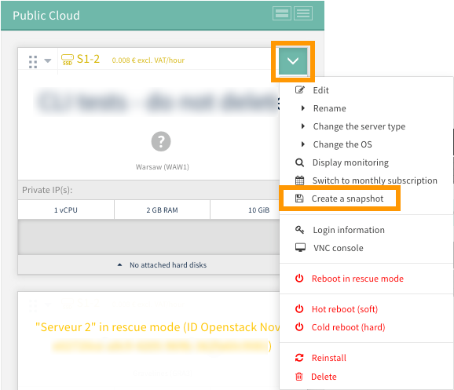

**Ultimo aggiornamento: 11/07/2018**

## Obiettivo

La sezione Cloud dello [Spazio Cliente OVH](https://www.ovh.com/auth/?action=gotomanager){.external} è stata progettata per consentire una gestione semplice e veloce delle istanze attive. Da questa interfaccia è possibile visualizzare tutti i progetti di infrastruttura (istanze, backup, dischi, chiavi SSH, ecc…) e storage (inclusa la lista dei container).

**Questa guida ti mostra le operazioni di base da effettuare sulla tua istanza Public Cloud OVH.**

### Prerequisiti

- [Aver creato un’istanza Public Cloud dallo Spazio Cliente OVH](https://docs.ovh.com/it/public-cloud/crea_unistanza_dallo_spazio_cliente_ovh/)
- [Aver creato una chiave SSH](https://docs.ovh.com/it/dedicated/chiave-ssh-ovh/)

### Procedura

### Accedi alla gestione dell’istanza

Accedi all’area “Cloud” dello [Spazio Cliente OVH](https://www.ovh.com/auth/?action=gotomanager){.external} e seleziona il tuo servizio nella sezione `Server`{.action} della colonna a sinistra.  Dovrebbe aprirsi di default la scheda `Compute`{.action}: assicurati che la voce selezionata sia “Istanze”.

L’interfaccia mostra la tua infrastruttura e diverse informazioni relative all’istanza:

- modello e costo
- nome e localizzazione
- risorse disponibili
- eventuali dischi aggiuntivi associati
- indirizzo IP

{.thumbnail}

### Modifica la configurazione dell’istanza

Nella pagina di gestione dell’istanza clicca sulla freccia verso il basso e seleziona l’opzione `Modifica`{.action}.

{.thumbnail}

Nella nuova finestra è possibile:

- rinominare l'istanza 
- modificare il modello dell’istanza
- reinstallare l’istanza su un altro sistema operativo (**attenzione: questa operazione comporta la cancellazione di tutti i dati**)
- passare dalla fatturazione oraria al forfait mensile (in questo caso viene generata una nuova fattura, calcolando il prorata temporis in base al giorno di attivazione del mese in corso)

{.thumbnail}

### Effettua un backup dell’istanza

Per creare un backup dell’istanza torna alla pagina di gestione, clicca nuovamente sulla freccia verso il basso, seleziona l’opzione `Crea uno Snapshot`{.action} e segui le indicazioni.

Per maggiori informazioni, consulta la guida [Effettuare lo Snapshot di un’istanza](https://docs.ovh.com/it/public-cloud/effettuare-snapshot-di-un-istanza/). 

{.thumbnail}

### Recupera le informazioni di connessione

Sempre nella pagina di gestione dell’istanza, clicca sulla freccia verso il basso e seleziona l’opzione `Informazioni di connessione`{.action}. Nella nuova finestra è disponibile il comando SSH da utilizzare per accedere all’istanza.

{.thumbnail}

### Accedi alla console VNC

La console VNC è un software di controllo remoto con cui è possibile accedere direttamente all’istanza. Per poter stabilire la connessione tramite questo programma è necessario aver impostato una password di root.

Per utilizzare la console accedi alla pagina di gestione dell’istanza, clicca sulla freccia verso il basso e seleziona l’opzione `Console VNC`{.action}.

{.thumbnail}

Il software si aprirà in una nuova finestra. 

{.thumbnail}

### Riavvia l’istanza

Il riavvio dell’istanza può essere effettuato in 2 modi diversi:

- a caldo (software)
- a freddo (hardware)

Nella pagina di gestione dell’istanza, clicca sulla freccia verso il basso e seleziona l’opzione `Riavvia a caldo (soft)`{.action} o `Riavvia a freddo (hard)`{.action}.

Nella nuova finestra, clicca su `OK`{.action} per confermare l’operazione.

{.thumbnail}

### Reinstalla l’istanza

La reinstallazione dell’istanza può essere eseguita anche mantenendo lo stesso sistema operativo. **Ti ricordiamo che questa operazione comporta la cancellazione di tutti i dati esistenti.**

Nella pagina di gestione dell’istanza, clicca sulla freccia verso il basso e seleziona l’opzione `Reinstalla`{.action}. Nella nuova finestra, clicca su `OK`{.action} per confermare l’operazione. 

{.thumbnail}

### Elimina l’istanza

Un’istanza può essere eliminata in qualsiasi momento. Ricorda però che **confermare questa operazione comporta la cancellazione definitiva di tutti i dati in essa contenuti, che non potranno più essere recuperati.**

Nella pagina di gestione dell’istanza, clicca sulla freccia verso il basso e seleziona l’opzione `Elimina`{.action}. Nella nuova finestra, clicca su `OK`{.action} per confermare l’operazione. 

{.thumbnail}

## Per saperne di più

Contatta la nostra Community di utenti all’indirizzo <https://www.ovh.it/community/>.
