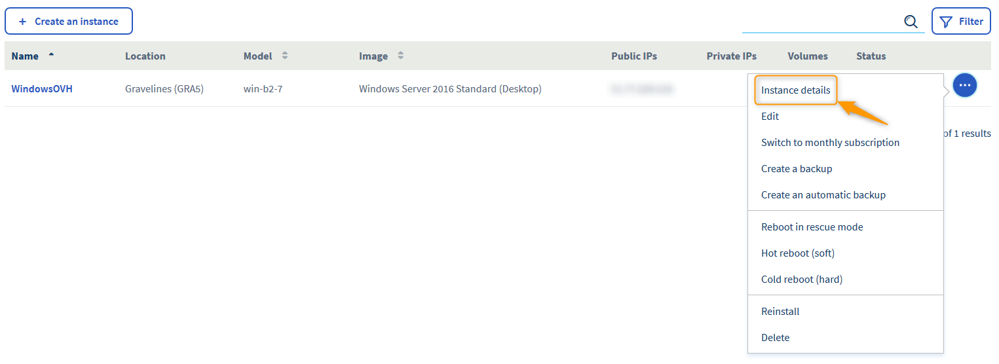
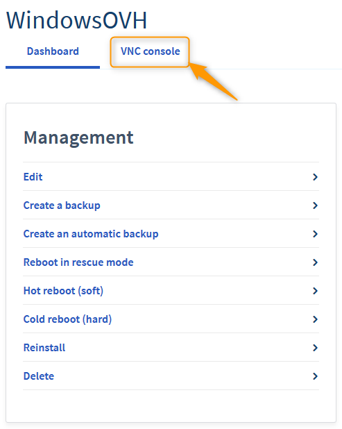
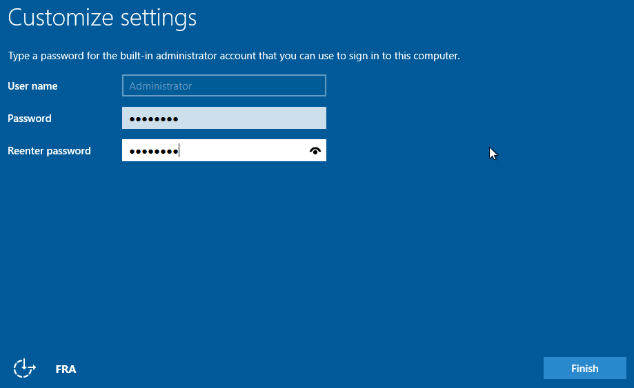
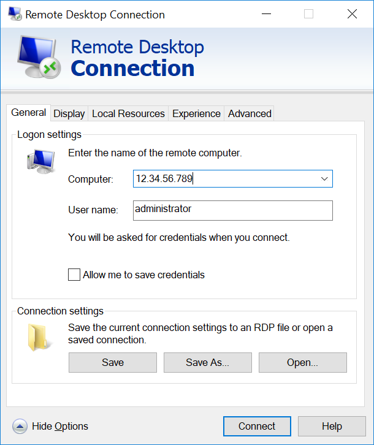
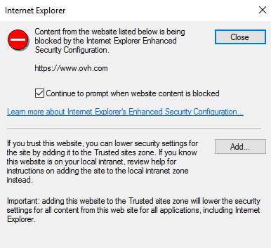
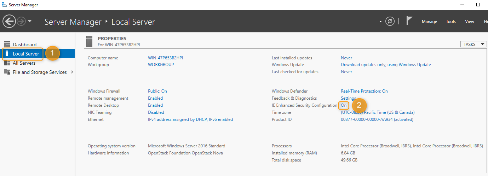
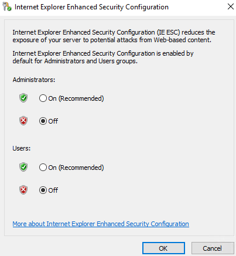

**letzter Stand 25.11.2019**

## Ziel

Es ist möglich die Öffentliche Cloud zu nutzen, wenn Sie Websites unter IIS oder Ihrer nur mit Windows kompatiblen Anwendungen beherbergen wollen. Unsere Instanzen können unter den [Windows Desktop-](https://www.ovh.de/public-cloud/prices/){.external} Distributionen installiert werden.

Sobald Ihre Instanz erstellt ist muss die Installation über die VNC-Konsole abgeschlossen werden.

**Dieses Handbuch erklärt Ihnen die zu befolgende Vorgehensweise, um nach der Installation zu Ihrer Windows-Instanz zu gelangen.**

## Voraussetzungen

- Sie haben ein Öffentliches Cloud-Projekt erstellt.
- Sie haben [eine Instanz im Kundenbereich](https://docs.ovh.com/de/public-cloud/erstellung_einer_instanz_im_ovh_kundencenter/)unter einer Windows Desktop-Distribution erstellt.

## Beschreibung

### Schritt 1: Ihr Passwort konfigurieren

Im Gegensatz zu einer Linux-Instanz wird eine Windows-Instanz nicht mit einem vorkonfigurierten SSH-Schlüssel installiert. 

Die Installation muss daher über die VNC-Konsole abgeschlossen werden:

- Klicken Sie auf die  `...`{.action} rechts von Ihrer Instanz und dann auf `Detail der Instanz`{.action} :

{.thumbnail}

- Gehen Sie dann auf den Tab `VNC-Konsole`{.action}

{.thumbnail}

- Wählen Sie dann die Sprach- und Tastaturinformationen aus und geben Sie dann Ihr Passwort an:

{.thumbnail}

> [!primary]
>
> Manche Tasten der Tastatur der VNC-Konsole entsprechen nicht zwingend der Tastatur AZERTY. Zögern Sie nicht, Ihr Passwort mehrmals zu überprüfen bevor Sie es bestätigen.
>

{.thumbnail}

### Schritt 2: über Remote zum Büro zu gelangen

Sobald das Passwort definiert ist können Sie über das Remote-Büro zu Ihrer Windows-Instanz gelangen.

Von einem Windows-Arbeitsplatz aus:

{.thumbnail}

Um sich von einem Linux-Arbeitsplatz aus au verbinden tippen Sie folgenden Befehl ein:

```
rdesktop 12.34.56.789 -u administrator
```
 
### Schritt 3: Verbesserung der Internet-Navigation

Standardmässig ist die verstärkte Sicherheit des Internet Explorers aktiviert. Während Ihrer Navigation erscheint ein Warnungshinweis mehrmals, um Sie zu warnen und um Downloads zu blockieren:

{.thumbnail}

Um dies zu verhindern können Sie die verstärkte Sicherheit von Ihrer Server-Verwaltung aus deaktivieren.

- Offnen Sie die**Server-Verwaltung** und wählen Sie den Tab `örtlicher Server`{.action} (1).

{.thumbnail}

- Klicken Sie dann `Aktiv `{.action} (2) an der Seite der  **Konfiguration der verstärkten Sicherheit des Internet Explorer**, um die Option zu deaktivieren.

{.thumbnail}

## Weiterführende Informationen

[Zugang und Sicherheit im Horizon](https://docs.ovh.com/de/public-cloud/zugriff_und_sicherheit_in_horizon/){.external}

[Zur Konsole einer Instanz in Horizon gelangen](https://docs.ovh.com/de/public-cloud/zugriff_auf_die_konsole_einer_instanz_in_horizon/){.external}

[ Cloud Guthaben aufladen](https://docs.ovh.com/de/public-cloud/cloud_guthaben_aufladen/){.external}

Für den Austausch mit unserer User Community gehen Sie auf <https://community.ovh.com/en/>.