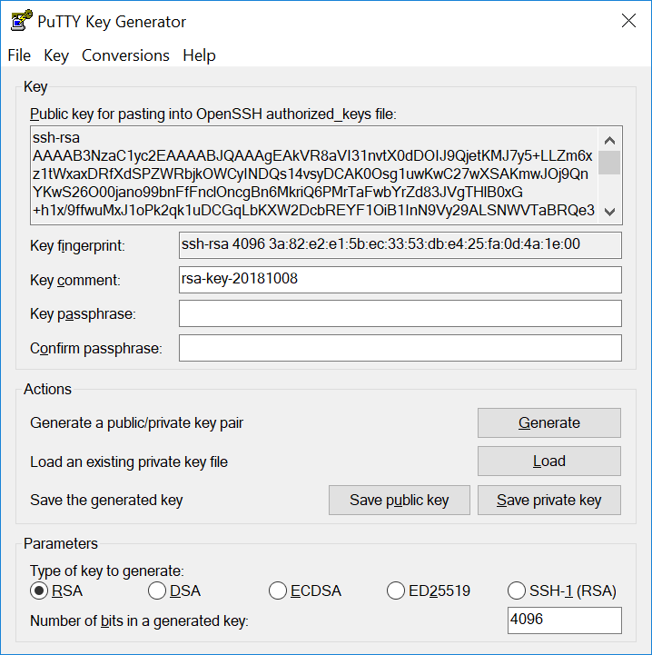
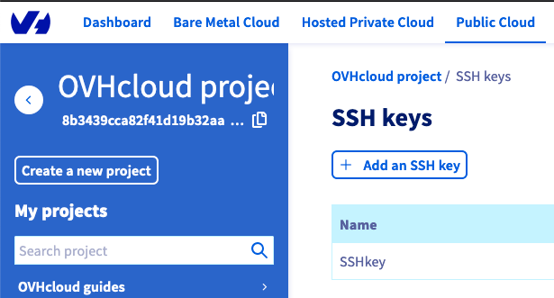

**Stand 23.07.2019**

## Einleitung

Wenn Sie eine [Public Cloud Instanz](https://ovh.de/public-cloud/){.external} erstellen, wird Ihnen keine E-Mail mit Verbindungsinformationen zugesandt. Die Authentifizierung erfolgt in diesem Fall über gesicherte SSH-Schlüssel.

**In dieser Anleitung erfahren Sie, wie Sie einen SSH-Schlüssel erstellen, um sich mit Ihrer Instanz zu verbinden.**

> [!primary]
>
Bitte beachten Sie, dass bei Instanzen mit Windows-Betriebssystem keine SSH-Schlüssel zur Authentifizierung verwendet werden. Stattdessen werden Benutzername und Passwort verwendet.
>

## Voraussetzungen

* Sie haben ein [Public Cloud](https://www.ovh.de/public-cloud/){.external} Projekt über Ihren OVH Account erstellt.
* Sie sind in Ihrem [OVH Kundencenter](https://www.ovh.com/auth/?action=gotomanager){.external} eingeloggt.

## Beschreibung

### SSH-Schlüssel unter Linux und Mac erstellen

Öffnen Sie das Terminal (die Kommandozeile) und führen Sie folgenden Befehl aus, um einen SSH-Schlüssel mit 4096 Bits zu erstellen:

```sh
# ssh-keygen -b 4096
```

Sie erhalten folgendes Ergebnis und werden aufgefordert, den neu erstellten Schlüssel zu speichern:

```sh
Generating public/private rsa key pair.
Enter file in which to save the key (/home/user/.ssh/id_rsa):
```

> [!warning]
>
> Bewahren Sie den privaten Teil des Schlüssels sicher auf und gewähren Sie nur autorisierten Personen Zugriff.
> 

Wenn Sie den Schlüssel gespeichert haben, werden folgende Elemente in der Kommandozeile angezeigt:

```ssh
Your identification has been saved in /home/user/.ssh/id_rsa.
Your public key has been saved in /home/user/.ssh/id_rsa.pub.
The key fingerprint is:
0a:3a:a4:ac:d1:40:6d:63:6d:fd:d9:fa:d6:b2:e0:36 user@host
The key's randomart image is:
+---[RSA 4096]----+
|      .          |
|                 |
| .               |
|. . . .          |
|. .=.o .S.       |
| =o.o. ..   .    |
|o +   .  . o ..  |
|.. .      oEoo . |
|o.        .o+oo  |
+-----------------+
```

Sie können den Schlüssel mit folgendem Befehl anzeigen:

```ssh
# cat .ssh/id_rsa.pub
```

Wenn dieser Befehl ausgeführt wird, werden folgende Elemente angezeigt:

```ssh
cat /home/user/.ssh/id_rsa.pub
ssh-rsa AAAAB3NzaC1yc2EAAAADAQABAAABAQC8teh2NJ42qYZV98gTNhumO1b6rMYIkAfRVazl
k6dSS3xf2MXJ4YHsDacdjtJ+evXCFBy/IWgdkFtcvsGAMZ2N1RdvhDyQYcy6NDaJCBYw1K6Gv5fJ
SHCiFXvMF0MRRUSMneYlidxU3U2q66yt/wPmw1yRsQagtNKHAzFUCSOB1nFz0RkqvqgARrHTY0bd
aS0weA//aK9f6z+Y4THPbcCj4xPH4iGikFMPrFivP8Z6tidzVpAtbr1sXmJGZazYWrU3FoK2a1sF
i4ANmLy7NULWK36yU0Rp9bFJ4o0/4PTkZiDCsK0QyHhAJXdLN7ZHpfJtHIPCnexmwIMLfIhCWhO5
 user@host
```

### SSH-Schlüssel unter Windows erstellen

#### Mit PuTTY

[PuTTY](https://www.chiark.greenend.org.uk/~sgtatham/putty/){.external} ist ein beliebter SSH-Client für Windows. Er wird verwendet, um sich remote mit einem Linux-Server zu verbinden. Die zugehörige Software [PuTTYgen](https://the.earth.li/~sgtatham/putty/latest/w64/puttygen.exe){.external} kann verwendet werden, um SSH-Schlüssel zu erstellen.

Laden Sie zunächst das Programm [PuTTYgen](https://the.earth.li/~sgtatham/putty/latest/w64/puttygen.exe){.external} herunter, mit dem wir den Schlüssel erstellen werden.

Starten Sie das Programm und wählen Sie RSA als Schlüsseltyp aus. Geben Sie anschließend 4096 als zu erstellende Bit-Anzahl ein und klicken Sie auf den Button `Generate`{.action}.

{.thumbnail}

Bewegen Sie anschließend Ihre Maus wie nachstehend gezeigt willkürlich im Bereich unter der Fortschrittsanzeige.

{.thumbnail}

Wenn Sie Ihre Maus bewegen, beginnt der Fortschrittsbalken, sich zu füllen. Wenn der Fortschrittsbalken komplett ausgefüllt ist, ist der SSH-Schlüssel fertig.

{.thumbnail}

### SSH-Schlüssel in das OVH Kundencenter importieren

Wählen Sie den Text Ihres öffentlichen Schlüssels aus und kopieren Sie diesen. Loggen Sie sich dann in Ihrem [Kundencenter](https://www.ovh.com/auth/?action=gotomanager){.external} ein.

Gehen Sie im Menü in den Bereich `Cloud`{.action}.

{.thumbnail}

Wählen Sie im linken Menü Ihr Public Cloud Projekt aus und klicken Sie dann auf `Infrastruktur`{.action}.

{.thumbnail}

Gehen Sie in den Tab `SSH-Schlüssel`{.action}.

{.thumbnail}

Fügen Sie den 4096-Bit-Schlüssel im hierzu vorgesehen Feld ein. Geben Sie dem Schlüssel einen Namen und klicken Sie auf den Button `Diesen Schlüssel hinzufügen`{.action}.

{.thumbnail}

Ihr SSH-Schlüssel ist nun zur Authentifizierung im OVH Kundencenter hinterlegt.

## Weiterführende Informationen

Für den Austausch mit unserer User Community gehen Sie auf <https://community.ovh.com/en/>.