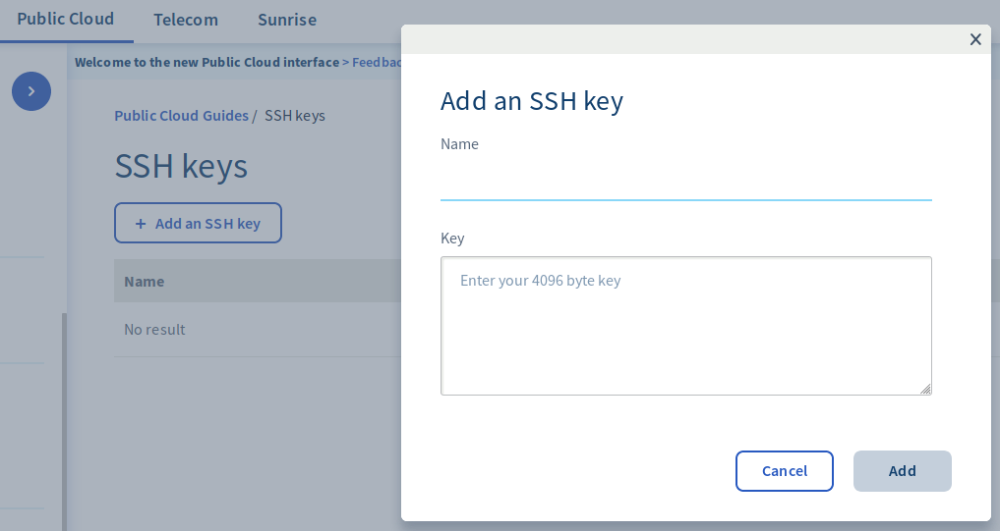

**Última atualização a 14 de Novembro de 2019**

## Sumário

Quando se cria uma [Instância Public Cloud](https://www.ovh.pt/public-cloud/){.external}, não se recebe um email com as credenciais para login, porque a autenticação baseia-se em chaves seguras SSH e não em  nomes de utilizador e senhas.

**Este guia explica como criar uma chave SSH para poder fazer login na sua instância.**

> [!primary]
>
Note que as chaves SSH não são utilizadas para a autenticação nas instâncias que executam o sistema operativo Windows. Para as instâncias no Windows, ainda é necessário usar um nome de utilizador e uma senha.
>

## Requisitos

* um projeto [Public Cloud](https://www.ovh.pt/public-cloud/){.external} na sua conta OVH
* acesso à [Área de Cliente OVH](https://www.ovh.com/auth/?action=gotomanager){.external}

## Instruções

### Como criar uma chave SSH no Linux e no Mac.

Primeiro, abra a aplicação do terminal (linha de comando), e em seguida execute o seguinte comando para gerar uma chave SSH de 4096 bits:

```sh
# ssh-keygen -b 4096
```

O comando irá produzir o seguinte resultado e pedir que guarde a chave recém-criada:

```sh
Generating public/private rsa key pair.
Enter file in which to save the key (/home/user/.ssh/id_rsa):
```

> [!warning]
>
> A parte privada da chave deve ser guardada em local seguro e o acesso deve ser limitado a pessoas autorizadas.
> 

Uma vez guardada a chave, a linha de comando irá produzir o seguinte resultado:

```ssh
Your identification has been saved in /home/user/.ssh/id_rsa.
Your public key has been saved in /home/user/.ssh/id_rsa.pub.
The key fingerprint is:
0a:3a:a4:ac:d1:40:6d:63:6d:fd:d9:fa:d6:b2:e0:36 user@host
The key's randomart image is:
+---[RSA 4096]----+
|      .          |
|                 |
| .               |
|. . . .          |
|. .=.o .S.       |
| =o.o. ..   .    |
|o +   .  . o ..  |
|.. .      oEoo . |
|o.        .o+oo  |
+-----------------+
```

Poderá consultar e mostrar a chave através do seguinte comando:

```ssh
# cat .ssh/id_rsa.pub
```

A execução deste comando irá produzir o seguinte resultado:

```ssh
cat /home/user/.ssh/id_rsa.pub
ssh-rsa AAAAB3NzaC1yc2EAAAADAQABAAABAQC8teh2NJ42qYZV98gTNhumO1b6rMYIkAfRVazl
k6dSS3xf2MXJ4YHsDacdjtJ+evXCFBy/IWgdkFtcvsGAMZ2N1RdvhDyQYcy6NDaJCBYw1K6Gv5fJ
SHCiFXvMF0MRRUSMneYlidxU3U2q66yt/wPmw1yRsQagtNKHAzFUCSOB1nFz0RkqvqgARrHTY0bd
aS0weA//aK9f6z+Y4THPbcCj4xPH4iGikFMPrFivP8Z6tidzVpAtbr1sXmJGZazYWrU3FoK2a1sF
i4ANmLy7NULWK36yU0Rp9bFJ4o0/4PTkZiDCsK0QyHhAJXdLN7ZHpfJtHIPCnexmwIMLfIhCWhO5
 user@host
```

### Como criar uma chave SSH no Windows.

#### Utilizando PuTTY

[PuTTY](https://www.chiark.greenend.org.uk/~sgtatham/putty/){.external} é um cliente SSH muito utilizado no Windows. Pode utilizá-lo para se ligar remotamente a um servidor Linux. O seu software associado, [PuTTYgen](https://the.earth.li/~sgtatham/putty/latest/w64/puttygen.exe){.external}, pode ser utilizado para criar chaves SSH.

Primeiro, descarregue o software [PuTTYgen](https://the.earth.li/~sgtatham/putty/latest/w64/puttygen.exe){.external}, que iremos utilizar para gerar a chave.

Em seguida, execute o software e selecione o tipo de chave RSA , digite 4096 no número de bits a gerar e clique no botão `Generate`{.action}.

{.thumbnail}

Em seguida, mova o rato de forma aleatória na zona vazia situada por baixo da barra de progresso, como se mostra abaixo.

{.thumbnail}

À medida que for movendo o rato, a barra de progresso vai-se preenchendo. Quando a barra estiver completamente cheia, significa que a chave está pronta.

{.thumbnail}

### Como importar a sua chave SSH para a Área de Cliente OVH

Primeiro, selecione e copie o texto da sua chave pública e, em seguida, faça login na [Área de Cliente OVH](https://www.ovh.com/auth/?action=gotomanager){.external}.

Agora clique no menu `Public Cloud`{.action}.

{.thumbnail}

Selecione o seu projeto Public Cloud do menu à esquerda{.action}.

{.thumbnail}

Agora selecione o separador `SSH keys`{.action}. Em seguida, cole a chave de 4096 bytes no espaço disponibilizado. Atribua um nome à chave e clique no botão `Add this key`{.action}.

{.thumbnail}

A sua chave ficará guardada na Área de Cliente OVH para a autenticação.


## Quer saber mais?

Fale com a nossa comunidade de utilizadores em [https://community.ovh.com/en/](https://community.ovh.com/en/){.external}