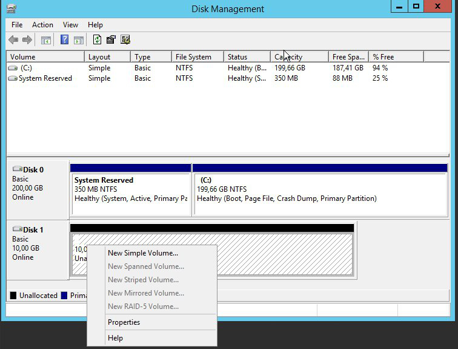

## Préambule
Vous avez probablement [créé un nouveau volume additionnel](../guide.fr-fr.md){.ref}, ou disque additionnel.

Ce guide vous explique comment créer un disque supplémentaire puis le rattacher sur l'une de vos instances.


### Prérequis
- Une [instance](../guide.fr-fr.md){.ref}
- Un [volume additionnel](../guide.fr-fr.md){.ref} rattaché


## Montage du disque

### Depuis une instance sous Linux
- Lister les disques

```bash
sudo fdisk -l /dev/vd*
```


> [!success]
>
> /dev/vda correspond généralement au disque de votre instance, /dev/vdb sera
> donc le premier volume supplémentaire.
> Certains systèmes d'exploitation reconnaissent les disques en utilisant un
> autre driver, ils apparaitront alors en /dev/sd*.
> 

- Créer une partition avec parted

```bash
sudo parted /dev/vdb
mktable gpt
mkpart primary ext4 512 100%
quit
```

- Formater la partition

```bash
sudo mkfs.ext4 /dev/vdb1
```

- Monter la partition

```bash
sudo mount /dev/vdb1 /mnt
```

- Vérification du montage

```bash
mount /dev/vdb1
```


> [!success]
>
> Pour un montage de disque persistant, il faudra modifier le fichier
> /etc/fstab :
> - Récupérer l'ID du bloc
> - Ajouter votre disque dans le fichier /etc/fstab :
>


### Depuis une instance sous Windows
- Accéder au l'outil de gestion de disque

{.thumbnail}

- Formater le disque

{.thumbnail}


Attention : Si le message "offline (the disk is offline because of policy set by an administrator)" apparaît, il faudra modifier les attributs des disques en effectuant un clic droit sur votre disque, puis sélectionner "Online" puis "Initialize" ou en utilisant Diskpart :

- Lancer Powershell ou une invite de commande
- Vérification de la stratégie appliquée
- Changer la stratégie
- Application de la stratégie sur le disque supplémentaire
- Initialiser le disque depuis le gestionnaire de disques puis procéder au formatage du disque.

Une fois le disque formaté, vous pourrez y accéder simplement depuis votre explorateur de fichiers.


{.thumbnail}