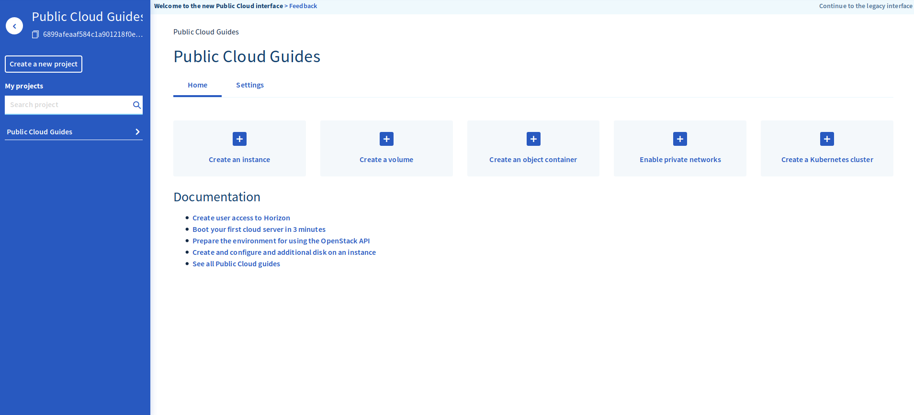
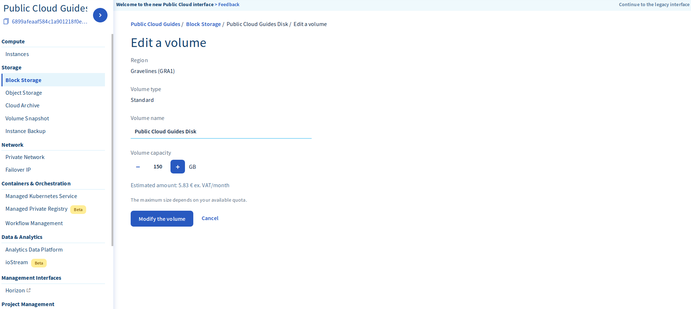
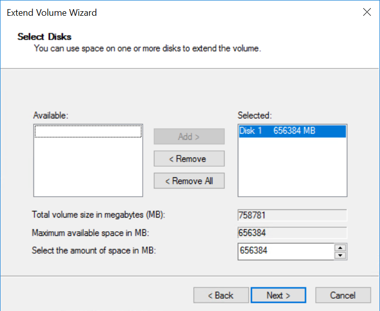

**Última actualización: 14 de noviembre de 2019**

## Objetivo

Si ha alcanzado la capacidad máxima de almacenamiento de su disco adicional, es posible aumentar su tamaño. 

**Esta guía explica cómo aumentar el tamaño de un disco adicional y cómo ampliar la partición principal.**

## Requisitos

* Tener una [instancia Public Cloud](https://www.ovhcloud.com/es/public-cloud/){.external} en su cuenta de OVHcloud
* Tener un [disco adicional](https://www.ovhcloud.com/es/public-cloud/block-storage/){.external} asociado a su instancia
* Tener acceso al [área de cliente de OVHcloud](https://www.ovh.com/auth/?action=gotomanager){.external}
* Tener acceso de administrador (root) a su instancia a través de SSH (solo para Linux)
* Tener acceso de administrador a su instancia a través de RDP (solo para Windows)

## Procedimiento

### Desde el área de cliente

Para desplegar una instancia public cloud, conéctese al [área de cliente de OVHcloud](https://www.ovh.com/auth/?action=gotomanager){.external}. Haga clic en `Public Cloud`{.action} en la esquina superior izquierda. En la pantalla siguiente, haga clic en la flecha junto al nombre por defecto del proyecto en la esquina superior izquierda de la pantalla. Seleccione a continuación el proyecto en el que desea ampliar el tamaño del disco adicional.

{.thumbnail}

Localice su disco Block Storage en la sección «Almacenamiento» del menú de la izquierda.

{.thumbnail}

Haga clic en los tres puntos situados a la derecha del disco y haga clic en Modificar. Se le redireccionará a esta página donde podrá modificar la capacidad del volumen de almacenamiento.

{.thumbnail}

Una vez terminado este paso, haga clic en el botón `Modificar el volumen`{.action}.


### Con Linux

Primero desmonte el disco con el siguiente comando:

```
admin@server-1:~$ sudo unmount /mnt/disk
```

Después, vuelva a crear la partición.

```
admin@server-1:~$ sudo fdisk /dev/vdb
Welcome to fdisk (util-linux 2.25.2).
Changes will remain in memory only, until you decide to write them.
Be careful before using the write command
```

```
Command (m for help): d

Selected partition 1
Partition 1 has been deleted.
```

```
Command (m for help): n

Partition type
p primary (0 primary, 0 extended, 4 free)
e extended (container for logical partitions)
Select (default p):
Using default response p.
Partition number (1-4, default 1):
First sector (2048-146800639, default 2048):
Last sector, +sectors or +size{K,M,G,T,P} (2048-146800639, default 146800639):

Created a new partition 1 of type 'Linux' and of size 70 GiB.
```

```
Command (m for help): w

The partition table has been altered.
Calling ioctl() to re-read partition table.
Syncing disks.
```

A continuación, compruebe de nuevo la partición.

```
#admin@server-1:~$ sudo e2fsck -f /dev/vdb1

e2fsck 1.42.12 (29-Aug-2014)
Pass 1: Checking inodes, blocks, and sizes
Pass 2: Checking directory structure
Pass 3: Checking directory connectivity
Pass 4: Checking reference counts
Pass 5: Checking group summary information
/dev/vdb: 12/3276800 files (0.0% non-contiguous), 251700/13107200 blocks
```

```
#admin@server-1:~$ sudo resize2fs /dev/vdb1

resize2fs 1.42.12 (29-Aug-2014)
Resizing the filesystem on /dev/vdb to 18350080 (4k) blocks.
The filesystem on /dev/vdb is now 18350080 (4k) blocks long.
```

Para terminar, monte y compruebe el disco.

```
#admin@server-1:~$ sudo mount /dev/vdb1 /mnt/disk/
```

```
#admin@server-1:~$ df -h
Filesystem Size Used Avail Use% Mounted on
/dev/vda1 9.8G 840M 8.6G 9% /
udev 10M 0 10M 0% /dev
tmpfs 393M 5.2M 388M 2% /run
tmpfs 982M 0 982M 0% /dev/shm
tmpfs 5.0M 0 5.0M 0% /run/lock
tmpfs 982M 0 982M 0% /sys/fs/cgroup
/dev/vdb1 69G 52M 66G 1% /mnt/disk
```

### Con Windows

Conéctese a su instancia con RDP. Una vez conectado, haga clic derecho en el `Menú Inicio`{.action} y después en `Administración de discos`{.action}.

{.thumbnail}

Cuando se abra la herramienta de administración de discos, aparecerá su nuevo disco como volumen desconocido con espacio no asignado, como se muestra a continuación.

{.thumbnail}

Si el disco está desconectado puede que se deba a alguna política aplicada a la instancia. Para solucionarlo, haga clic derecho sobre el disco y seleccione En línea.

{.thumbnail}

> [!primary]
>
En función de su versión de Windows, puede que necesite inicializar su disco adicional antes de utilizarlo. Para inicializarlo, haga clic derecho de nuevo sobre el disco y seleccione esta vez `Inicializar Disco`{.action}.
>

Si el volumen principal de su disco es inferior a la capacidad total del disco, haga clic derecho sobre el volumen y haga clic en `Ampliar volumen`{.action}

{.thumbnail}

Aparecerá a continuación el Asistente para extender volúmenes. Haga clic en `Siguiente`{.action} para iniciar el asistente.

{.thumbnail}

Ahora aumente el volumen hasta el tamaño deseado y haga clic en `Siguiente`{.action} cuando haya terminado.

{.thumbnail}

Por último, haga clic en `Finalizar`{.action} para completar el proceso.

{.thumbnail}

## Más información

* [Crear y configurar un disco adicional en una instancia](https://docs.ovh.com/es/public-cloud/crear_y_configurar_un_disco_adicional_en_una_instancia/){.external}
* Interactúe con nuestra comunidad de usuarios en <https://community.ovh.com/en/>.