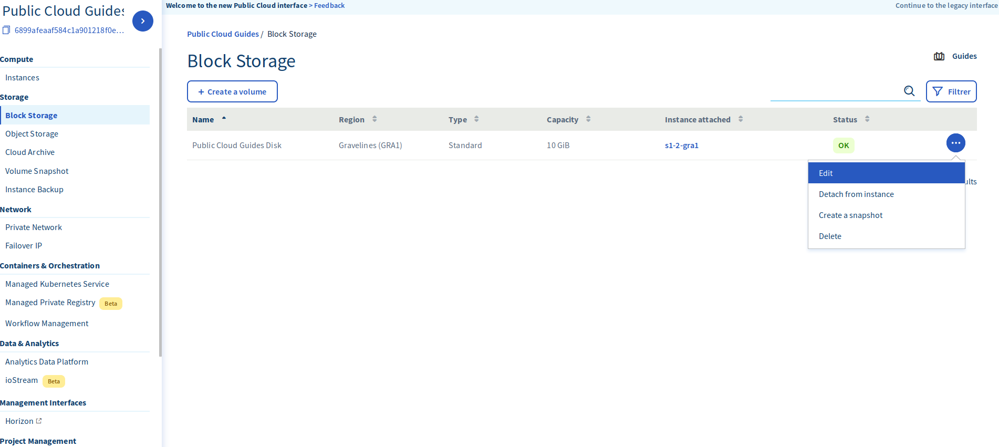

**Ultimo aggiornamento: 14/11/2019**

## Obiettivo

Se hai raggiunto la capacità massima di storage del tuo disco aggiuntivo, puoi aumentare lo spazio disponibile e la sua partizione. 

**Come aumentare la spazio del tuo disco aggiuntivo e la sua partizione**

## Prerequisiti

* Aver creato un’istanza [Public Cloud](https://www.ovhcloud.com/it/public-cloud/){.external} nel tuo account OVHcloud
* Disporre di un [disco aggiuntivo](https://www.ovhcloud.com/it/public-cloud/block-storage/){.external}
* Avere accesso allo [Spazio Cliente](https://www.ovh.com/auth/?action=gotomanager){.external}
* Avere accesso all’istanza via SSH con l’utente root (solo per Linux)
* Avere accesso all’istanza via RDP con l’utente root (solo per Windows)

## Procedura

### Dallo Spazio Cliente

Per distribuire un’istanza Public Cloud accedi allo [Spazio Cliente OVH](https://www.ovh.com/auth/?action=gotomanager){.external}. Clicca su`Public Cloud`{.action} in alto a sinistra. Poi, nella nuova pagina, clicca sulla freccia accanto al nome del progetto predefinito in alto a sinistra. Ora seleziona il progetto su cui vuoi modificare la dimensione del disco aggiuntivo.

{.thumbnail}

Scegli la localizzazione del tuo disco Block Storage nella sezione ”Storage” del menu a sinistra.

{.thumbnail}

Poi clicca sui tre puntini a destra del disco e seleziona Modifica. Sarai reindirizzato alla pagina in cui è possibile modificare la capacità del volume.

{.thumbnail}

A questo punto, clicca sul pulsante `Modifica il volume`{.action}.


### Da Linux

Per prima cosa, smonta il disco:

```
admin@server-1:~$ sudo unmount /mnt/disk
```

Ricrea la partizione:

```
admin@server-1:~$ sudo fdisk /dev/vdb
Welcome to fdisk (util-linux 2.25.2).
Changes will remain in memory only, until you decide to write them.
Be careful before using the write command
```

```
Command (m for help): d

Selected partition 1
Partition 1 has been deleted.
```

```
Command (m for help): n

Partition type
p primary (0 primary, 0 extended, 4 free)
e extended (container for logical partitions)
Select (default p):
Using default response p.
Partition number (1-4, default 1):
First sector (2048-146800639, default 2048):
Last sector, +sectors or +size{K,M,G,T,P} (2048-146800639, default 146800639):

Created a new partition 1 of type 'Linux' and of size 70 GiB.
```

```
Command (m for help): w

The partition table has been altered.
Calling ioctl() to re-read partition table.
Syncing disks.
```

Verifica la partizione:


```
#admin@server-1:~$ sudo e2fsck -f /dev/vdb1

e2fsck 1.42.12 (29-Aug-2014)
Pass 1: Checking inodes, blocks, and sizes
Pass 2: Checking directory structure
Pass 3: Checking directory connectivity
Pass 4: Checking reference counts
Pass 5: Checking group summary information
/dev/vdb: 12/3276800 files (0.0% non-contiguous), 251700/13107200 blocks
```

```
#admin@server-1:~$ sudo resize2fs /dev/vdb1

resize2fs 1.42.12 (29-Aug-2014)
Resizing the filesystem on /dev/vdb to 18350080 (4k) blocks.
The filesystem on /dev/vdb is now 18350080 (4k) blocks long.
```

Infine, monta e verifica il disco:

```
#admin@server-1:~$ sudo mount /dev/vdb1 /mnt/disk/
```

```
#admin@server-1:~$ df -h
Filesystem Size Used Avail Use% Mounted on
/dev/vda1 9.8G 840M 8.6G 9% /
udev 10M 0 10M 0% /dev
tmpfs 393M 5.2M 388M 2% /run
tmpfs 982M 0 982M 0% /dev/shm
tmpfs 5.0M 0 5.0M 0% /run/lock
tmpfs 982M 0 982M 0% /sys/fs/cgroup
/dev/vdb1 69G 52M 66G 1% /mnt/disk
```

### Da Windows

Accedi alla tua istanza via Remote Desktop Protocol (RDP). Una volta effettuato l’accesso, clicca con il tasto destro del mouse sul menu `Start`{.action} e poi su `Gestione disco`{.action}.

{.thumbnail}

Quando il pannello di gestione dei dischi si apre, visualizzi il nuovo disco come un volume sconosciuto e con lo spazio non allocato, come mostrato qui di seguito: 

{.thumbnail}

Se il disco è offline, potrebbe dipendere da una politica applicata sull’istanza. Per modificare la politica, fai click sul tuo disco con il tasto destro e seleziona “Online”.

{.thumbnail}

> [!primary]
>
A seconda della versione di Windows, potrebbe essere necessario inizializzare il disco aggiuntivo prima di poterlo usare. Per farlo, fai click sul tuo disco con il tasto destro e seleziona `Inizializza Disco`{.action}.
>

Se il volume principale del tuo disco è inferiore all’intera capacità del disco, fai click sul volume con il tasto destro e poi su `Estendi Volume`{.action}.

{.thumbnail}

A questo punto, visualizzi Extend Volume Wizard. Clicca su `Avanti`{.action} per avviare la procedura guidata.

{.thumbnail}

Ora, aumenta la partizione del disco e infine clicca su `Avanti`{.action}.

{.thumbnail}

Infine, clicca su `Termina`{.action}per completare l’operazione.

{.thumbnail}

## Per saperne di più 

* [Crea e configura un disco aggiuntivo sulla tua istanza](https://docs.ovh.com/it/public-cloud/crea_e_configura_un_disco_aggiuntivo_sulla_tua_istanza/){.external}
* Contatta la nostra Community di utenti all’indirizzo <https://community.ovh.com/en/>.