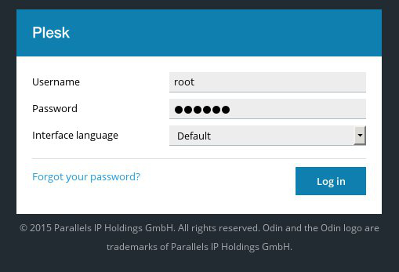
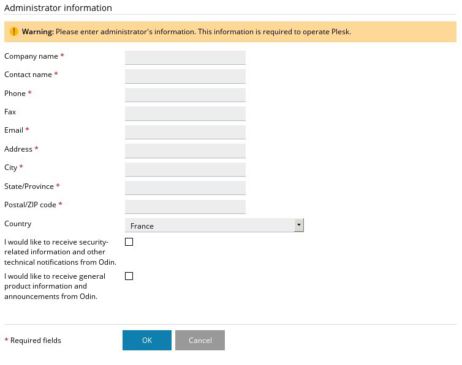

**Stand 11.07.2019**

## Einleitung

Plesk ist ein einfach zu verwendendes Server-Verwaltungsinterface. Sie können es auf Ihren OVH Public Cloud Instanzen einrichten und verwenden.

**In dieser Anleitung erfahren Sie, wie Sie Plesk auf Ihrer Public Cloud Instanz einrichten.** 

> [!warning]
> 
> OVH stellt Ihnen Dienstleistungen zur Verfügung, für die Sie die alleinige Verantwortung tragen. Da wir keinen Zugriff auf diese Maschinen haben, können wir hierfür keinerlei Administrator-Aufgaben übernehmen oder sonstige Hilfeleistung anbieten. Es liegt daher in Ihrer Verantwortung, das Softwaremanagement und die tägliche Sicherheit zu gewährleisten.
>
> Wir stellen Ihnen diese Anleitung zur Verfügung, um Ihnen bei der Bewältigung alltäglicher Verwaltungsaufgaben zu helfen. Wir empfehlen Ihnen jedoch, sich an einen spezialisierten Dienstleister zu wenden, wenn Sie Schwierigkeiten oder Zweifel hinsichtlich der Verwaltung, Nutzung oder Sicherheit eines Servers haben. Sie können sich auch jederzeit an unsere [Community](https://community.ovh.com/en/){.external} wenden, um sich mit anderen Benutzern auszutauschen.
>

## Voraussetzungen

- Sie haben im [OVH Kundencenter](https://www.ovh.com/auth/?action=gotomanager) eine Public Cloud Instanz erstellt.
- [Sie sind Root-Benutzer und verfügen über das zugehörige Passwort](../root-rechte_erlangen_und_passwort_festlegen/).

## Beschreibung

### Schritt 1: Plesk installieren

Plesk kann ganz einfach über eine SSH-Verbindung installiert werden. Laden Sie hierzu das Plesk-Installationsskript herunter und starten Sie dieses mit dem für Sie passenden Befehl:

- **Nicht angepasste Plesk-Standardinstallation**

```bash
# sh <(curl https://autoinstall.plesk.com/one-click-installer || wget -O - https://autoinstall.plesk.com/one-click-installer)
```

- **Angepasste Plesk-Installation**

```bash
# sh <(curl https://autoinstall.plesk.com/plesk-installer || wget -O - https://autoinstall.plesk.com/plesk-installer)
```

Warten Sie, bis Plesk fertig installiert ist. 

### Schritt 2: Plesk konfigurieren

Sie können sich jetzt auf dem Plesk-Interface einloggen, um es zu konfigurieren. Geben Sie hierzu in Ihrem Browser die Adresse `https://IP.der.lnstanz:8443`ein. Sie werden nun aufgefordert, Ihre **Root**-Login-Daten einzugeben.

{.thumbnail}

Sobald Sie eingeloggt sind, öffnet sich ein Konfigurationsassistent. In diesem können Sie die Anzeige des Plesk-Interface einrichten. Wählen Sie die Anzeigenart aus, die am besten zur geplanten Verwendung passt.

{.thumbnail}

Wählen Sie dann die Anzeige des Plesk-Interface aus, die Sie verwenden möchten.

{.thumbnail}

Geben Sie anschließend Informationen für den Zugriff auf Ihre Instanz ein:

- Hostname
- IP-Adresse
- Root-Passwort

Geben Sie diese in den entsprechenden Feldern ein.

{.thumbnail}

Geben Sie nun die Informationen des **Administrator**-Accounts ein.

{.thumbnail}

### Schritt 3: Eine Lizenz hinzufügen

Um Ihre Plesk-Lizenz hinzuzufügen, halten Sie den Schlüssel bereit, den Sie von Ihrem Anbieter erhalten haben.

> [!primary]
>
> Wir bieten keine Plesk-Lizenzen für unsere Public Cloud Instanzen an. Sie können eine Lizenz über die [Plesk](https://www.plesk.com/){.external}-Website erwerben.
> 

Bei Ihrem ersten Login auf das Interface werden Sie automatisch dazu aufgefordert, die Plesk-Lizenz zu installieren.

{.thumbnail}

Sie möchten Ihre Lizenz ändern, beispielsweise, um einen Test-Schlüssel zu ersetzen oder zu einem anderen Angebot zu wechseln. Gehen Sie hierzu im Plesk-Interface in den Bereich `Server Management` und klicken Sie dann auf `Tools & Settings`{.action}. Wählen Sie anschließend im Bereich **Plesk** `Licence Management`{.action} aus.

Nachdem Sie den neuen Schlüssel hinzugefügt haben, wird der installierte Lizenz-Typ oben links in der Menüleiste angezeigt.

{.thumbnail}

## Weiterführende Informationen

[Offizielle Plesk-Dokumentation](https://docs.plesk.com/en-US/onyx/){.external}

Für den Austausch mit unserer User Community gehen Sie auf <https://community.ovh.com/en/>.
