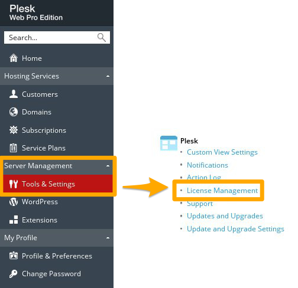

**Ultimo aggiornamento: 11/07/2018**

## Obiettivo

Plesk è un’interfaccia di gestione server di semplice utilizzo, disponibile all’installazione su tutte le istanze Public Cloud OVH.

**Questa guida ti mostra come installare e configurare l’interfaccia Plesk sulla tua istanza Public Cloud.** 

> [!warning]
> 
> OVH mette a disposizione i server, ma non è autorizzata ad accedervi e non si occupa quindi della loro amministrazione. Garantire quotidianamente la gestione software e la sicurezza di queste macchine è quindi responsabilità dell’utente.
>
> Questa guida ti aiuta a muovere i primi passi nell’utilizzo di Plesk sulle istanze Public Cloud OVH. Tuttavia, in caso di difficoltà o dubbi relativi ad amministrazione e sicurezza, ti consigliamo di contattare un fornitore specializzato o rivolgerti alla [Community OVH](https://www.ovh.it/community/){.external} per confrontarti con altri utenti.
>

## Prerequisiti

- [Aver creato un’istanza dallo Spazio Cliente OVH](../crea_unistanza_dallo_spazio_cliente_ovh/)
- [Poter accedere come utente root e impostare la password associata](https://docs.ovh.com/it/public-cloud/imposta_una_password_amministratore/)

## Procedura

### Step 1: installa Plesk

Accedi all’istanza via SSH, scarica e poi esegui lo script di installazione di Plesk utilizzando uno di questi comandi:

- **Installazione predefinita non personalizzata**

```bash
# sh <(curl https://autoinstall.plesk.com/one-click-installer || wget -O - https://autoinstall.plesk.com/one-click-installer)
```

- **Installazione personalizzata**

```bash
# sh <(curl https://autoinstall.plesk.com/plesk-installer || wget -O - https://autoinstall.plesk.com/plesk-installer)
```

Attendi il completamento dell’operazione. 

### Step 2: configura Plesk

Una volta effettuata l’installazione, è possibile accedere all’interfaccia Plesk per configurarla.  Apri il browser e connettiti all’indirizzo `https://IP.dell.istanza:8443` utilizzando le credenziali di **root**.

{.thumbnail}

Compare l’assistente di configurazione guidata, che permette di impostare la visualizzazione dell’interfaccia Plesk in base al tipo di attività svolta.

{.thumbnail}

Seleziona il tipo di visualizzazione da applicare:

{.thumbnail}

Inserisci le informazioni di accesso all’istanza nei campi corrispondenti:

- hostname
- indirizzo IP
- password root

 

{.thumbnail}

A questo punto, inserisci le informazioni relative al tuo account **amministratore**:

{.thumbnail}

### Step 3: aggiungi una licenza

Per aggiungere una licenza Plesk, assicurati per prima cosa di avere a disposizione la chiave ricevuta dal tuo provider.

> [!primary]
>
> OVH non fornisce licenze Plesk per la soluzione Public Cloud. Per ottenerne una, accedi al sito di [Plesk](https://www.plesk.com/){.external}.
> 

La prima volta che ti connetti all’interfaccia, si apre automaticamente una pagina che propone di installare la licenza:

{.thumbnail}

Per modificare la licenza, ad esempio per sostituire la chiave di licenza di prova o cambiare offerta, accedi all’interfaccia di gestione e, nella sezione `Gestione del server` della colonna a sinistra, clicca su `Strumenti e impostazioni`{.action} > `Gestione di licenza`{.action}.

Una volta aggiunta la nuova chiave, il tipo di licenza visualizzato in alto a destra nella barra del menu si aggiorna.

{.thumbnail}

## Per saperne di più

[Documentazione ufficiale Plesk](https://docs.plesk.com/it-IT/onyx/){.external}

Contatta la nostra Community di utenti all’indirizzo <https://www.ovh.it/community/>.