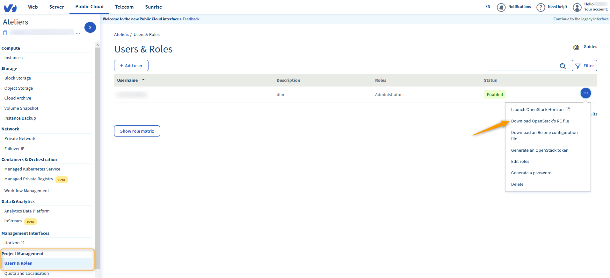

**Dernière mise à jour le 20/11/2019**

## Objectif

Charger les variables d'environnement OpenStack sur votre poste vous permettra d'utiliser l'API OpenStack et ainsi gérer votre infrastructure depuis celle-ci.


## Prérequis
- Avoir créé un utilisateur OpenStack. Consultez [le guide qui y est dédié](https://docs.ovh.com/fr/public-cloud/creer-un-acces-a-horizon/#creer-un-utilisateur-openstack)
- Avoir préparé l'environnement pour utiliser OpenStack. Consultez pour cela le guide suivant : [Préparer l’environnement pour utiliser l’API OpenStack](https://docs.ovh.com/fr/public-cloud/preparer-lenvironnement-pour-utiliser-lapi-openstack/)

## En pratique

### Étape 1 : récupérer les variables

Afin de récupérer vos variables d'environnement, vous pouvez télécharger le fichier OpenRC de votre utilisateur OpenStack créé au préalable.

Pour cela, rendez-vous dans la rubrique `Users & Roles`{.action}, cliquez sur les `...`{.action} à droite de votre utilisateur et sélectionnez `Télécharger le fichier RC d'OpenStack`{.action}.

{.thumbnail}

Un fichier OpenRC correspond à un utilisateur et aussi à une zone. Vous ne pouvez pas gérer plusieurs zones dans un même fichier.

### Étape 2 : charger les variables

#### **Sous Linux**

* Ouvrez un terminal, ou connectez-vous avec l'utilisateur qui fera les appels à l’API OpenStack
* Chargez le contenu du fichier dans l’environnement courant. Le mot de passe de l’utilisateur Horizon correspondant vous sera alors demandé.

```bash
admin@vpsxxxxxx:~$ source openrc.sh
Please enter your OpenStack Password:
```

Comme indiqué dans le guide [Accéder à l’interface Horizon](https://docs.ovh.com/fr/public-cloud/creer-un-acces-a-horizon/), le mot de passe n'est visible qu'une seule fois, à sa création.

Si vous avez oublié celui-ci, il faudra le recréer.

Si les CLI ont déjà été installés, vérifiez simplement le bon fonctionnement :

```bash
admin@vpsxxxxxx:~$ nova list
+--------------------------------------+------+--------+------------+-------------+------------------------+
| ID                                   | Name | Status | Task State | Power State | Networks               |
+--------------------------------------+------+--------+------------+-------------+------------------------+
| 2278e269-a529-40cc-9a08-794fda9302d3 | deb8 | ACTIVE | -          | Running     | Ext-Net=xx.xxx.xx.xxx |
+--------------------------------------+------+--------+------------+-------------+------------------------+
```

Il est possible de stocker en dur le mot de passe de l'utilisateur Horizon. Pour cela, remplacez :

```bash
echo "Please enter your OpenStack Password: "
read -sr OS_PASSWORD_INPUT
export OS_PASSWORD=$OS_PASSWORD_INPUT
```

Par :

```bash
#echo "Please enter your OpenStack Password: "
#read -sr OS_PASSWORD_INPUT
export OS_PASSWORD="Mot de passe de l'utilisateur Horizon"
```

Par défaut, il faudra charger cet environnement après chaque ouverture de session dans l'environnement courant. Il est possible de rendre cela permanent en ajoutant le source openrc.sh au fichier bashrc. Cela requiert de fixer le mot de passe dans le fichier.


#### **Sous Windows**

Le fichier OpenRC n'est pas conçu pour être lancé sur Windows.

Vous avez donc 2 solutions pour charger les variables d'environnement :

- Il faudra adapter le fichier en modifiant certaines commandes. En effet, **export** peut être remplacé par **set** :

```bash
set OS_PASSWORD="Mot de passe de l'utilisateur Horizon"
```

- Il est possible de charger les variables directement depuis les paramètres système : Panneau de configuration > Système > Paramètres systèmes avancés > Variables d'environnement :


{.thumbnail}

## Aller plus loin

Pour apprendre à utiliser OpenStack : [Documentation OpenStack](https://docs.openstack.org/train/){.external}

Échangez avec notre communauté d'utilisateurs sur <https://community.ovh.com>
