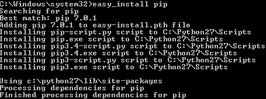

## 
Um Ihre Public Cloud Dienstleistungen mit einem Terminal zu verwalten, können Sie die OpenStack Clients unter Python installieren.
So können Sie unter anderem das Object Storage verwalten und die verschiedenen Aktionen automatisieren, die Sie mit diesen Clients durchführen können.

In dieser Anleitung wird die Vorgehensweise zur Installation der OpenStack Clients beschrieben.


## Debian

- Öffnen Sie ein Terminal oder eine SSH Verbindung hin zur zu konfigurierenden Umgebung

- [Root-Rechte erlangen und Passwort festlegen](https://www.ovh.de/g1786.root-rechte_erlangen_und_passwort_festlegen)

- Führen Sie ein Update des Paket-Caches durch:

```
root@vps187763:~# apt-get update
```


- Installieren Sie die Clients für Nova (compute) und glance (image service):

```
root@vps187763:~# apt-get install python-glanceclient python-novaclient -y
```


Nachdem Sie die Schritte im vorherigen Abschnitt durchgeführt haben, empfehlen wir Ihnen die Erstellung eines neuen Benutzers, um nicht ständig im Kontext des Benutzers root zu arbeiten.

- Die Hilfe für die nova und glance CLI können Sie wie folgt einsehen:

```
admin@vps187763:~$ nova help
```


```
admin@vps187763:~$ glance help
```


- Die ausführliche Dokumentation der OpenStack API finden Sie [hier](http://docs.openstack.org/cli-reference/content/)


## CentOS

- Öffnen Sie ein Terminal oder eine SSH Verbindung hin zur zu konfigurierenden Umgebung

- [Root-Rechte erlangen und Passwort festlegen](https://www.ovh.de/g1786.root-rechte_erlangen_und_passwort_festlegen)

- Führen Sie ein Update des Paket-Caches durch:

```
[root@vps187769 ~]# yum update -y
```


- Installieren Sie das rpm-Paket rdo-release:

```
[root@vps187769 ~]# yum install -y https://rdoproject.org/repos/rdo-release.rpm
```


- Installieren Sie nova:

```
[root@vps187769 ~]# yum install -y python-novaclient
```


- Installieren Sie glance:

```
[root@vps187769 ~]# yum install -y python-glanceclient
```


Quelle: [https://www.rdoproject.org/Quickstart](https://www.rdoproject.org/Quickstart)
Nachdem Sie die Schritte im vorherigen Abschnitt durchgeführt haben, empfehlen wir Ihnen die Erstellung eines neuen Benutzers, um nicht ständig im Kontext des Benutzers root zu arbeiten.

- Die Hilfe für die nova und glance CLI können Sie wie folgt einsehen:

```
[root@vps187769 ~]# nova help
```


```
[root@vps187769 ~]# glance help
```


- Die ausführliche Dokumentation der OpenStack API finden Sie [hier](http://docs.openstack.org/cli-reference/content/)


## 

- Laden Sie die [Version 2.7.10 von Python](https://www.python.org/downloads/release/python-2710/) herunter und installieren Sie diese.

- Öffnen Sie eine Eingabeaufforderung


Installieren Sie PIP per easy_install:

{.thumbnail}

- Installieren Sie Swift


{.thumbnail}

- Sie können die CLI Hilfe mit folgendem Befehl aufrufen:


```
C:\Windows\system32>swift --help
```


## 
[Zurück zum Index der Cloud Hilfen]({legacy}1785)

