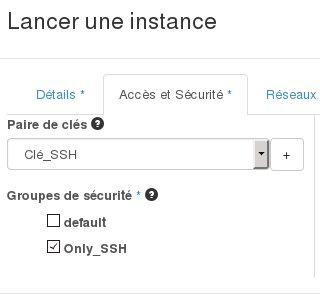

**Última actualización: 08/11/2018**

## Objetivo

Por motivos de seguridad, es posible configurar y utilizar reglas de filtrado que definan los accesos a sus instancias. En ella, puede autorizar o bloquear determinadas conexiones entrantes o salientes utilizando grupos de seguridad. Estas reglas pueden aplicarse al tráfico procedente de determinadas direcciones IP, o incluso a las instancias configuradas en grupos de seguridad en particular.

**Esta guía explica cómo crear un grupo de seguridad y configurarlo en una instancia de Public Cloud.**

## Requisitos

- Estar conectado a Horizon. Para más información, consulte la guía [Conectarse a Horizon](https://docs.ovh.com/es/public-cloud/crear_un_acceso_a_horizon/){.external}.

## Procedimiento

### 1\. crear un grupo de seguridad

En el menú `Acceso y seguridad`{.action}, abra la pestaña `Grupos de seguridad`{.action}. Una tabla lista los grupos de seguridad creados. El grupo "default" ya está listado. que permite pasar todo el tráfico entrante y saliente.

Para añadir un nuevo grupo de seguridad, haga clic en el botón `Crear un grupo de seguridad`{.action}.

{.thumbnail}

En la nueva página, introduzca un nombre y una descripción para el grupo que vaya a crear. A continuación, haga clic en el botón `Crear un grupo de seguridad`{.action}.

{.thumbnail}

A continuación, en la pestaña `Grupos de seguridad`{.action}, la tabla mostrará el grupo que acaba de crear. Las reglas están configuradas por defecto. estas últimas dejan pasar únicamente el tráfico saliente. Si desea modificarlas, vaya al siguiente paso.

Si lo necesita, vaya al paso 3\. Configurar un grupo de seguridad en la instancia[ ](./#3-configurar-un-grupo-de-seguridad-en-su-instancia){.external} de dicho servicio.

### 2\. configurar las reglas de un grupo de seguridad

Para modificar las reglas o, si lo necesita, acceda al menú `Acceso y Seguridad`{.action} y abra la pestaña `Grupos de seguridad`{.action}. Haga clic en el botón `Gestionar las reglas`{.action}. 

{.thumbnail}

Si ha dejado las reglas por defecto en su grupo de seguridad, estas solo dejan pasar el tráfico saliente.

```bash
root@serveur:~$ ssh admin@149.xxx.xxx.177

ssh: connect to host 149.xxx.xxx.177 port 22: Connection timed out
```

A continuación, en la página de gestión de las reglas, podrá:

- eliminar una regla existente: Para ello, utilice el botón `Eliminar la regla`{.action}.
- añadir una nueva regla: para ello, haga clic en el botón `Añadir una regla`{.action}.

Al añadir una regla, deberá completar la información solicitada y hacer clic en `Añadir`{.action}. 

{.thumbnail}

Una vez que haya solicitado la adición, espere a que esta esté operativa.

```bash
root@serveur:~$ ssh admin@149.xxx.xxx.177

Last login: Tue Oct 13 13:56:30 2015 from proxy-109-190-254-35.ovh.net
admin@serveur1:~$
```

### 3\. configurar un grupo de seguridad en su instancia

Una vez conectado a la interfaz, seleccione el menú `Instancias`{.action}. Cree una nueva instancia desde esta página. 

A continuación, abra la pestaña `Acceso y seguridad`{.action} y seleccione el nuevo grupo de seguridad creado en el paso anterior.

{.thumbnail}

Es posible cambiar la configuración de los grupos de seguridad de las instancias ya creadas seleccionando la opción "Editar los grupos de seguridad".

{.thumbnail}

## Más información

Interactúe con nuestra comunidad de usuarios en <https://community.ovh.com/en/>.
