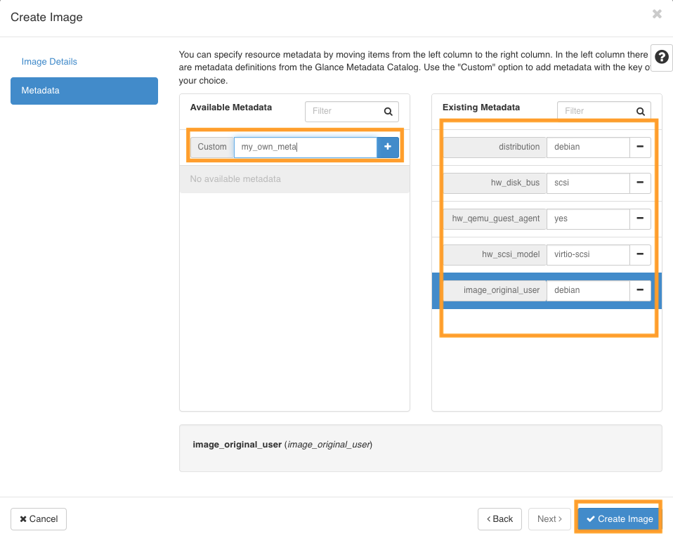

> [!primary]
> Tłumaczenie zostało wygenerowane automatycznie przez system naszego partnera SYSTRAN. W niektórych przypadkach mogą wystąpić nieprecyzyjne sformułowania, na przykład w tłumaczeniu nazw przycisków lub szczegółów technicznych. W przypadku jakichkolwiek wątpliwości zalecamy zapoznanie się z angielską/francuską wersją przewodnika. Jeśli chcesz przyczynić się do ulepszenia tłumaczenia, kliknij przycisk „Zaproponuj zmianę” na tej stronie.
> 

**Ostatnia aktualizacja z dnia 27-10-2020**

## Wprowadzenie

OVHcloud oferuje klientom Public Cloud gotowe do użycia obrazy oraz możliwość korzystania z ich własnych obrazów.

**Dowiedz się, jak importować Twoje obrazy do projektu Public Cloud.**

## Wymagania początkowe

- instancji [Public Cloud](../tworzenie_instancji_w_panelu_klienta_ovh/) w Panelu klienta OVHcloud
- swój własny obraz RAW/QCOW2 (zalecane formaty) 
- użytkownik [OpenStack](../tworzenie-i-usuwanie-uzytkownika-openstack/) 
- środowisko [OpenStack CLI ready](../przygotowanie_srodowiska_dla_api_openstack/) (jeśli korzystasz z CLI)

## W praktyce

### Wprowadzenie

Zalecamy używanie obrazów kompatybilnych z chmurą dostarczanych przez dystrybutora lub tworzenie własnego obrazu za pomocą rozwiązań takich jak [Packer OpenStack builder](https://docs.ovh.com/gb/en/public-cloud/packer-openstack-builder/).

Kompatybilne obrazy cloud są dostępne tutaj:

- https://cloud.centos.org/centos/
- https://cloud.debian.org/images/cloud/
- https://cloud-images.ubuntu.com/releases/
- https://alt.fedoraproject.org/cloud/

Inne systemy operacyjne oferują również obrazy ISO, które są również stosowane podczas [tworzenia obrazów z pakietem Packer](https://www.packer.io/docs/builders), takim jak QEMU i VirtualBox.

Upewnij się, czy na Twoich obrazach zainstalowane są następujące elementy, które mogą zostać zintegrowane ze środowiskiem cloud:

- *QEMU Guest Agent*\: operacja ta pozwala na korzystanie z większej ilości kopii zapasowych, ponieważ umożliwia hoście komunikację z instancją w celu zapisywania na żywo kopii zapasowych. Wszystkie systemy operacyjne nie są kompatybilne z tym pakietem.
- *cloud-init*\: pozwoli Ci to uruchomić instancję przy pierwszym uruchomieniu, dodając klucze SSH i konfigurację sieci. Większość systemów operacyjnych jest kompatybilna z tą funkcją.

Zalecamy użycie obrazów w formacie RAW lub QCOW2. Zoptymalizuj rozmiar obrazu, aby był jak najmniejszy, co zmniejszy koszty miesięcznego fakturowania oraz skróci czas generowania instancji.

### Importuj obraz

Z OpenStack istnieją dwie metody importowania własnego obrazu. Możesz to zrobić za pomocą wiersza poleceń OpenStack lub [interfejsu Horizon](https://horizon.cloud.ovh.net/auth/login/).

#### W wierszu poleceń OpenStack

Po przygotowaniu obrazu, postępuj zgodnie z poniższymi instrukcjami, aby rozpocząć import za pomocą CLI OpenStack:

1\. Pobierz plik openrc.sh dla użytkownika OpenStack w Panelu klienta OVHcloud (wybierz region, do którego chcesz pobrać plik).

{.thumbnail}

2\. Pobierz plik openrc:

```sh
źródło openrc.sh
```

3\. Po załadowaniu pliku zostaniesz poproszony o wpisanie hasła użytkownika OpenStack.

4\. Teraz możesz zaimportować obraz. Poniższy przykład zamówienia wykonuje następujące operacje:

- Format dysku to "RAW"
- Pobierz obraz z obecnej ścieżki o nazwie "debian9.raw"
- Nazwij obraz "Debian 9 - Mój obraz"
- Definiuje obraz na poziomie prywatnym
- Określa zalecane właściwości. Optymalna konfiguracja pozwala na korzystanie z funkcji takich jak *live-snapshot* i *cloud-init* (wymaga użycia nazwy użytkownika)

```sh
openstack image create —disk-format raw —container-format bare —file debian9.raw "Debian 9 - Mój obraz" —private —property distribution=debian —property hw_disk_bus=scsi —property hw_scsi_model=virtio-scsi —property hw_qemu_guest_agent=yes property image_origin_user=debian
```

#### Zarządzanie w interfejsie Horizon

Gdy Twój obraz jest gotowy do importu, postępuj zgodnie z poniższymi krokami, aby zaimportować go z interfejsu Web OpenStack Horizon:

1\. Zaloguj się do [interfejsu Horizon](https://horizon.cloud.ovh.net/auth/login/).

2\. W lewym górnym rogu wybierz region, do którego chcesz pobrać obraz.

{.thumbnail}

3\. Przejdź do sekcji `Obrazy`, a następnie kliknij `Create Image`{.action}.

{.thumbnail}

4\. Wprowadź szczegóły obrazu i wybierz plik z komputera.

{.thumbnail}

5\. Wprowadź metadane instancji (możesz również wpisać wybrane metadane), następnie kliknij `Create Image`{.action}.

{.thumbnail}

## Sprawdź również

Dołącz do społeczności naszych użytkowników na stronie <https://community.ovh.com/en/>.
