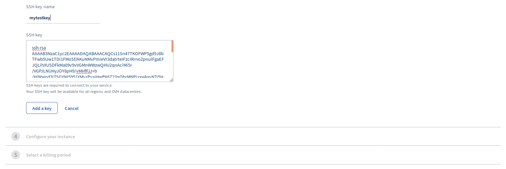
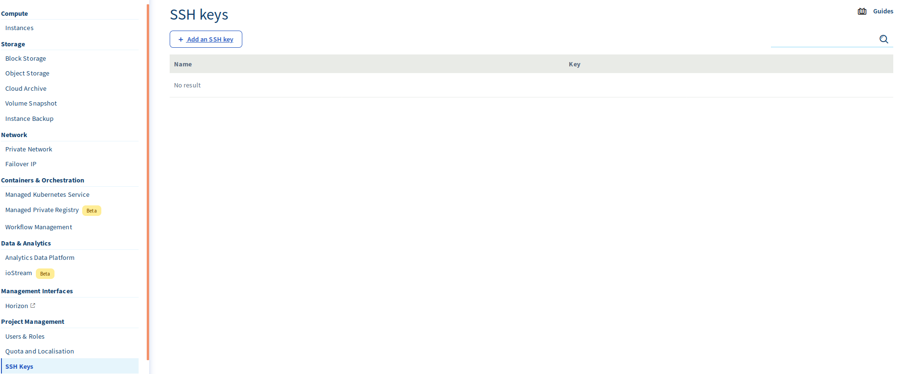
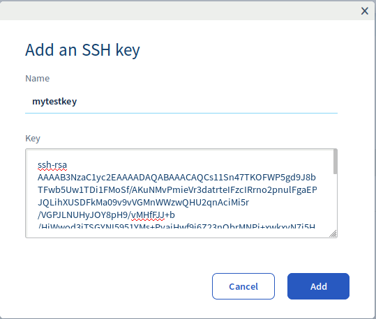

## Preamble
SSH is a protocol making it possible to access and communicate with a server in an authenticated and encrypted manner.

There are two ways to add an SSH key from the Public Cloud interface:

- The first and more direct method is done at the time of the creation of an instance.
- The second method is to add a key from the SSH key manager.

### Prerequisites
- An [SSH key](../howto_create_an_ssh_key/guide.en-gb.md){.ref}

## Creation of an instance
From the Public Cloud client interface, to create a cloud instance, click on `Create an instance`{.action} in the Instances menu under the `Compute`{.action} section on the left-hand menu.

{.thumbnail}

If you already have keys, simply select the key of your choice.

If you want to add a key, click on `Add a key`{.action} then click `Add a key`{.action}

Create a name for your key in the 'Name' box and paste the key into the box labeled 'Key'.

{.thumbnail}

## From the key management tool

Once the 'SSH keys' has been selected from the menu for your project, an 'SSH keys' tab will be available.

{.thumbnail}

Click on `Add a key`{.action} then click on `Add this key`{.action} after you have named the key and pasted the key in the box.

{.thumbnail}

This key will be available for use at the time of [creation your next cloud instance](../first_steps_start_my_first_server_within_3_minutes/guide.en-gb.md){.ref}.
