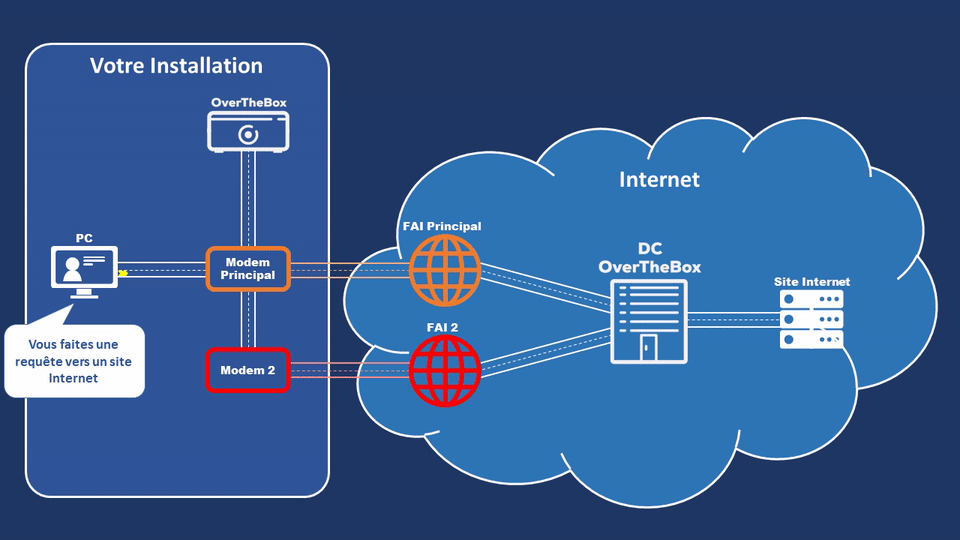

## Branchements finaux

> [!alert]
>
> La photo suivante illustre les branchements finaux pour une OverTheBox Intel. Avant d'en arriver là sur
> votre installation, il est impératif de suivre le  processus d'installation
> disponible sur les guides suivants (selon votre matériel) :
> 
[Mes 10 premières minutes avec OverTheBox Intel](https://docs.ovh.com/fr/overthebox/mes-10-premieres-minutes-avec-overthebox-intel/){.external}  
[Mes 10 premières minutes avec OverTheBox IT](https://docs.ovh.com/fr/overthebox/mes-10-premieres-minutes-avec-overthebox-intel/){.external}  
[Mes 10 premières minutes avec OverTheBox PLUS](https://docs.ovh.com/fr/overthebox/mes-10-premieres-minutes-avec-overthebox-plus/){.external}  
> 

{.thumbnail}

## Fonctionnement
Le principe est simple, tous les éléments du réseau sont reliés physiquement entre eux par le biais des ports Ethernet de l'un des modems (qui sera donc  **le Modem Principal** ). Cela inclut :

- Le deuxième modem (câble vert )
- L' OverTheBox (câble jaune )
- Vos Ordinateurs/Téléphones etc. ( port libre sur le modem principal)

C'est donc ce  **Modem Principal**  qui permet la liaison physique de tous ces éléments.

Lorsque votre ordinateur, branché sur le  **Modem Principal** , effectue une requête sur Internet; celle-ci transite d'abord par l' **OverTheBox**  qui va ensuite router les paquets intelligemment vers les 2 connexions Internet grâce aux ports Ethernet du  **Modem Principal** . Comme le montre l'illustration suivante :

{.thumbnail}