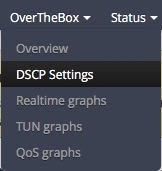
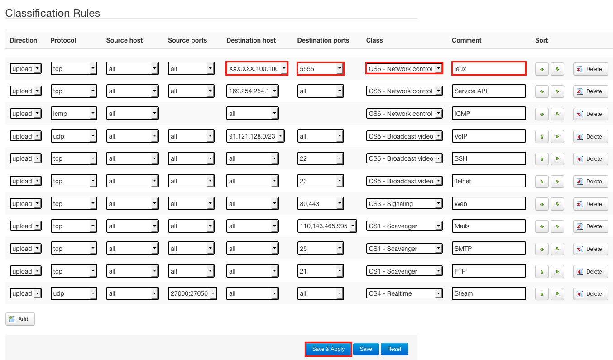

Il est par exemple nécessaire de prioriser le flux téléphonique par rapport à un téléchargement afin de garantir une communication optimale.

**OverTheBox**  propose alors une QoS que vous pouvez personnaliser en fonction du besoin. Cette dernière va permettre d'assurer une limitation de la bande passante sur les différentes files (en fonction de leur priorité), et ainsi d'assurer un lien non saturé au trafic que vous jugez prioritaire.

## Activation de la QoS
Afin d'activer la  **QoS**  par défaut, veuillez suivre le guide suivant : [Activer la QoS](../activer-la-qos/){.ref}

## Customisation de la QoS
Il est possible de marquer certains paquets (en **CSx** ) pour les inclure dans une priorité spécifique. Ainsi vous pourrez garantir une qualité de service optimale pour  **une application choisie** .

> [!alert]
>
> La configuration par défaut est déjà optimisée pour une utilisation
> générique ( Upload , VoIP  OVH  etc.), la customisation n'est
> conseillée que si vous souhaitez prioriser une application particulière.
> 

> [!success]
>
> Exemple :  Vous souhaitez, quoi qu'il arrive, garantir une stabilité pour
> votre jeu video en ligne. Le serveur de ce jeu a comme adresse IP publique
> XXX.XXX.100.100  sur le port  5555
> 

Pour ce faire :

- Rendez vous sur [http://overthebox.ovh (192.168.100.1)](http://overthebox.ovh){.external}
- Cliquez sur **"OvertheBox"**
- Cliquez sur **"DSCP Settings"**

{.thumbnail}

- Cliquez sur **"Add"**

Une nouvelle ligne apparait

- Remplissez cette dernière comme sur l'illustration suivante :
- Placez cette ligne en haut de la liste via les flèches de position comme sur l'illustration afin que le marquage soit pris en compte.

{.thumbnail}

- Cliquez sur **"Save & Apply"**

Cette manipulation permet de marquer les paquets souhaités en  **CS6** , ils seront donc inclus dans la file prioritaire.

Il est possible que cette configuration ne soit pas prise en compte tout de suite. Veuillez procéder à un redémarrage électrique de l' **OverTheBox** si ce n'est pas le cas.

Ceci est un exemple. Il est possible d'adapter cela à n'importe quel type d'application réseau.

> [!success]
>
> 
> > [!faq]
> >
> > Il y a en réalité 4 files de priorisation, voici la meilleure manière d'utiliser les tags en fonction de vos besoins :
> >> 
> >> - 
> Pour un trafic très prioritaire et nécessitant une faible latence : CS6
> >> - 
> Pour une priorité juste plus élevée que le trafic standard : CS3
> >> - 
> Pour la majorité du trafic : ne rien modifier
> >> - 
> Pour un trafic peu important : CS1
> >>
> >
> 