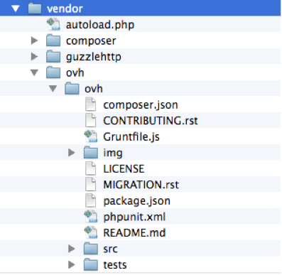

**Ultimo aggiornamento: 18/05/2020**

## Obiettivo

Gli SMS sono ampiamente utilizzati per inviare informazioni pratiche, per seguire lo stato di un ordine o di un processo transazionale, essere avvisati di un evento insolito o come promemoria di appuntamenti. Questa guida espone in dettaglio il metodo di invio di un primo SMS con l'API OVHcloud RESTful in PHP. 

**Impara come inviare SMS con l’API OVHcloud RESTful in PHP**

## Prerequisiti

- Disporre di un ambiente di sviluppo PHP
- Disporre di un account SMS OVHcloud con saldo SMS

## Procedura

### Step 1: Recupero del Wrapper PHP per le OVH API

Collegati al progetto [https://github.com/ovh/php-ovh](https://github.com/ovh/php-ovh)

Potrai integrare rapidamente il wrapper PHP grazie a Composer: [https://getcomposer.org/](https://getcomposer.org/)

Segui le istruzioni su GitHub, crea il file composer.json, come indicato nel progetto:
GitHub> Readme > Quickstart

Potrai acquisire nel tuo progetto la directory ./vendor/ovh/ovh/ oltre che il file autoload.php che permette di gestire tutte le dependency e le importazioni.

{.thumbnail}


### Step 2: Creazione degli identificativi

Per utilizzare l’API SMS sono necessari degli identificativi. Questi identificativi vengono creati una volta per individuare l’applicazione che invierà gli SMS. La loro durata di vita è configurabile.

Crea i tuoi identificativi di Script (tutte le chiavi in una volta) su questa pagina:
[https://api.ovh.com/createToken](https://eu.api.ovh.com/createToken/index.cgi?GET=/sms&GET=/sms/*/jobs&POST=/sms/*/jobs) (questo URL permette di avere automaticamente le autorizzazioni per gli step descritti in questa guida).


{.thumbnail}

In questo semplice esempio, recuperiamo le autorizzazioni per avere accesso alle informazioni sull’account, alla possibilità di vedere i messaggi in uscita e di inviare SMS.


- GET /sms
- GET /sms/\*/jobs
- POST /sms/\*/jobs


L’asterisco (\*) attiva le chiamate a questi metodi per tutti i tuoi account di SMS. Puoi ugualmente limitare le chiamate a un solo account, se gestisci diversi account SMS sul tuo account OVHcloud, sostituendo «/sms» con «/sms/NOME-ACCOUNT» e «/sms/\*/» con «/sms/NOME-ACCOUNT/».

In questo modo recupererai gli identificativi per il tuo script:

- Application Key (identifica la tua applicazione)
- Application Secret (autentica la tua applicazione)
- Consumer Key (autorizza l’applicazione ad accedere ai metodi scelti)


{.thumbnail}

L’ambiente è pronto, gli identificativi sono creati, ora puoi codificare il tuo script PHP.


### Step 3: Configurazione di un SDK PHP

Per semplificare le cose abbiamo configurato un SDK PHP che è possibile trovare [qui](https://github.com/ovh/php-ovh-sms).


### Step 4: Connessione base all’API

A questo punto è possibile verificare se la connessione all’API è buona visualizzando i dati di ciascun account SMS:

```
<?php
/**
 * Elenca e visualizza in dettaglio ogni account SMS
 * 
 * Fare riferimento all’indirizzo https://eu.api.ovh.com/createToken/index.cgi?GET=/sms&GET=/sms/*/jobs&POST=/sms/*/jobs
 * per generare le chiavi di accesso API per:
 *
 * GET /sms
 * GET /sms/*/jobs
 * POST /sms/*/jobs
 */

require __DIR__ . '/vendor/autoload.php';
use \Ovh\Api;

$endpoint = 'ovh-eu';
$applicationKey = "your_app_key";
$applicationSecret = "your_app_secret";
$consumer_key = "your_consumer_key";

$conn = new Api(    $applicationKey,
                    $applicationSecret,
                    $endpoint,
                    $consumer_key);
     
$smsServices = $conn->get('/sms/');
foreach ($smsServices as $smsService) {

    print_r($smsService);
}

?>
```


All’avvio di questo script dovresti recuperare l’elenco dei tuoi account SMS.


### Step 5: Invio del primo SMS

Per inviare degli SMS, utilizza il metodo POST jobs: [https://api.ovh.com/console/#/sms/{serviceName}/jobs#POST](https://api.ovh.com/console/#/sms/{serviceName}/jobs#POST)

> [!primary]
>
> **Unicamente per gli account OVHcloud in Francia:**
> 
> Il parametro senderForResponse permetterà di utilizzare un numero breve, il che consente di inviare direttamente degli SMS senza dover creare un mittente alfanumerico (ad esempio: il tuo cognome).
> 
> I numeri brevi permettono anche di ricevere delle risposte da parte dei destinatari dei tuoi SMS, il che può essere utile per un sondaggio sulla soddisfazione, un’applicazione di voto, un gioco,...
>


```
<?php
/**
 * Invia un SMS poi visualizza l’elenco degli SMS in uscita.
 * 
 * Fare riferimento all’indirizzo https://eu.api.ovh.com/createToken/index.cgi?GET=/sms&GET=/sms/*/jobs&POST=/sms/*/jobs
 * per generare le chiavi di accesso API per:
 *
 * GET /sms
 * GET /sms/*/jobs
 * POST /sms/*/jobs
 */

require __DIR__ . '/vendor/autoload.php';
use \Ovh\Api;

$endpoint = 'ovh-eu';
$applicationKey = "your_app_key";
$applicationSecret = "your_app_secret";
$consumer_key = "your_consumer_key";

$conn = new Api(    $applicationKey,
                    $applicationSecret,
                    $endpoint,
                    $consumer_key);
     
$smsServices = $conn->get('/sms/');
foreach ($smsServices as $smsService) {

    print_r($smsService);
}

$content = (object) array(
	"charset"=> "UTF-8",
	"class"=> "phoneDisplay",
	"coding"=> "7bit",
	"message"=> "Bonjour les SMS OVH par api.ovh.com",
	"noStopClause"=> false,
	"priority"=> "high",
	"receivers"=> [ "+3360000000" ],
	"senderForResponse"=> true,
	"validityPeriod"=> 2880
);
$resultPostJob = $conn->post('/sms/'. $smsServices[0] . '/jobs', $content);

print_r($resultPostJob);

$smsJobs = $conn->get('/sms/'. $smsServices[0] . '/jobs');
print_r($smsJobs);
        
?>
```


Ecco il tipo di risposta prevista:

```
sms-XXXXXX-1
Array
(
    [totalCreditsRemoved] => 1
    [invalidReceivers] => Array
        (
        )

    [ids] => Array
        (
            [0] => 26929925
        )

    [validReceivers] => Array
        (
            [0] => +3360000000
        )

)
Array
(
)
```

Recuperi l’account SMS (ServiceName) Ottieni una risposta con 1 credito consumato per un numero valido. Infine, verifica che non vi sono SMS in uscita.

## Per saperne di più

La console d'API ([https://api.ovh.com/console/#/sms](https://api.ovh.com/console/#/sms)) ti permetterà di scoprire altri metodi per facilitare l’integrazione di servizi SMS quali: SMS che permettono la risposta (unicamente per gli account OVHcloud in Francia), invio in massa con file CSV, mailing o con conferma di ricezione...


Contatta la nostra Community di utenti all’indirizzo [https://community.ovh.com/en](https://community.ovh.com/en).
