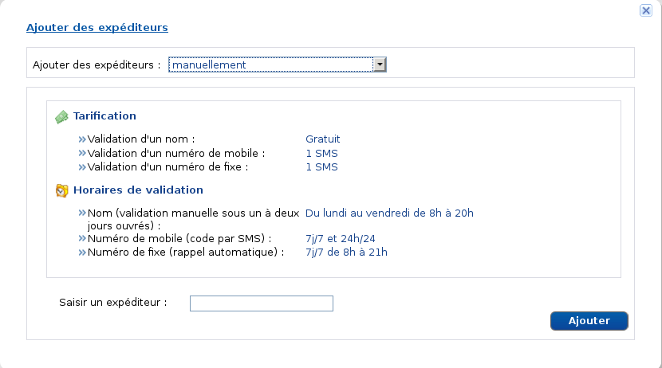
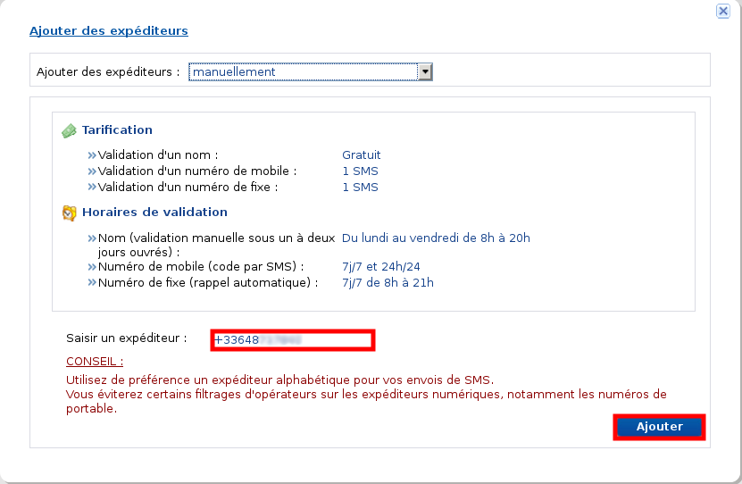
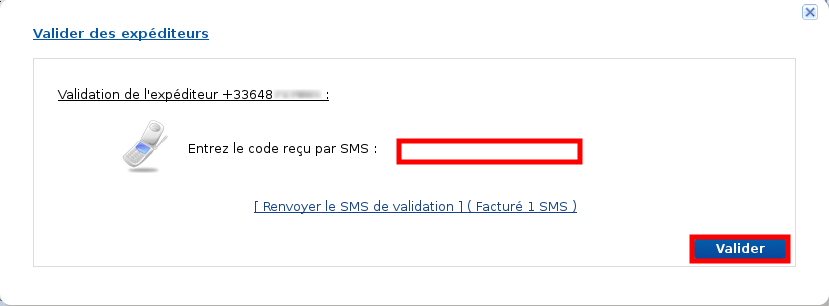
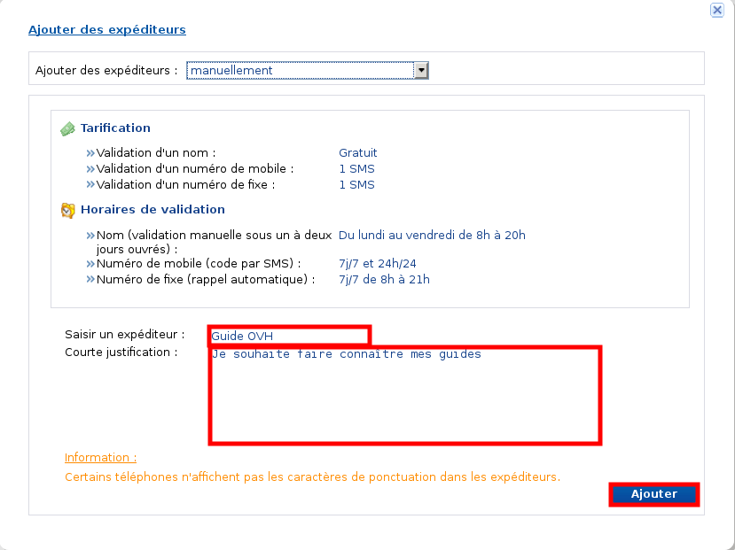

### Préambule {#préambule}

Les envois de SMS sont soumis à certaines restrictions en fonction du pays de destination. Ces restrictions sont souvent liées au type d'expéditeur. Nous allons voir comment les gérer afin d'éviter les échecs de réception.

**Sommaire :**

Niveau : Débutant

------------------------------------------------------------------------

### Rappel sur l'envoi de SMS {#rappel-sur-lenvoi-de-sms}

Lors de l'envoi d'un SMS, vous avez le choix entre trois types d'expéditeurs :

-   expéditeur permettant les réponses ;
-   expéditeur alphanumérique ;
-   autre expéditeur (type numérique).

Nous verrons dans ce guide comment la gestion des expéditeurs peut influer sur la bonne réception des SMS.

Pour avoir plus de détails sur l'envoi des SMS, veuillez consulter cette page : **&lt;lien vers guide d'envoi de SMS&gt;**.

------------------------------------------------------------------------

### Les différentes restrictions en fonction des destinations {#les-différentes-restrictions-en-fonction-des-destinations}

Lors de vos envois, il est possible que votre SMS n'aboutisse pas. Dans 99% des cas, c'est lié aux filtrages des opérateurs tiers. Voici une liste des exceptions à éviter lors de vos envois, et ce afin d'optimiser votre taux d'aboutissement. Les filtrages des opérateurs étant en constante évolution, nous vous invitons à nous contacter si vous constatez toujours des erreurs dans ces recommandations :

Azerbaidjan

-   Azercell utilise des filtrages. L'envoi avec un expéditeur alphanumérique n'est pas garanti.

Algerie

-   L'envoi avec un expéditeur alphanumérique est indisponible vers l'opérateur Djezzy.

Allemagne

-   L'envoi avec un expéditeur alphanumérique est indisponible.

Belgique

-   L'envoi avec un expéditeur alphanumérique est indisponible.

Bresil

-   Les accusés de réception ne sont pas garantis.
-   L'expéditeur est remplacé par un numéro long.

Canada

-   Seul l'envoi avec un expéditeur numérique est supporté.

Chine

-   L'envoi avec un expéditeur alphanumérique est indisponible.
-   Les accusés de réception ne sont pas garantis.

Etats-Unis

-   L'envoi avec un expéditeur alphanumérique est indisponible.
-   L'envoi avec un expéditeur court permettant la réponse n'est pas disponible.
-   Les accusés de réception ne sont pas garantis.

Égypte

-   Les expéditeurs alphanumériques ne sont pas pris en charge pour Vodafone Egypt.
-   Les accusés de réception ne sont pas garantis sur Vodafone Egypt et Mobinil.

France

-   Seul l'envoi avec un expéditeur de type alphanumérique est supporté vers les opérateurs Virgin Mobile, Orange et SFR.
-   Seul l'envoi avec un expéditeur de type alphanumérique est supporté vers l'opérateur Free. Il faut que la mention STOP:36111 soit présente.
-   [L'unicode](#GestiondesexpéditeursSMSetdesrestrictionsopérateursdestinataires-Unicode) (8bit) ainsi que les expéditeurs numériques ne sont actuellement pas supporté vers l'opérateur Bouygues.
-   L'envoi au format Flash n'est pas supporté vers l'opérateur Free.

Guadeloupe

-   Seul l'envoi avec un expéditeur de type alphanumérique est supporté vers l'opérateur Free. Il faut que la mention STOP:36111 soit présente.

Guyane

-   Seul l'envoi avec un expéditeur numérique est supporté vers l'opérateur Orange Guyane.

Hong Kong

-   Les expéditeurs alphanumériques ne sont pas pris en charge le dimanche par tous les opérateurs.
-   Les expéditeurs alphanumériques ne sont pas pris en charge pour l'opérateur Sunday.

Inde

-   Les expéditeurs seront remplacé par un numéro court.
-   Les message sont délivrés uniquement entre 9h et 21h.

Indonésie

-   Seul l'envoi avec un expéditeur numérique est supporté vers cette destination.
-   Telkomsel utilise le filtrage de contenu. L'envoi d'un SMS n'est pas recommandé sans test. Les accusés de réception ne sont pas fiables.

Italie

-   Les messages contenant des numéros surtaxés (899xxxxxx, 894xxxxxx, 895xxxxxx, 892xxxxxx, 166xxxxxx etc) peuvent être bloqués par les opérateurs.

Jordanie

-   Les expéditeurs alphanumériques peuvent être bloqués par l'opérateur Fastlink.

Koweit

-   Seul l'envoi avec un expéditeur numérique (non local) est supporté par l'opérateur Zain (MTCnet).

Malaisie

-   La Malaisie utilise des connexions directes. Les accusés de réception ne sont pas supportés par les opérateurs de réseaux.
-   Le régulateur de la Malaisie exige que tous les messages commerciaux fassent mention du prix dans leur contenu. Les clients sont invités à inclure "0,00 € " en début de message. Par exemple, "0,00 € Votre compte a été activé.".
-   **[L'unicode](#GestiondesexpéditeursSMSetdesrestrictionsopérateursdestinataires-Unicode)** (8bit) n'est pas supporté vers cette destination.

Maroc

-   L'envoi de masse avec un expéditeur alphanumérique peut être bloqué par l'opérateur Maroc Telecom.

Martinique

-   Seul l'envoi avec un expéditeur numérique est supporté vers l'opérateur Orange Martinique.

Mayotte

-   L'envoi avec un expéditeur alphanumérique est indisponible.

Nouvelle-Caledonie

-   Les expéditeurs alphanumériques sont bloqués par l'opérateur Mobilis.

Nouvelle-Zelande

-   Les expéditeurs alphanumériques sont bloqués par l'opérateur Telecom NZ.

Norvège

-   Seul l'envoi avec un expéditeur numérique est supporté vers l'opérateur Telenor.

Portugal

-   Seul l'envoi avec un expéditeur numérique est supporté vers l'opérateur Vodafone Telecel (abonnements pré-payés).

Qatar

-   L'envoi avec un expéditeur alphanumérique est indisponible.

Pologne

-   Seul l'envoi avec un expéditeur numérique est supporté vers l'opérateur P4 Play.

Roumanie

-   Seul l'envoi avec un expéditeur numérique est supporté vers l'opérateur Cosmote Romania.

Russie et Kazakhstan

-   Les expéditeurs numériques peuvent être remplacés par l'opérateur K-Mobile.
-   Les expéditeurs alphanumériques peuvent être remplacés par l'opérateur MTS.

Afrique Du Sud

-   L'envoi avec un expéditeur alphanumérique est indisponible vers l'opérateur Vodacom.

Corée Du Sud

-   L'envoi avec un expéditeur alphanumérique est indisponible.
-   Le contenu des messages est limité à 40 caractères coréens (80 octets).

Sri Lanka

-   L'envoi avec un expéditeur alphanumérique est indisponible vers l'opérateur MTN.

Tunisie

-   L'envoi avec un expéditeur alphanumérique est indisponible vers l'opérateur Tunisiana.

Suède

-   Les abonnés mobile de l'opérateur Spring Mobile ne peuvent recevoir les messages que lorsqu'ils sont couverts par le réseau de Tele2.

Taiwan

-   L'envoi en masse avec un expéditeur alphanumérique peut être bloqué vers l'opérateur Chunghwa Telecom.

Turquie

-   L'envoi avec un expéditeur alphanumérique peut être bloqué vers les opérateurs Avea, Turkcell et Vodafone Turkey.
-   L'opérateur Turkcell ne semble pas toujours accepter [l'unicode](#GestiondesexpéditeursSMSetdesrestrictionsopérateursdestinataires-Unicode) (8bit).

Réunion

-   Les expéditeurs numériques et alphanumériques peuvent être remplacés par “PINKNETWORK”.

Royaume-Uni

-   Seul l'envoi avec un expéditeur numérique est supporté.
-   L'envoi entre 22h00 et 08h00 est déconseillé.

Émirats arabes unis

-   Seul l'envoi avec un expéditeur numérique est supporté.
-   Les accusés de réception ne sont pas disponibles lors d'un envoi de masse.
-   L'aboutissement des messages avec expéditeurs numériques commençant par '0 'ou '971' ne sont pas garantis vers l'opérateur Etisalat.

Vietnam

-   L'envoi avec un expéditeur alphanumérique est indisponible vers cette destination.
-   Il est conseillé d'éviter d'utiliser un expéditeur numérique débutant par +84 vers l'opérateur Viettel.

------------------------------------------------------------------------

Certaines destinations ne permettent pas l'envoi en **Unicode (8bits)**, cela signifie que ces opérateurs n'acceptent que les caractères réservés par la norme GSM en 7bits.

Voici la liste des ces caractères (7bits) :

**0 1 2 3 4 5 6 7 8 9 a b c d e f g h i j k l m n o p q r s t u v w x y z**

**A B C D E F G H I J K L M N O P Q R S T U V W X Y Z Ä ä à Å å Æ æ ß Ç è**

**é É ì Ö ö ò Ø ø Ñ ñ Ü ü ù \# ¤ % & ( ) \* + , – . / : ; &lt; &gt; = § $ ! ? £ ¿**

**¡ @ ¥ Δ \_ Φ Γ Λ Ω Π Ψ Σ Θ Ξ » ‘**

Si votre message contient un seul caractère non compris dans cette liste, votre message sera encodé en 8bits. Cela affecte le nombre maximal de caractères dans ce SMS mais ce dernier peut aussi être filtré par certaines destinations.

------------------------------------------------------------------------

### Gestion des expéditeurs {#gestion-des-expéditeurs}

Dans la liste des restrictions opérateurs, il est plusieurs fois question d'expéditeur numérique ou alphanumérique. Pour les gérer :

-   rendez-vous dans le Manager partie SMS ;
-   cliquez sur Gérer les expéditeurs ;
-   cliquez sur Ajouter.

Vous arriverez sur le menu suivant :

{.thumbnail}

Il vous permettra d'ajouter un expéditeur numérique ou alphanumérique manuellement ou en se basant sur les données déjà connues par OVH.

#### Expéditeur numérique : {#expéditeur-numérique}

Un expéditeur numérique permet d'afficher un numéro de téléphone (local ou non) à votre destinataire lors de la réception d'un SMS.

La validation d'un expéditeur numérique créditera un SMS sur votre solde pour l'envoi du code de vérification.

-   Exemple : +33648XXXXXX

{.thumbnail}

Un code est envoyé par SMS sur ce numéro, inscrivez le sur la page suivante :

{.thumbnail}

#### Expéditeur alphanumérique : {#expéditeur-alphanumérique}

Un expéditeur alphanumérique permet d'afficher un texte au lieu d'un numéro à votre destinataire lors de la réception d'un SMS.

-   Exemple : Guide OVH

{.thumbnail}

Une validation manuelle est faite en interne sous 24h.

#### Votre expéditeur est-il utilisable? {#votre-expéditeur-est-il-utilisable}

Afin de vérifier si un expéditeur est validé (donc utilisable), regardez simplement son statut :

{.thumbnail}

Dans notre cas:

-   L'expéditeur numérique +33648XXXXXX est utilisable.
-   L'expéditeur alphanumérique Guide OVH n'est pas utilisable car il n'a pas été encore été validé.

