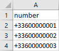
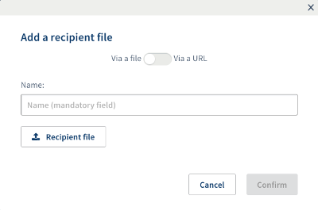

## Objetivo

Todas las cuentas de SMS de OVHcloud pueden utilizar una o más listas de destinatarios. 

**Esta guía explica cómo crear una lista de destinatarios.**

## Requisitos
- Disponer de una cuenta de SMS en OVHcloud.
- Tener un programa de hojas de cálculo o un editor de texto.

## Procedimiento

### 1. Crear una lista de destinatarios

#### En una hoja de cálculo

Es posible crear una lista de destinatarios en una hoja de cálculo desde cero o reutilizando una lista existente. Para ello, la lista debe estar en formato .CSV y tener la siguiente apariencia en la hoja de cálculo:

{.thumbnail}

Si abre el archivo .CSV con un editor de texto (como el bloc de notas), debería tener un aspecto similar al siguiente:

{.thumbnail}

Para que el área de cliente de OVHcloud reconozca la lista de destinatarios, esta debe cumplir los siguientes requisitos:

- Todos los contactos deben estar en la misma hoja, en una columna llamada «**number**».
- La lista no debe contener caracteres especiales (como acentos). De lo contrario, no será posible importar el archivo .CSV al área de cliente.
- Los números deben tener formato internacional. Por ejemplo, un número español tendrá el siguiente formato: +34123456789.
- El archivo debe guardarse en formato .CSV (utilizando el punto y coma como separador).

Si utiliza una hoja de cálculo, para que el programa no realice ninguna operación automática con los números, configure el formato de las celdas que contienen los números en la categoría «Personalizada» e introduzca manualmente lo siguiente en el campo «Tipo»: `[>0]+0;Estándar`.

{.thumbnail}

#### Con un editor de texto

También es posible crear una lista de destinatarios mediante un archivo .TXT desde un editor de texto o bloc de notas.

- Escriba «**number**» en la primera línea.
- A continuación, introduzca un número de teléfono en cada línea en formato internacional (+34123456789).

El resultado debería ser como el siguiente:

{.thumbnail}

### 2. Conexión a la interfaz

Conéctese al [área de cliente de OVHcloud](https://www.ovh.com/auth/?action=gotomanager) y haga clic en la sección `Telecom`{.action}. A continuación, haga clic en `SMS`{.action} en la columna izquierda y seleccione la cuenta de SMS.

{.thumbnail}

### 3. Importar una lista de destinatarios

Abra la pestaña `Contactos`{.action}.

{.thumbnail}

Puede crear hasta 9 listas de contactos.

Para ello, haga clic en `Acciones`{.action} y seleccione `Añadir`{.action}.

{.thumbnail}

Asigne un nombre al archivo de destinatarios e importe el archivo local desde el área de cliente.

{.thumbnail}

## Más información

Interactúe con nuestra comunidad de usuarios en [ovh.es/community](https://www.ovh.es/community/).