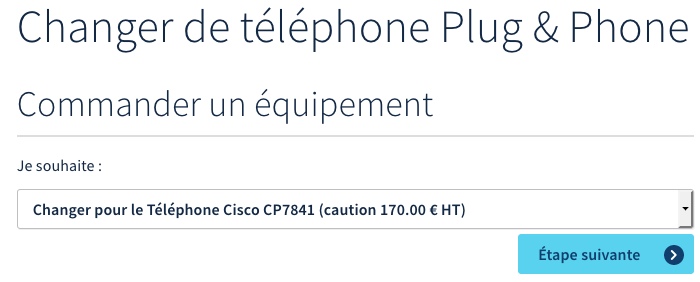
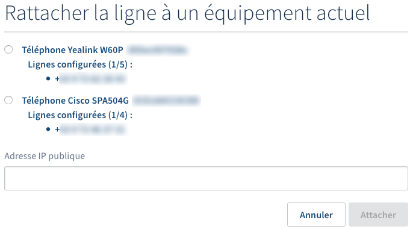
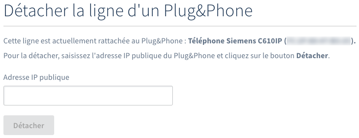

**Dernière mise à jour le 31/07/2020**

## Objectif

Votre ligne SIP OVHcloud vous permet de recevoir et d’émettre des appels depuis l'appareil de votre choix. Celui-ci peut notamment être un téléphone Plug & Phone OVHcloud que vous pouvez gérer depuis votre espace client OVHcloud.

**Apprenez à gérer le téléphone Plug & Phone de votre ligne SIP OVHcloud.**

## Prérequis

- Disposer d'une [ligne SIP OVHcloud](https://www.ovhtelecom.fr/telephonie/voip/){.external}.
- Être connecté à l'[espace client OVHcloud](https://www.ovhtelecom.fr/manager/auth/?action=gotomanager){.external}, partie `Télécom`{.action}.

## En pratique

Votre ligne SIP OVHcloud peut être associée à un téléphone Plug & Phone OVHcloud. Cela vous permet ainsi de gérer ce dernier depuis votre espace client. Cette gestion s'effectue par le biais de plusieurs manipulations. Poursuivez la lecture de cette documentation selon celle que vous souhaitez réaliser.

- [Obtenir un téléphone Plug & Phone OVHcloud](./#obtenir-un-telephone-plug-phone-ovhcloud){.external} : vous permet d'obtenir votre premier téléphone Plug & Phone OVHcloud ou d'en obtenir un supplémentaire.

- [Changer ou renvoyer le téléphone Plug & Phone de votre ligne](./#changer-ou-renvoyer-le-telephone-plug-phone-de-votre-ligne){.external} : vous permet de changer le téléphone Plug & Phone OVHcloud actuellement associé à votre ligne SIP ou de le renvoyer si vous n'en avez plus l'utilité.

- [Rattacher votre ligne à un téléphone Plug & Phone](./#rattacher-votre-ligne-a-un-telephone-plug-phone){.external} : vous permet de rattacher une ligne SIP à un téléphone Plug & Phone OVHcloud que vous possédez déjà.

- [Détacher votre ligne d'un téléphone Plug & Phone](./#detacher-votre-ligne-dun-telephone-plug-phone){.external} : vous permet de détacher de votre ligne SIP le téléphone Plug & Phone OVHcloud actuellement associé à celle-ci. 

### Obtenir un téléphone Plug & Phone OVHcloud

Vous pouvez obtenir un téléphone Plug & Phone OVHcloud pour une ligne SIP non rattachée à un téléphone OVHcloud. 

Pour cela, connectez-vous à votre [espace client OVHcloud](https://www.ovhtelecom.fr/manager/auth/?action=gotomanager){.external} dans la section `Télécom`, cliquez sur `Téléphonie`{.action} dans la barre de services à gauche, puis sélectionnez la ligne SIP concernée. Positionnez-vous ensuite sur l'onglet `Téléphone`{.action}, puis cliquez sur `Commander un Plug & Phone`{.action}.

{.thumbnail}

Sur la page qui s'affiche, dans la partie « Commander un équipement », sélectionnez dans le menu déroulant le téléphone que vous souhaitez obtenir, puis suivez les étapes qui apparaissent.

Si vous souhaitez rattacher votre ligne SIP à un équipement OVHcloud que vous possédez déjà et qui s'affiche dans l'espace client, suivez les instructions de la section « [Rattacher votre ligne à un téléphone Plug & Phone](./#rattacher-votre-ligne-a-un-telephone-plug-phone){.external} » de cette documentation. 

{.thumbnail}

### Changer ou renvoyer le téléphone Plug & Phone de votre ligne

Lorsque vous possédez une ligne SIP OVHcloud actuellement rattachée à un téléphone Plug & Phone OVHcloud, vous avez la possibilité de :

- changer votre téléphone Plug & Phone actuel pour un autre modèle ;
- renvoyer le téléphone Plug & Phone que vous possédez actuellement.

> [!primary]
>
> Selon l'offre dont vous disposez sur votre ligne SIP, l'option de renvoi du téléphone Plug  & Phone peut ne pas être disponible.
>

Pour débuter, connectez-vous à votre [espace client OVHcloud](https://www.ovhtelecom.fr/manager/auth/?action=gotomanager){.external} dans la section `Télécom`, cliquez sur `Téléphonie`{.action} dans la barre de services à gauche, puis sélectionnez la ligne SIP concernée. Positionnez-vous ensuite sur l'onglet `Téléphone`{.action}, puis cliquez sur `Changer de téléphone Plug & Phone`{.action}.

{.thumbnail}

Sur la page qui s'affiche, dans la partie « Commander un équipement », sélectionnez dans le menu déroulant l'action que vous souhaitez réaliser, puis suivez les étapes qui apparaissent.

|Actions|Description|  
|---|---|  
|Renvoyer mon équipement actuel|Permet de renvoyer le téléphone actuellement rattaché à votre ligne SIP, si votre offre le permet. Assurez-vous de prendre connaissance de la procédure qui apparaît dans la partie « Informations ».| 
|Changer pour le ...|Permet de changer le téléphone actuellement rattaché à votre ligne SIP pour un autre équipement. Assurez-vous de prendre connaissance de la procédure qui apparaît dans la partie « Informations ».| 

{.thumbnail}

### Rattacher votre ligne à un téléphone Plug & Phone

Certains téléphones Plug & Phone OVHcloud peuvent être associés à plusieurs lignes SIP. Vous avez donc la possibilité de rattacher une ligne SIP OVHcloud à un téléphone que vous possédez déjà, seulement si :

- la ligne SIP sélectionnée n'est actuellement rattachée à aucun téléphone Plug & Phone OVHcloud ;
- le téléphone Plug & Phone OVHcloud sélectionné peut accueillir une ligne configurée supplémentaire.

Si tel est le cas, pour réaliser la manipulation, connectez-vous à votre [espace client OVHcloud](https://www.ovhtelecom.fr/manager/auth/?action=gotomanager){.external} dans la section `Télécom`, cliquez sur `Téléphonie`{.action} dans la barre de services à gauche, puis sélectionnez la ligne SIP concernée (n'étant actuellement rattachée à aucun téléphone Plug & Phone). Positionnez-vous ensuite sur l'onglet `Téléphone`{.action}, puis cliquez sur `Commander un Plug & Phone`{.action}.

{.thumbnail}

Sur la page qui s'affiche, dans la partie « Rattacher la ligne à un équipement actuel », sélectionnez l'équipement sur lequel vous souhaitez rattacher votre ligne SIP, indiquez l'adresse IP publique de celui-ci, puis cliquez sur le bouton `Attacher`{.action}.

Si vous en avez besoin, vous avez la possibilité d'obtenir un téléphone Plug & Phone OVHcloud supplémentaire. Pour cela, suivez les instructions de la section « [Obtenir un téléphone Plug & Phone OVHcloud](./#obtenir-un-telephone-plug-phone-ovhcloud){.external} » de cette documentation. 

{.thumbnail}

### Détacher votre ligne d'un téléphone Plug & Phone

Vous avez la possibilité de détacher une ligne SIP d'un téléphone Plug & Phone OVHcloud disposant de plusieurs lignes SIP configurées. Pour cela, connectez-vous à votre [espace client OVHcloud](https://www.ovhtelecom.fr/manager/auth/?action=gotomanager){.external} et assurez-vous de vous situer dans la section `Télécom`. Cliquez sur `Téléphonie`{.action} dans la barre de services à gauche, puis sélectionnez la ligne SIP concernée.

Positionnez-vous ensuite sur l'onglet `Téléphone`{.action}, puis cliquez sur `Changer de téléphone Plug & Phone`{.action}.

{.thumbnail}

Sur la page qui s'affiche, dans la partie « Détacher la ligne d'un Plug & Phone », renseignez l'adresse IP publique de celui-ci, puis cliquez sur `Détacher`{.action}. 

{.thumbnail}

## Aller plus loin

Échangez avec notre communauté d'utilisateurs sur <https://community.ovh.com>.
