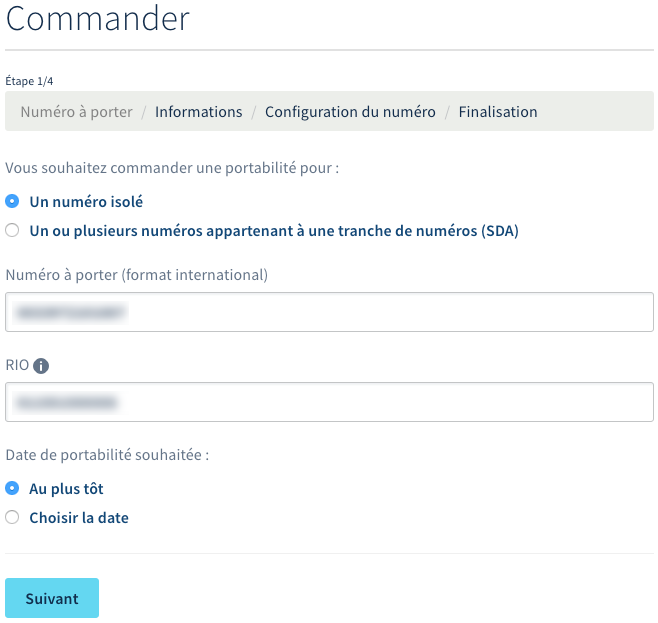
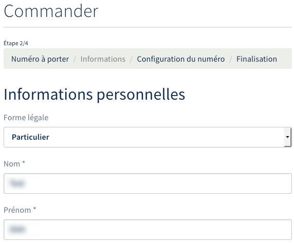
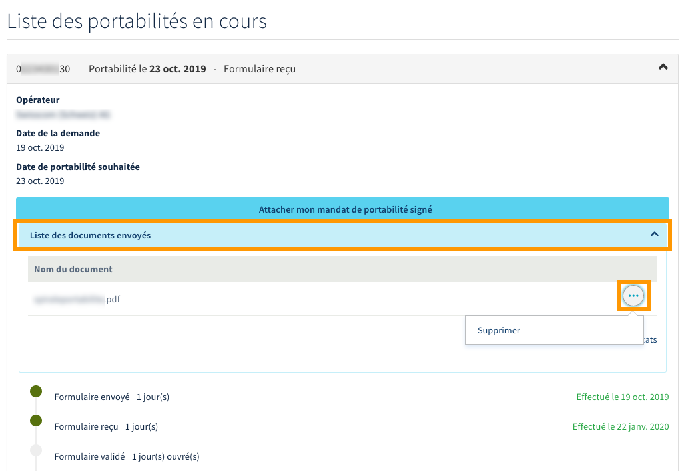
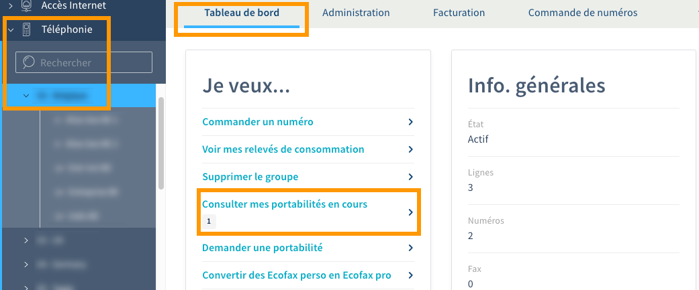
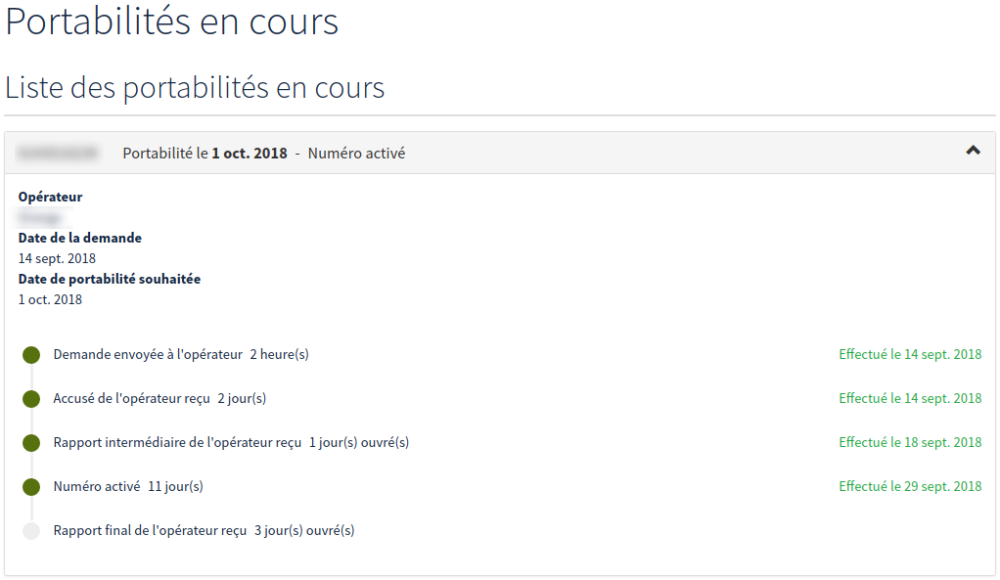

**Dernière mise à jour le 28/01/2020**

## Objectif

La portabilité permet à un abonné de conserver son numéro de téléphone lorsqu'il souhaite changer d'opérateur. Toute demande doit alors suivre un processus comportant plusieurs étapes.

**Apprenez à porter un ou plusieurs numéros chez OVHcloud et à suivre l'avancement du processus.**

## Prérequis

- Disposer d'au moins un numéro de téléphone chez un autre opérateur, dont le pays est compatible avec [la portabilité chez OVHcloud](https://www.ovhtelecom.fr/telephonie/services_inclus/portabilite_numero.xml){.external}.
- Pour les numéros géographiques, justifier d'une adresse postale correspondant à la zone du ou des numéros concernés.
- Disposer d'une offre [VoIP OVHcloud](https://www.ovhtelecom.fr/telephonie/){.external}.
- Être connecté à l'[espace client OVHcloud](https://www.ovhtelecom.fr/manager/auth/?action=gotomanager){.external}, partie `Télécom`{.action}.

## En pratique

### Étape 1 : préparer sa demande de portabilité

Selon le type du ou des numéros que vous souhaitez porter chez OVHcloud, le processus à suivre sera différent. Cela affectera aussi le délai nécessaire à sa complétion. Afin que votre demande de portabilité arrive au plus vite à son terme, nous vous invitons à prendre en considération les recommandations suivantes :

- assurez-vous de connaître les informations du titulaire actuel de la ou des lignes concernées (comme son nom et prénom, son adresse, etc.) ;

- même si une portabilité est possible jusqu'à 40 jours après la résiliation d'un numéro, entamez de préférence la démarche de portabilité lorsque le ou les numéros concernés sont toujours actifs chez votre opérateur actuel. N'en demandez pas la résiliation durant le processus de portabilité ;

- assurez-vous de connaître le type du ou des numéros que vous souhaitez porter : celui-ci déterminera le processus à effectuer (si vous avez un doute, votre opérateur actuel peut vous confirmer le type de numéro que vous possédez).

|Type de numéro|Description|
|---|---|
|Numéro isolé|Il s'agit d'un numéro ne faisant pas partie d'une tranche de numéros (comme celui d'une ligne ADSL ou d'une ligne téléphonique seule). Un RIO (pour relevé d’identité opérateur) est alors nécessaire pour le porter. Vous pouvez l'obtenir en appelant le 3179 depuis la ligne concernée ou en contactant votre opérateur actuel.|
|Tranche de numéros (SDA)|Comme son nom l'indique, il s'agit d'une tranche de plusieurs numéros. Il est possible de porter tout ou partie des numéros de cette tranche. Un mandat de portabilité est alors nécessaire pour effectuer la demande. Celui-ci vous sera transmis par OVHcloud durant les étapes du processus de portabilité.|

### Étape 2 : demander la portabilité

Connectez-vous à votre [espace client OVHcloud](https://www.ovhtelecom.fr/manager/auth/?action=gotomanager){.external}, partie `Télécom`. Cliquez sur `Téléphonie`{.action} dans la barre de services à gauche, puis sélectionnez le groupe de facturation concerné dans lequel le ou les numéros portés seront intégrés. 

Assurez-vous d'être positionné sur l'onglet `Tableau de bord`{.action} et cliquez sur `Demander une portabilité`{.action}.

{.thumbnail}

Dans la page qui apparaît, deux types de demandes sont proposés. Poursuivez la lecture de cette documentation selon celui choisi.

- 2.1 [Porter un numéro isolé](https://docs.ovh.com/fr/voip/demander-la-portabilite-de-mon-numero/#21-porter-un-numero-isole){.external}.

- 2.2 [Porter une tranche de numéros](https://docs.ovh.com/fr/voip/demander-la-portabilite-de-mon-numero/#22-porter-une-tranche-de-numeros){.external}.

#### 2.1 Porter un numéro isolé

Cochez la case `Un numéro isolé`{.action} et renseignez le numéro isolé que vous souhaitez porter au format international (par exemple, « 0033100000000 » pour un numéro français). Ensuite, indiquez le *RIO* du numéro concerné, sélectionnez la date souhaitée de la portabilité, puis cliquez sur `Suivant`{.action}.

{.thumbnail}

Dans la page suivante, renseignez avec précision les informations personnelles du titulaire de la ligne ainsi que l'adresse complète d'installation de cette dernière. Précisez également si vous souhaitez voir apparaître votre numéro dans l'annuaire. Une fois ces données complétées, cliquez sur le bouton `Suivant`{.action}.

{.thumbnail}

Assurez-vous maintenant que le groupe de facturation qui apparaît est bien celui dans lequel le numéro porté doit être intégré. Si ce n'est pas le cas, modifiez-le en choisissant le bon groupe dans le menu déroulant.

Vous pouvez également configurer une redirection, effective une fois le numéro porté, des appels réceptionnés sur ce numéro vers une de vos lignes. Utilisez le bouton `Choisir une ligne`{.action} pour la définir.

Si vous souhaitez utiliser un autre type de configuration pour ce numéro (comme une file d'appels par exemple), sachez que vous pourrez l'appliquer depuis votre espace client OVHcloud 48 heures avant la date effective de sa portabilité.

Vos choix faits, cliquez sur `Suivant`{.action}.

{.thumbnail}

La dernière étape vérifie l'exactitude des informations que vous avez renseignées. Si celles-ci sont valides, il ne vous reste plus qu'à finaliser votre demande de portabilité en cliquant sur `Commander`{.action} puis en validant le bon de commande qui vous sera présenté. 

Dès lors, pour suivre l'avancement de votre demande, reportez-vous aux informations de l'étape 3 « [Suivre une demande de portabilité](https://docs.ovh.com/fr/voip/demander-la-portabilite-de-mon-numero/#etape-3-suivre-une-demande-de-portabilite){.external} » de cette documentation. 

#### 2.2 Porter une tranche de numéros

Pour porter tout ou partie des numéros d'une tranche, cochez la case `Un ou plusieurs numéros appartenant à une tranche de numéros (SDA)`{.action}. 

Renseignez alors le numéro de tête de ligne de la tranche concernée au format international (par exemple, « 0033100000000 » pour un numéro français). En cas de doute, votre opérateur actuel peut vous communiquer ce numéro. Ensuite, indiquez si vous souhaitez :

- **porter l'ensemble de la tranche de numéros** : pour cela, cochez `Porter votre numéro principal et l’ensemble des numéros`{.action} ;

- **porter certains numéros de la tranche, dont celui de tête de ligne** : pour cela, cochez `Porter votre numéro principal et une partie des numéros`{.action} puis renseignez les numéros additionnels de la tranche que vous souhaitez porter. Utilisez alors la zone de texte en dessous de `Numéro SDA à ajouter` ainsi que le bouton `Ajouter`{.action}.

Sélectionnez la date souhaitée de la portabilité, puis cliquez sur `Suivant`{.action}.

{.thumbnail}

Dans la page suivante, renseignez avec précision les informations personnelles du titulaire de la ligne ainsi que l'adresse complète d'installation de cette dernière. Précisez également si vous souhaitez voir apparaître vos numéros dans l'annuaire. Une fois ces données complétées, cliquez sur le bouton `Suivant`{.action}.

{.thumbnail}

Assurez-vous maintenant que le groupe de facturation qui apparaît est bien celui dans lequel les numéros portés doivent être intégrés. Si ce n'est pas le cas, modifiez-le en choisissant le bon groupe dans le menu déroulant.

Vous pouvez également configurer une redirection, effective une fois le numéro de tête de ligne porté, des appels réceptionnés sur ce numéro uniquement vers une de vos lignes. Utilisez le bouton `Choisir une ligne`{.action} pour la définir.

Si vous souhaitez utiliser un autre type de configuration pour ce numéro (comme une file d'appels par exemple), sachez que vous pourrez l'appliquer depuis votre espace client OVHcloud 48 heures avant la date effective de sa portabilité.

Vos choix faits, cliquez sur `Suivant`{.action}.

{.thumbnail}

La dernière étape vérifie l'exactitude des informations que vous avez renseignées. Si celles-ci sont valides, il ne vous reste plus qu'à finaliser votre demande de portabilité en cliquant sur `Commander`{.action} puis en validant le bon de commande qui vous sera présenté. 

Dès lors, vous recevrez un mandat de portabilité autorisant OVHcloud à porter les numéros souhaités. Complétez puis retournez-nous ce mandat **depuis votre espace client**, au format PDF. 

Pour cela, sélectionnez votre groupe de téléphonie dans la barre de services à gauche puis cliquez sur `Consulter mes portabilités en cours`{.action}. Cliquez alors sur `Attacher mon mandat de portabilité signé`{.action}, sous la demande de portabilité concernée, pour importer le mandat au format PDF.

Avant la validation manuelle du mandat par nos services techniques, vous pouvez, en cas d'erreur, supprimer le mandat actuel pour en attacher un autre. Pour cela, cliquez sur `Liste des documents envoyés`{.action} puis sur le bouton `...`{.action} à droite du mandat actuel et enfin sur `Supprimer`{.action}. 

{.thumbnail}

Pour suivre l'avancement de votre demande de portabilité, reportez-vous aux informations décrites dans l'étape 3 « [Suivre une demande de portabilité](https://docs.ovh.com/fr/voip/demander-la-portabilite-de-mon-numero/#etape-3-suivre-une-demande-de-portabilite){.external} » de cette documentation.

### Étape 3 : suivre une demande de portabilité

Connectez-vous à votre [espace client OVHcloud](https://www.ovhtelecom.fr/manager/auth/?action=gotomanager){.external}, partie `Télécom`. Cliquez sur `Téléphonie`{.action} dans la barre de services à gauche, puis sélectionnez le groupe de facturation sur lequel a été demandée la portabilité.

Assurez-vous d'être positionné sur l'onglet `Tableau de bord`{.action} et cliquez sur `Consulter mes portabilités en cours`{.action}.

{.thumbnail}

Dans la page qui apparaît, vous trouverez l'état de vos demandes de portabilité. L'image ci-dessous montre par exemple l'avancement pour un numéro isolé.

{.thumbnail}

Si, durant le processus, vous souhaitez annuler votre demande de portabilité, vous pouvez le faire grâce au bouton `Annuler la portabilité ?`{.action}.

Nous vous recommandons également de consulter régulièrement votre adresse e-mail. Des notifications peuvent en effet vous y être envoyées si une action de votre part est requise. 

Vous trouverez ci-dessous un récapitulatif des différentes étapes du **processus de portabilité d'un numéro isolé** chez OVHcloud :

|Avancement dans le processus|Description|Délai estimé|
|---|---|---|
|Demande envoyée à l'opérateur|La demande est envoyée à l'opérateur cédant|2 heures|
|Accusé de l'opérateur reçu|L'opérateur cédant valide la réception de la demande|2 jours|
|Rapport intermédiaire de l'opérateur reçu|Après vérification des informations, l'opérateur confirme le lancement de la procédure de portabilité vers OVHcloud|1 jour ouvré|
|Numéro activé|48 heures avant la finalisation de la portabilité, le numéro est disponible dans votre espace client pour être configuré. Pour vous aider, reportez-vous aux informations décrites dans l'étape 4 « [Préparer la configuration des numéros portés](https://docs.ovh.com/fr/voip/demander-la-portabilite-de-mon-numero/#etape-4-preparer-la-configuration-des-numeros-portes){.external} »|11 jours|
|Rapport final de l'opérateur cédant|L'opérateur cédant confirme la portabilité. OVHcloud configure le numéro sur son réseau (déclaration *APNF* et routage). La portabilité est terminée et le numéro opérationnel|3 jours ouvrés|

Vous trouverez ci-dessous un récapitulatif des différentes étapes du **processus de portabilité d'une tranche de numéros** chez OVHcloud :

|Avancement dans le processus|Description|Délai estimé|
|---|---|---|
|Mandat de portabilité envoyé|Vous envoyez le mandat de portabilité à OVHcloud|Selon votre action|
|Réception du mandat|Il s'agit du temps entre l'envoi du formulaire de votre part et sa réception chez OVHcloud|Quelques minutes à quelques jours selon le mode d'envoi|
|Validation du mandat|OVHcloud vérifie la cohérence et la légitimité des informations du mandat de portabilité|1 jour ouvré|
|Demande envoyée à l'opérateur|Suite à la validation du mandat, la demande est envoyée à l'opérateur cédant|2 heures|
|Accusé de l'opérateur reçu|L'opérateur cédant valide la réception de la demande|2 jours|
|Rapport intermédiaire de l'opérateur reçu|L'opérateur cédant vérifie l'ensemble de la tranche de numéros SDA|5 jours ouvrés|
|Numéro activé|48 heures avant la finalisation de la portabilité, le numéro est disponible dans votre espace client pour être configuré. Afin de vous aider, reportez-vous aux informations décrites dans l'étape 4 « [Préparer la configuration des numéros portés](https://docs.ovh.com/fr/voip/demander-la-portabilite-de-mon-numero/#etape-4-preparer-la-configuration-des-numeros-portes){.external} »| - |
|Rapport final de l'opérateur cédant|L'opérateur cédant confirme la portabilité. OVHcloud configure les numéros sur son réseau (déclaration *APNF* et routage). La portabilité est terminée et les numéros opérationnels|3 jours ouvrés|

### Étape 4 : préparer la configuration des numéros portés

Vous avez la possibilité de préparer la configuration du ou des numéros portés 48 heures avant que celle-ci soit effective. Ceci peut vous permettre de limiter, voire d'éviter, une coupure de service lors de votre changement d'opérateur pour OVHcloud.

Pour cela, et selon la configuration que vous souhaitez mettre en place sur vos numéros, reportez-vous aux instructions décrites dans notre documentation « [Choisir et appliquer une configuration pour un numéro alias](https://docs.ovh.com/fr/voip/quelle-configuration-est-adaptee-a-mes-besoins/){.external} ».

## Aller plus loin

Échangez avec notre communauté d'utilisateurs sur <https://community.ovh.com>.