**Dernière mise à jour le 24/01/2019** 
 
## Objectif
 
La configuration en file d'appels du réseau permet de rediriger un appel entrant vers plusieurs lignes. Cette solution rend notamment possible la création d'une stratégie permettant d'éviter la perte d'appels. Elle s'adapte à vos besoins et à votre propre organisation en fonction de ce que vous souhaitez paramétrer.
 
Par exemple, pour un petit support téléphonique, un appel entrant peut être redirigé vers plusieurs collaborateurs ou vers la première ligne disponible qui prendra l'appel.
 
**Apprenez à configurer intégralement une file d'appels.**
 
## Prérequis
 
- Disposer d'un [numéro alias](https://www.ovhtelecom.fr/telephonie/numeros/){.external}.
- Disposer d'un accès la gestion du numéro alias en tant que contact administrateur ou technique.
- Être connecté à l’[espace client OVH](https://www.ovhtelecom.fr/manager/auth/?action=gotomanager){.external}, partie `Télécom`{.action}.
 
## En pratique
 
### Étape 1 : configurer le numéro en tant que file d'appels
 
Pour débuter la manipulation, connectez-vous à votre [espace client OVH](https://www.ovhtelecom.fr/manager/auth/?action=gotomanager){.external} et assurez-vous de vous situer dans la section « Télécom ». Cliquez sur `Téléphonie`{.action} dans la barre de services à gauche, puis choisissez le numéro alias sur lequel vous souhaitez configurer la file d'appels.

Dès lors, deux possibilités existent selon la configuration actuelle du numéro concerné :

- **le numéro ne possède pas de configuration** : positionnez-vous alors sur l'onglet `Configuration`{.action}, puis poursuivez selon les instructions ci-dessous ;

- **le numéro possède déjà une configuration** : cliquez sur l'onglet `Configuration`{.action}, puis sur `Changer de configuration`{.action}. Poursuivez ensuite selon les instructions ci-dessous.

{.thumbnail}
 
Sur la nouvelle fenêtre qui apparaît, assurez-vous avoir coché la case `File d’appels`{.action}, puis cliquez sur le bouton `Paramétrer`{.action} situé en bas de la page. Si vous changez de configuration pour une autre, vous devrez confirmer accepter de perdre celle actuellement en place.

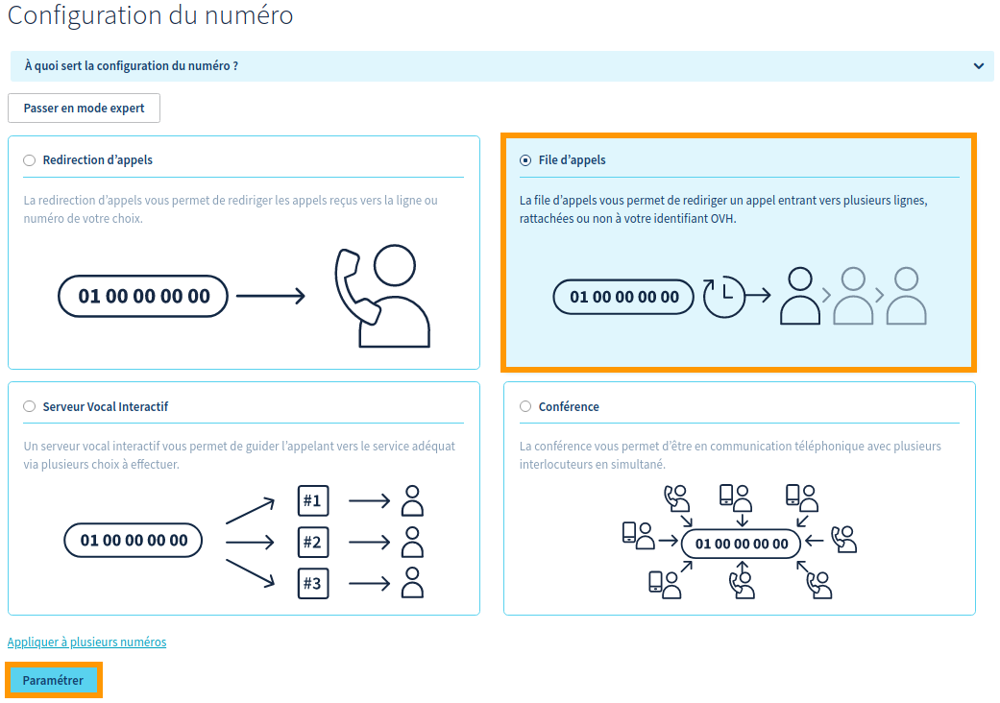{.thumbnail}

### Étape 2 : paramétrer la file d'appels
 
Maintenant que votre numéro est défini en tant que file d'appels, vous pouvez le paramétrer. Pour cela, assurez-vous d'être toujours bien positionné dans la partie « Configuration ».

Si vous n'êtes plus positionné sur celle-ci, ou que vous souhaitez y accéder de nouveau : positionnez-vous sur l'onglet `Mon numéro`{.action}, puis dans le cadre « Configuration », cliquez sur `Paramétrer la configuration`{.action}.

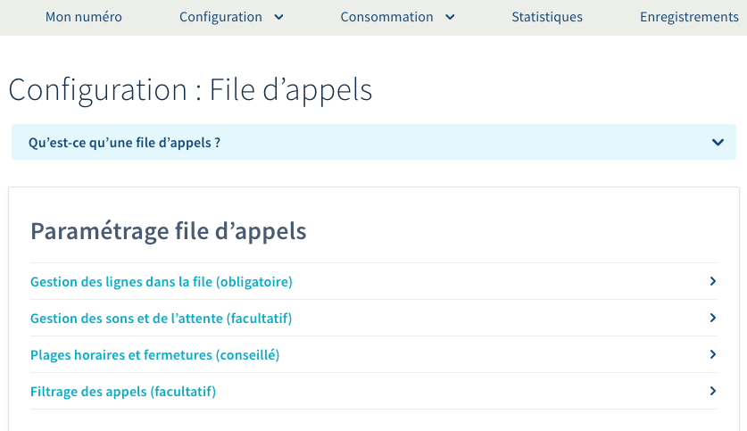{.thumbnail}
 
Vous avez la possibilité de paramétrer votre file d'appels selon quatre thématiques :

|Thématiques|Détails|
|---|---|
|Gestion des lignes dans la file|Permet de gérer les membres de la file d'appels ainsi que divers paramètres de cette dernière. Ce paramétrage est obligatoire pour que la file d'appels puisse fonctionner.|
|Gestion des sons et de l'attente|Permet de personnaliser l'expérience des personnes qui vous contactent. Ce paramétrage est facultatif.|
|Plages horaires et les fermetures|Permet de définir des horaires d'ouverture (habituels ou exceptionnels) à votre file d'appels. Nous vous recommandons d'effectuer ce paramétrage.|
|Filtrage des appels|Permet de définir des listes blanches ou noires, afin d'autoriser uniquement certains correspondants à vous joindre ou, au contraire, de rejeter automatiquement les appels en provenance de certains numéros.|

Poursuivez la lecture de cette documentation selon le ou les paramètres que vous souhaitez réaliser.

- [2.1 Gérer la file d'appels et ses lignes](../les-files-d-appels/#21-gerer-la-file-dappels-et-ses-lignes).
- [2.2 Gérer les sons et l'attente](../les-files-d-appels/#22-gerer-les-sons-et-lattente).
- [2.3 Gérer les plages horaires et les fermetures](../les-files-d-appels/#23-gerer-les-plages-horaires-et-les-fermetures).
- [2.4 Gérer le filtrage des appels](../les-files-d-appels/#24-gerer-le-filtrage-des-appels).

#### 2.1 Gérer la file d'appels et ses lignes

Positionné dans la partie « Configuration », cliquez sur `Gestion des lignes dans la file`{.action}. Plusieurs actions sont alors possibles depuis cette page. 

##### 1. Ajouter une ligne à la file

Sur la page qui s'affiche, dans la partie « Organisation de vos lignes », cliquez sur le bouton `Ajouter une ligne`{.action} pour ajouter une nouvelle ligne à votre file d'appels. Celles déjà présentes apparaissent dans un tableau sur cette même page.

{.thumbnail}

Complétez ensuite les informations demandées :

|Informations|Détails|
|---|---|
|Numéro|Il s'agit du ou des numéros que vous souhaitez ajouter en tant que membres à la file d'appels.   Cliquez sur le bouton `Rechercher`{.action} pour afficher la liste des lignes et numéros rattachés à votre compte. Sélectionnez celui que vous souhaitez ajouter, puis cliquez sur `Valider`{.action}.  S'il n'apparaît pas dans la liste, entrez manuellement le numéro au format international (0033 pour la France par exemple) dans la zone de texte.   Pour ajouter un ou plusieurs membres supplémentaires, cliquez sur `Ajouter une ligne supplémentaire`{.action}.|
|Durée de la sonnerie|Permet de définir la durée pendant laquelle la ligne sonnera. Une fois ce temps écoulé, et selon la stratégie d'appels de la file, l'appel sera alors transmis vers un autre membre de la file.|
|Temps de repos|Permet de définir la durée pendant laquelle le membre ne prendra pas d'appel après avoir raccroché.|
|Appels simultanés|Permet de définir le nombre d'appels que la ligne pourra recevoir.|

Une fois ces informations complétées, cliquez sur le bouton `Valider`{.action} pour réaliser l'ajout. 

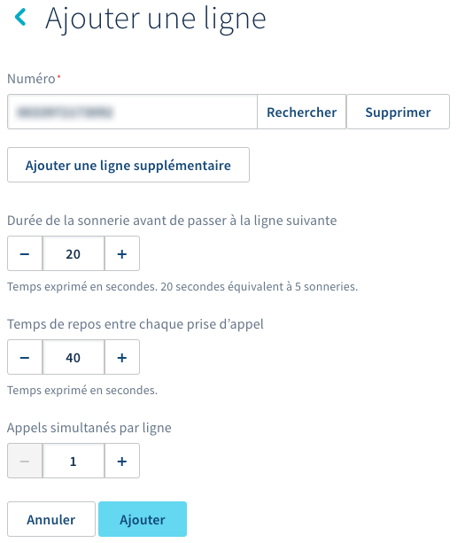{.thumbnail}

##### 2. Configurer une stratégie d’appels

Dès qu'au moins une ligne est présente dans votre file, vous avez la possibilité de configurer une stratégie d'appels pour cette dernière. Pour cela, en dessous du tableau de vos lignes, faites votre choix parmi les trois configurations proposées :

- **« Numéro à afficher »** : définissez le numéro qui sera visible sur le téléphone de la personne qui reçoit l’appel ;

- **« Stratégie de sonnerie »** : définissez la manière dont les lignes de votre file d'appels sonneront. Selon celle choisie, vous serez peut-être amené à [modifier l'ordre des lignes de la file](../les-files-d-appels/#3-organiser-les-lignes-de-la-file-dappels) ;

- **« Appliquer les renvois définis sur les lignes »** : définissez si les renvois d'appels configurés sur les lignes de la file doivent être appliqués ou non.

Une fois vos choix effectués, cliquez sur le bouton `Valider`{.action}.

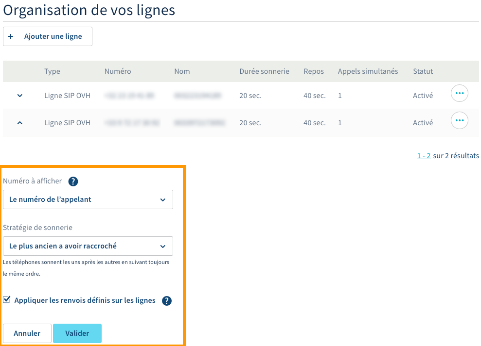{.thumbnail}

##### 3. Organiser les lignes de la file d’appels

Vous avez la possibilité d'organiser les lignes dans votre file d'appels depuis le tableau où celles-ci apparaissent. Pour cela, utilisez les flèches hautes et basses pour déplacer un membre jusqu'à sa position adéquate. 

{.thumbnail}

##### 4. Supprimer ou modifier une ligne 

Depuis le tableau des lignes de votre file d'appels, cliquez sur le bouton représentant `...`{.action} à droite de la ligne concernée, puis sélectionnez l'action que vous souhaitez réaliser. Suivez alors les étapes qui apparaissent jusqu'à finalisation.

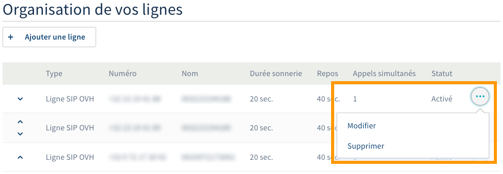{.thumbnail}

#### 2.2 Gérer les sons et l'attente

Positionné dans la partie « Configuration », cliquez sur `Gestion des sons et de l'attente`{.action}. Plusieurs actions sont alors possibles depuis cette page. 

##### 1. Configurer l'attente

Depuis cette partie, vous avez la possibilité d'ajouter deux sons :

- **l'annonce avant mise en attente** : ce son sera joué intégralement avant que le correspondant ne rentre dans la file d'attente (et donc, avant qu'une ligne sonne) ;

- **la musique d'attente** : ce son sera joué à l'entrée dans la file d'attente jusqu'au décrochage de l'appel par une ligne. C'est en quelque sorte une musique de prédécroché.

Pour ajouter un son, cliquez sur le bouton `Ajouter un son`{.action}, puis suivez les étapes qui apparaissent jusqu'à finalisation. Cliquez enfin sur le bouton `Valider`{.action} en bas de la page pour confirmer les changements.

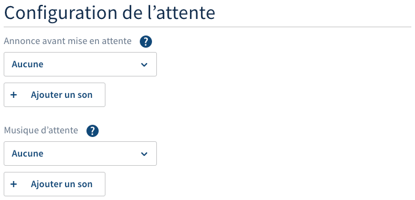{.thumbnail}

##### 2. Configurer le débordement

Depuis cette partie, définissez le nombre maximum d'appelants pouvant être en attente dans la file. Si ce nombre venait à être dépassé, choisissez parmi les deux possibilités suivantes le comportement à adopter.

- **Renvoyer sur un répondeur** : le ou les appelants concernés par le débordement seront alors renvoyés vers le répondeur de votre choix. Pour le sélectionner, cochez d'abord la case `Renvoyer sur un répondeur`{.action}. Cliquez ensuite sur `Ajouter un répondeur`{.action}, puis suivez les étapes qui apparaissent jusqu'à finalisation.

- **Jouer une annonce de débordement** : le ou les appelants concernés par le débordement entendront alors l'annonce que vous avez définie. Pour l'envoyer, cochez d'abord la case `Jouer une annonce de débordement`{.action}. Cliquez ensuite sur `Ajouter un son`{.action}, puis suivez les étapes qui apparaissent jusqu'à finalisation.

Cliquez enfin sur le bouton `Valider`{.action} en bas de la page pour confirmer les changements.

{.thumbnail}

##### 3. Configurer la fermeture

Depuis cette partie, définissez la durée maximale pour laquelle un appelant attendra dans la file. Si cette durée venait à être dépassée, choisissez parmi deux possibilités le comportement à adopter.

- **Renvoyer sur un répondeur** : le ou les appelants concernés seront alors renvoyés vers le répondeur de votre choix. Pour le sélectionner, cochez d'abord la case `Renvoyer sur un répondeur`{.action}. Cliquez ensuite sur `Ajouter un répondeur`{.action}, puis suivez les étapes qui apparaissent jusqu'à finalisation.

- **Jouer une annonce de fermeture** : le ou les appelants concernés entendront alors l'annonce que vous avez définie. Pour l'envoyer, cochez d'abord la case `Jouer une annonce de fermeture`{.action}. Cliquez ensuite sur `Ajouter un son`{.action}, puis suivez les étapes qui apparaissent jusqu'à finalisation.

Cliquez enfin sur le bouton `Valider`{.action} en bas de la page pour confirmer les changements.

{.thumbnail}

#### 2.3 Gérer les plages horaires et les fermetures

Positionné dans la partie « Configuration », cliquez sur `Plages horaires et fermetures`{.action}. Plusieurs actions sont alors possibles depuis cette page. 

##### 1. Activer ou désactiver les plages horaires

Utilisez les boutons `Activées`{.action} ou `Désactivées`{.action} afin de définir si vous souhaitez utiliser ou non les plages horaires mises en place.

{.thumbnail}

##### 2. Configurer les créneaux horaires

Définissez des scénarios de redirection que vous pourrez utiliser ensuite pour vos plages horaires. 

Pour cela, dans la partie « Configuration des créneaux horaires », cliquez sur le pictogramme en forme de roue dentée pour configurer les créneaux. Vous devrez y sélectionner ou renseigner un numéro vers lequel les appels seront redirigés. Par défaut, la sélection est positionnée sur « Un numéro externe », vous pouvez modifier ce choix en cliquant dessus. Finalisez votre choix en cliquant sur le bouton `Modifier`{.action}.

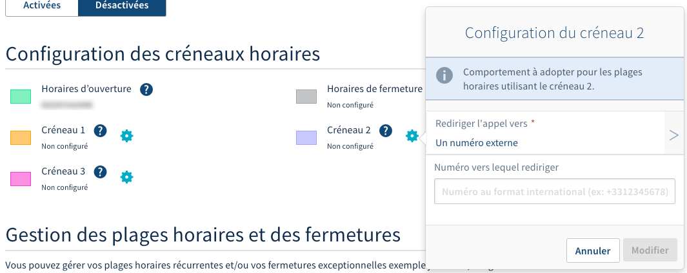{.thumbnail}

##### 3. Définir les plages horaires

Une fois les créneaux configurés à votre convenance, dans la partie « Gestion des plages horaires et des fermetures » de la page, positionnez les créneaux sur les plages horaires que vous souhaitez.

Pour cela, deux possibilités : cliquer sur un horaire et modifier la plage associée ou cliquer sur l’horaire de début souhaité, puis glisser en maintenant le clic jusqu’à l’horaire de fin. Vous devrez définir le créneau à appliquer grâce au bouton `Rediriger les appels vers`{.action}, puis valider l’ajout de la plage horaire en cliquant sur `Ajouter`{.action}.

{.thumbnail}

Vous pouvez également **déplacer des plages existantes**. Pour ce faire, cliquez sur ces dernières, et en maintenant le clic, glissez-les dans le tableau des horaires.
Pour **supprimer une plage**, cliquez sur celle-ci, puis sur `Supprimer`{.action}.

Dès que toutes vos plages horaires sont configurées, cliquez sur le bouton `Valider`{.action} pour sauvegarder ces changements. 

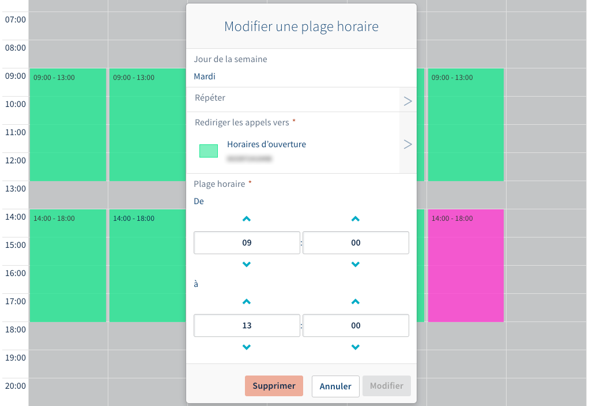{.thumbnail}

##### 4. Définir des fermetures exceptionnelles

Une fois les plages horaires créées à votre convenance, vous avez la possibilité de définir des fermetures exceptionnelles. Celles-ci vous permettront de fermer votre file d’appels sur des plages horaires normalement considérées comme étant ouvertes. Pour cela, toujours dans la partie « Gestion des plages horaires et des fermetures », cliquez sur `Gérer les fermetures exceptionnelles`{.action}.

> [!primary]
>
> Les fermetures exceptionnelles complètent vos plages horaires paramétrées. Il est donc indispensable que ces dernières soient activées pour que les fermetures exceptionnelles s'appliquent.
>

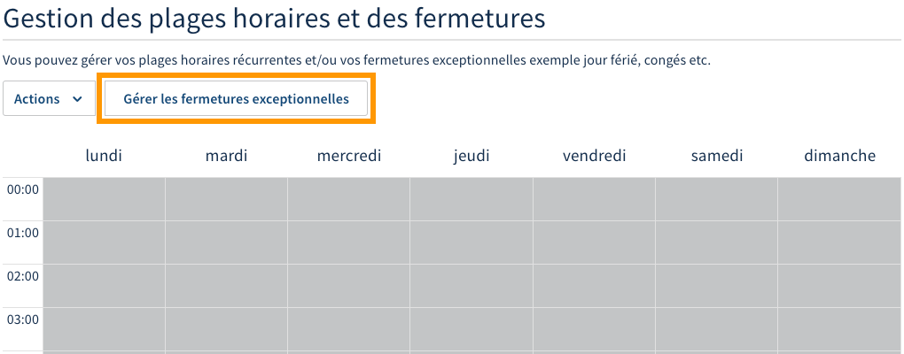{.thumbnail}

Sur la page qui apparaît, positionnez vos fermetures exceptionnelles sur le calendrier en cliquant sur les jours concernés. Complétez les informations demandées :
 
|Information|Description|
|---|---|
|Plage horaire/journée entière|Choisissez si la fermeture exceptionnelle concerne uniquement une plage horaire ou une journée entière.|
|Objet|Définissez un titre vous permettant d'identifier cette fermeture exceptionnelle dans le tableau.|
|Catégorie|Choisissez un créneau qui permettra de rediriger les appels reçus pendant la fermeture exceptionnelle. Si nécessaire, vous avez la possibilité de configurer les créneaux au-dessus du tableau de planification.|
|Du/au|Définissez la date et l'heure (si nécessaire) de la fermeture exceptionnelle.|
|Description|Vous pouvez ajouter une description plus détaillée à la fermeture exceptionnelle.|

Une fois les informations complétées, cliquez sur `Créer l'événement`{.action}. Répétez cette manipulation afin d'ajouter toutes les fermetures exceptionnelles que vous souhaitez créer. Cliquez finalement sur le bouton `Valider`{.action} pour sauvegarder ces changements.

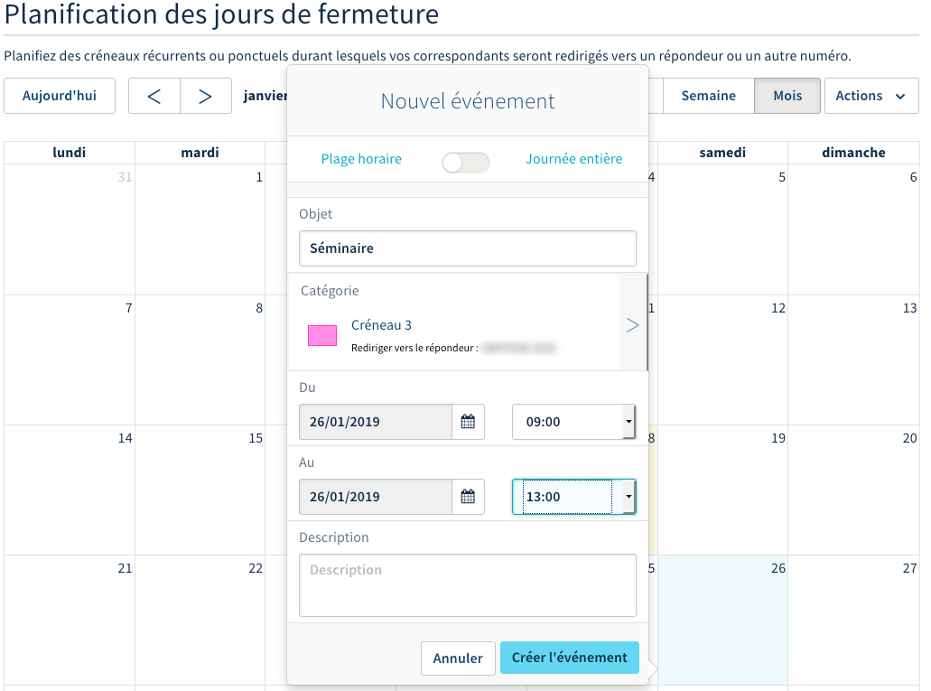{.thumbnail}

#### 2.4 Gérer le filtrage des appels

Positionné dans la partie « Configuration », cliquez sur `Filtrages des appels`{.action}. Plusieurs actions sont alors possibles depuis cette page. 

##### 1. Configurer les filtrages d'appels

Vous avez la possibilité de mettre en place un filtrage s’appliquant aux appels entrants selon quatre configurations :

|Configurations|Description|
|---|---|  
|Rejeter automatiquement les appels anonymes|Permet de rejeter automatiquement les appels entrants provenant d'un correspondant anonyme. Pour gérer son activation, utilisez les boutons `Activé`{.action} ou `Désactivé`{.action}.|
|Aucun filtrage|Permet de ne pas appliquer le filtrage des appels entrants selon une liste noire ou blanche. Ce choix n'annule pas le rejet des appels anonymes s'il est activé.|
|Appels entrants refusés (liste noire)|Les numéros ou les tranches de numéros inscrits dans la liste ne peuvent plus vous contacter.|
|Appels entrants autorisés (liste blanche)|Seuls les numéros ou les tranches de numéros inscrits dans la liste sont autorisés à vous contacter.|

Cliquez sur le bouton `Valider`{.action} pour sauvegarder ces changements.

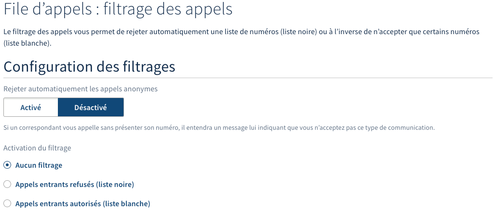{.thumbnail}

##### 2. Configurer et gérer les listes

Dans la partie « Configuration des listes », vous avez la possibilité d'ajouter des numéros ou des types de numéros à la liste blanche ou à la liste noire. Pour cela, complétez les informations demandées :

|Informations|Description|
|---|---|  
|Type de liste|Choisissez parmi la liste noire ou la liste blanche.|
|Ajout automatique de certains types de numéros dans la liste|Permet d'ajouter de manière automatique des types de numéros. Faites votre choix dans la liste proposée ou laissez la sélection sur « Aucun ».|
|Ajouter un numéro|Spécifiez le numéro que vous souhaitez ajouter à la liste. Celui-ci doit être au format international (0033 pour la France par exemple).|

Une fois complétées, appuyez sur `Appliquer`{.action}.

{.thumbnail}

En dessous de la configuration des listes, dans la partie « Détails de vos listes », un tableau s'affiche vous permettant de visualiser les numéros ainsi que les types de numéros ajoutés à vos listes. Si nécessaire, vous avez la possibilité de filtrer l'affichage de ce tableau grâce la barre de recherche ou le bouton filtre situés au-dessus de celui-ci.

Pour **supprimer des éléments de vos listes**, sélectionnez-les dans le tableau en cochant la case située à gauche de ces derniers. Cliquez ensuite sur le bouton `Actions`{.action} puis sur `Supprimer les éléments sélectionnés`{.action}. Confirmez alors la suppression.

{.thumbnail}

## Aller plus loin

Échangez avec notre communauté d'utilisateurs sur <https://community.ovh.com>.