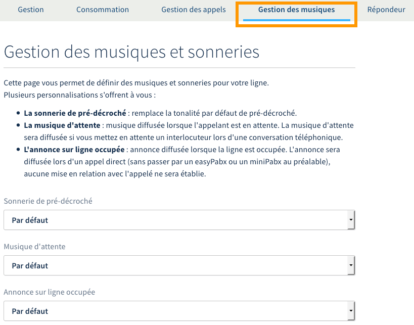

**Dernière mise à jour le 24/09/2018**

## Objectif

Votre ligne SIP OVH vous permet de recevoir et d’émettre des appels. Afin de personnaliser l'expérience de vos correspondants, vous pouvez modifier les musiques et les sonneries qu'ils entendent lors d'un appel vers votre ligne ou votre numéro.

**Apprenez à modifier les musiques et les sonneries de votre ligne OVH.**

## Prérequis

- Disposer d'une [ligne téléphonique OVH](https://www.ovhtelecom.fr/telephonie/){.external}, entreprise
- Être connecté à l'[espace client OVH](https://www.ovhtelecom.fr/manager/auth/?action=gotomanager){.external}, partie `Télécom`{.action}.
- Être en possession de la ou des musiques ou sonneries que vous souhaitez utiliser, au format audio adéquat.

> [!primary]
>
> La gestion des musiques n'est pas disponible sur les lignes SIP Découverte.
>

## En pratique

### Étape 1 : accéder à la gestion des musiques et sonneries

Connectez-vous à votre [espace client OVH](https://www.ovhtelecom.fr/manager/auth/?action=gotomanager){.external} et rendez-vous dans la section `Télécom`. Cliquez sur `Téléphonie`{.action} dans la barre de services à gauche, puis sélectionnez la ligne concernée parmi celles qui s'affichent.

Positionnez-vous ensuite sur l'onglet `Gestion des musiques`{.action}.

{.thumbnail}

Dans la page qui apparaît, vous avez la possibilité de modifier plusieurs musiques ou sonneries. Chacune d'elles dispose d'un son par défaut :

|Musiques/sonneries|Son par défaut|
|---|---|
|Sonnerie de pré-décroché|Tonalité de pré-décroché classique (bip long)|
|Musique d'attente|Le message suivant est joué : « Votre correspondant vous a mis en attente, veuillez patienter. »|
|Annonce sur ligne occupée|Tonalité d'occupation classique (bip court)|

### Étape 2 : modifier une musique ou une sonnerie

Il existe certaines règles et informations à prendre en considération concernant le fichier audio que vous souhaitez utiliser en tant que nouvelle sonnerie ou musique :

- **le fichier audio doit être dans un format compatible** : seuls les formats WAV, MP3, MP4, OGG et WMA sont acceptés par l’outil d’import ;

- **le fichier audio ne doit pas excéder une certaine taille** : la taille maximale est fixée à 10 Mo ;

- **le fichier audio doit être encodé d'une certaine manière pour une qualité optimale** : nous vous recommandons d'encoder votre fichier en mono, 16 bits, 8 kHz ;

- **vous devez disposer du droit d'utiliser le fichier audio** : si vous n'êtes pas le créateur du fichier, vous avez l'obligation légale de détenir le droit de l'utiliser (sauf s'il est libre de droits).

Afin de vous aider dans la création de votre fichier audio, sachez que vous pouvez laisser un message sur le répondeur de votre ligne OVH puis le récupérer. Si besoin, reportez-vous aux instructions décrites dans notre documentation « [Configurer et consulter le répondeur de sa ligne](https://docs.ovh.com/fr/voip/configurer-consulter-repondeur-ligne-ovh/){.external} »

Une fois que vous êtes prêt, en dessous de la musique ou de la sonnerie que vous voulez modifier, choisissez dans le menu déroulant `Personnalisée` puis cliquez sur le bouton `Choisir un fichier`{.action}. Dans la fenêtre qui s'ouvre, retrouvez le fichier audio que vous souhaitez utiliser. Une fois sélectionné, cliquez sur le bouton `Envoyer le fichier`{.action}.

{.thumbnail}

## Aller plus loin

Échangez avec notre communauté d'utilisateurs sur <https://community.ovh.com>.
