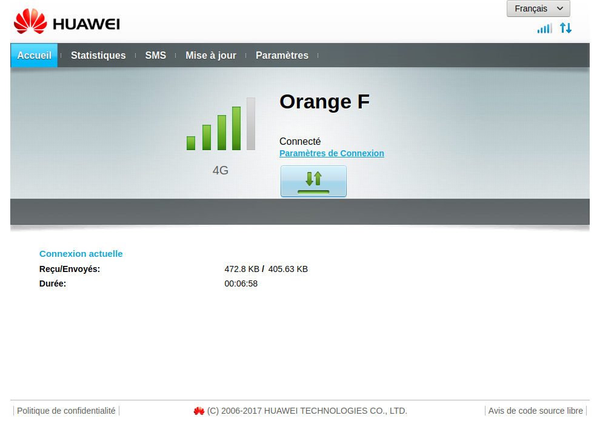

**Dernière mise à jour le 02/12/2020**

## Objectif

Un lien de secours LTE permet de sécuriser votre connexion en cas de perte. Si votre connexion cuivre ou fibré tombe, une clé LTE branché au dos du modem prend alors le relais en se connectant au réseau 3G ou 4G.

**Apprenez à activer un lien de secours LTE sur votre modem**

## Prérequis

- Disposer d’un [accès internet xDSL ou fibre OVHcloud](https://www.ovhtelecom.fr/offre-internet/){.external} et d'un modem Zyxel fourni par OVHcloud.
- Cette fonctionnalité est disponible même si la configuration à distance est désactivée.
- Disposer d'une clé LTE Huawei E3372 ainsi qu'une carte SIM permettant l'accès au réseau mobile de données.

## En pratique

### Étape 1 : Configurer la clé LTE Huawei E3372

Insérez la carte SIM dans votre clé Huawei E3372, puis branchez la clé sur votre ordinateur. Accédez à la clé via votre navigateur à l'adresse [192.168.8.1](http://192.168.8.1){.external}.
Une fois connecté, accéder au menu `Paramètres`, puis dans le menu `Gestion Du Code PIN` entrez le code PIN de votre carte SIM.

{.thumbnail}

Retournez sur l'onglet onglet `Accueil` pour vérifier que vous êtes bien connecté. si elle est correctement connectée, la LED sur la clé doit également être de couleur fixe, de couleur cyan pour un réseau 4G ou verte pour un réseau 3G.

{.thumbnail}

### Étape 2 : Configurer le modem

#### Zyxel

> [!warning]
>
> En cas de perte de connexion la VoIP reste fonctionnelle lorsque le modem passe sur le lien de secours LTE, par contre un reboot est nécessaire pour que la VoIP soit de nouveau fonctionnelle après le rétablissement du lien cuivre ou fibre.
>

Par défaut le modem Zyxel est déjà configuré pour supporter les liens de secours LTE, il suffit donc uniquement de brancher votre clé Huawei E3372 sur le port USB du modem.

Des configurations plus avancées sont disponibles à partir de l'interface locale, vous pouvez-vous reporter au [guide utilisateur](http://files.isp.ovh.net/zyxel/VMG8823-B50B_V5.13_5.50.pdf) (en anglais) pour plus de détails.

## Aller plus loin

Échangez avec notre communauté d'utilisateurs sur <https://community.ovh.com>.
