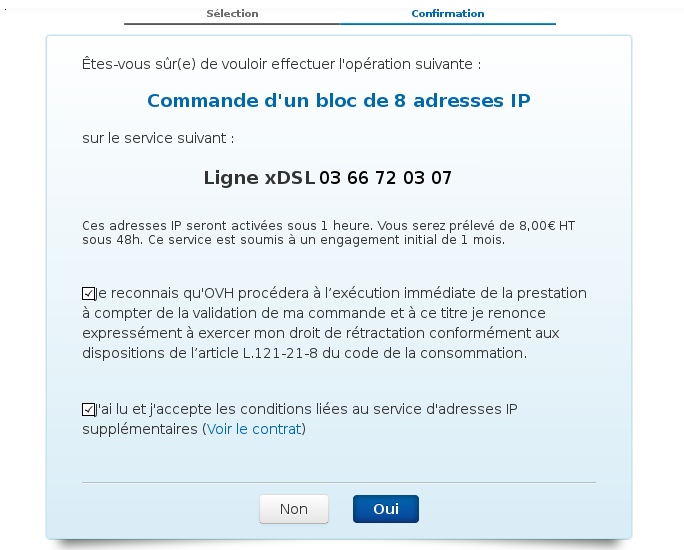

### Préambule {#préambule}

Le bloc IP vous permet d'obtenir 5 IP publiques utilisables afin d'associer différentes machines et services à une adresse IP publique du bloc.

Ce guide montre la configuration via notre modem en mode routeur. La gestion du réseau local est désactivée et vous devrez le gérer via l'équipement de votre choix.

**Sommaire :**

Niveau : Expert

------------------------------------------------------------------------

### Prérequis {#prérequis}

Pour commander et gérer le bloc IP, vous devez posséder :

-   Un accès xDSL
-   Un modem OVH
-   Un client Telnet (Sur Linux et Mac OS X, utilisez le terminal, sur Windows utilisez Putty ou activez le client Telnet dans l'invite de commande en entrant **pkgmgr /iu:"TelnetClient".**)

------------------------------------------------------------------------

### Commande du bloc {#commande-du-bloc}

La commande du bloc IP s'effectue dans l'Espace Client Telecom :

-   Connectez vous à l'espace client : **<https://www.ovhtelecom.fr/espaceclient/login/>**
-   Cliquez sur "**Configuration**".
-   Cliquez sur "**xDSL**".
-   Cliquez sur "**IPv4/IPv6**".
-   Cliquez sur "**Commander un bloc d'adresses IP**".
-   Validez les conditions générales et cliquez sur "**Oui**" pour lancer la commande.

{.thumbnail}

Vous recevrez un e-mail une fois le bloc livré.

------------------------------------------------------------------------

### Calcul des IP utilisables {#calcul-des-ip-utilisables}

Le bloc auquel vous souscrivez est une /29, vous pouvez utiliser ces outils pour calculer vos adresses :

-   Sur **Windows:** Le logiciel en ligne de commande "**IP Subnet Calculator**". L'utilisation est simple : vous appelez simplement l’exécutable suivi de votre bloc IP.

<!-- -->

    C:\Users\kevin.binetruy\Documents>subnet.exe 109.190.100.100/29 Showing : 109.190.100.100/29
        01101101.10111110.01100100.01100100 Subnet Mask : 255.255.255.248 11111111.11111111.11111111.11111000 Wildcard Mask
        : 0.0.0.7 00000000.00000000.00000000.00000111 Host Count : 6 Network : 109.190.100.96
        01101101.10111110.01100100.01100000 Minimum Host : 109.190.100.97 01101101.10111110.01100100.01100001 Maximum Host :
        109.190.100.102 01101101.10111110.01100100.01100110 Broadcast : 109.190.100.103
        01101101.10111110.01100100.01100111

La ligne "**Minimum Host**" est la première IP hôte utilisable. La ligne "**Maximum Host**" est l'IP de la passerelle. Pour obtenir la **dernière** IP hôte, il faut prendre l'IP de la passerelle -1. Dans notre exemple : **109.190.100.101**.

-   Sur **Linux :** Vous pouvez utiliser le paquet "**subnetcalc**". Son utilisation est simple :

<!-- -->

    kb@desk:~$subnetcalc 109.190.100.100/29 Address = 109.190.100.100 01101101 .
        10111110 . 01100100 . 01100100 Network = 109.190.100.96 / 29 Netmask = 255.255.255.248 Broadcast = 109.190.100.103
        Wildcard Mask = 0.0.0.7 Hosts Bits = 3 Max. Hosts = 6 (2^3 - 2) Host Range = { 109.190.100.97 - 109.190.100.102 }
        Properties = - 109.190.100.100 is a HOST address in 109.190.100.96/29 - Class A

La ligne "**Host Range**" comprend la plage des IP hôtes allouables. La dernière IP est la passerelles et les 5 autres IP sont les IP hôtes allouables.

------------------------------------------------------------------------

### Configuration du modem {#configuration-du-modem}

La configuration du modem est à effectuer en Telnet. Pour vous y connecter, utilisez le client de votre choix. (Une liste est établie dans les **[Prérequis](#CommentcommanderetgérerunblocIP/29-telnet)**.)

-   Connectez vous au modem : l'adresse IP par défaut est 192.168.1.254
-   La première étape consiste à identifier le nom de l'interface LAN et WAN du modem : la commande à entrer **ip iflist**.

<!-- -->

    {admin}=>ip iflist Interface Group MTU RX TX Admin Oper 1 loop. . . . . . . . . .
        . . . . local 4096 378 MB 373 MB UP [UP] 2 Internet. . . . . . . . . . . . wan 1492 977 MB 436 MB UP UP 3
        LocalNetwork. . . . . . . . . . lan 1500 382 MB 833 MB UP [UP] {admin}=>

Sur ce modem, l'interface WAN est **Internet** et l'interface LAN est **LocalNetwork**.

-   Les commandes suivantes permettent de configurer le bloc IP sur le modem :

<!-- -->

    {admin}=>dhcp server
        config state disabled {admin}=>dhcp server lease flush {admin}=>ip ipadd intf=LocalNetwork
        addr=109.190.100.102/29 {admin}=>nat ifconfig intf=Internet translation=disabled {admin}=>saveall

-   -   **dhcp server config state disabled:** Cette commande désactive le serveur DHCP.

    -   **dhcp server lease flush :**Cette commande efface les lease en cours sur le DHCP.

    -   **ip ipadd intf=LocalNetwork addr=109.190.100.102/29 :**Configuration de la passerelle du bloc IP sur l'interface LAN.

    -   **nat ifconfig intf=Internet translation=disabled :**Désactivation du NAT sur l'interface WAN.

    -   **saveall :**Sauvegarde de la configuration.

Une fois le modem paramétré, il faudra configurer vos hôtes avec les IP du bloc.
