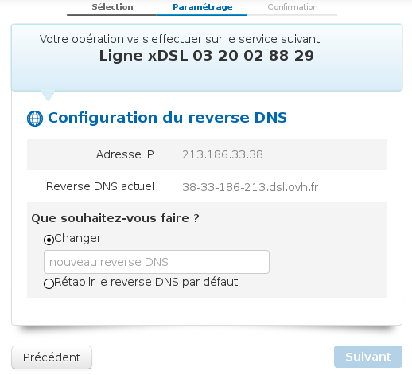

### Préambule {#préambule}

Le Reverse DNS, aussi appelé PTR Record (ou pointer record) sert à associer une adresse IP à un enregistrement de nom de domaine.

Il est important de l'utiliser car l'absence de Reverse DNS peut être considéré comme une erreur et peut entrainer le refus d'accès à certains services (exemple : dans le cadre d'utilisation d'un serveur mail, si l'e-mail est envoyé depuis un serveur ayant une adresse IP sans résolution DNS appropriée, il a de grandes chances d'être refusé par le serveur de réception).

**Sommaire :**

Niveau : Débutant

------------------------------------------------------------------------

### Prérequis {#prérequis}

-   Un nom de domaine (ou sous-domaine) redirigeant vers l'adresse IP de votre accès xDSL.
-   Un accès xDSL OVH.

Pour le moment il n'est pas possible de configurer les Reverse DNS des blocs IP ([Commander et gérer un bloc IP /29]({legacy}7962652)) fournis en option sur nos accès.

### Vérifier que le nom de domaine soit bien configuré {#vérifier-que-le-nom-de-domaine-soit-bien-configuré}

Nous allons faire le test avec ovhtelecom.fr.

#### Sous windows : {#sous-windows}

Ouvrez l'invite de commande et mettez :

    nslookup ovhtelecom.fr

Vous obtiendrez une réponse du type :

    Name : www.ovhtelecom.fr Address : 213.186.33.38

#### Sous MAC et linux : {#sous-mac-et-linux}

Ouvrez le terminal et mettez :

    host ovhtelecom.fr

Vous obtiendrez une réponse du type :

    ovhtelecom.fr has address 213.186.33.38

Dans les deux cas, nous voyons que le nom de domaine redirige bien vers notre adresse IP 213.186.33.38 (si ce n'est pas le cas, nous vous invitons à vous rapprocher de votre registreur afin de configurer votre nom de domaine).

Nous pouvons maintenant passer à l'étape suivante qui est la configuration de notre Reverse DNS de l'adresse 213.186.33.38.

------------------------------------------------------------------------

### Configuration du Reverse DNS de votre connexion {#configuration-du-reverse-dns-de-votre-connexion}

La configuration du Reverse DNS s'effectue dans l'Espace Client Telecom :

-   Connectez vous à l'espace client : **<https://www.ovhtelecom.fr/espaceclient/login/>**
-   Cliquez sur "**Configuration**".
-   Cliquez sur "**xDSL**".
-   Cliquez sur "**Reverse DNS**".{.thumbnail}
-   Mettez le nom de domaine ou sous-domaine et cliquez sur suivant. Validez à la page suivante. La nouvelle valeur de votre DNS prendra quelques minutes avant d’être visible sur votre espace Client.

------------------------------------------------------------------------

### Vérifier la configuration du Reverse DNS {#vérifier-la-configuration-du-reverse-dns}

Nous allons utiliser les mêmes commandes que pour la vérification de la configuration du nom de domaine mais cette fois-ci avec l'adresse IP.

#### Sous windows : {#sous-windows-1}

Ouvrez l'invite de commande et mettez :

    nslookup 213.186.33.38

Vous obtiendrez une réponse du type :

    Name : www.ovhtelecom.fr Address : 213.186.33.38

#### Sous MAC et linux : {#sous-mac-et-linux-1}

Ouvrez le terminal et mettez :

    host 213.186.33.38

Vous obtiendrez une réponse du type :

    38.33.186.213.in-addr.arpa domain name pointer www.ovhtelecom.fr.

Dans les deux cas, nous voyons que l'adresse IP redirige bien vers le nom de domaine [ovhtelecom.fr](http://ovhtelecom.fr){.external-link}.

Votre Reverse DNS est maintenant configuré.

