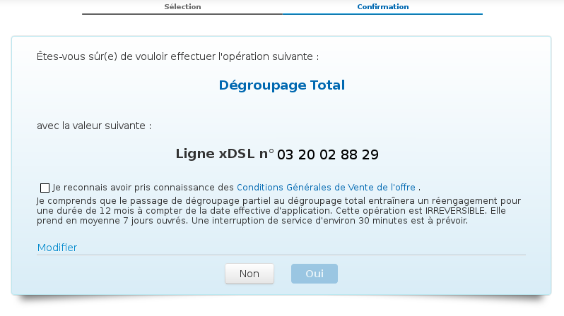

### Préambule {#préambule}

Le passage de dégroupage partiel à total permet d'avoir la ligne gérée complètement par OVH, de faire porter votre numéro et de pouvoir l'utiliser avec votre téléphonie OVH.

Elle vous permet aussi de simplifier et de réduire votre facture en ne payant plus l'abonnement France Telecom.

**Sommaire :**

Niveau : Débutant

------------------------------------------------------------------------

### Prérequis {#prérequis}

Pour effectuer cette migration, vous devez possédez :

-   Un accès OVH en dégroupage partiel.
-   Une offre éligible.

<!-- -->

-   Le passage de dégroupage partiel à total est irréversible.
-   Si vous avez une ancienne offre, il faut passer à l'une de nos offres Express ou Entreprise ([Changer l'offre d'un accès xDSL]({originalUrl}/display/CRXDSL/Comment+changer+mon+offre+xDSL)).
-   Une interruption de service est probable.

### Passer en dégroupage Total {#passer-en-dégroupage-total}

La commande du bloc IP s'effectue dans l'Espace Client Telecom :

-   Connectez vous à l'espace client : **<https://www.ovhtelecom.fr/espaceclient/login/>**
-   Cliquez sur "**Gestion des offres**".
-   Cliquez sur "**Dégroupage Total**".
-   Sélectionnez votre accès dans la liste.
-   Cliquez sur "**Suivant**".{.thumbnail}
-   Vous devez ensuite valider les "**Conditions Générales de Vente de l'offre**" (lien ici : <https://www.ovhtelecom.fr/support/documents_legaux/>)
-   Cliquez sur "**Oui**".

Cette demande prend en moyenne 7 jours ouvrés et ne peut pas être anticipée. L'interruption de service est en théorie de 30 minutes.

Votre ligne fixe est résiliée techniquement auprès de votre opérateur ligne fixe.

