## 
Pour réaliser les actions ci-dessous, rendez-vous sur votre [espace client ](https://www.ovhtelecom.fr/espaceclient/login.html)

## 
Renseignez vos identifiants OVH.

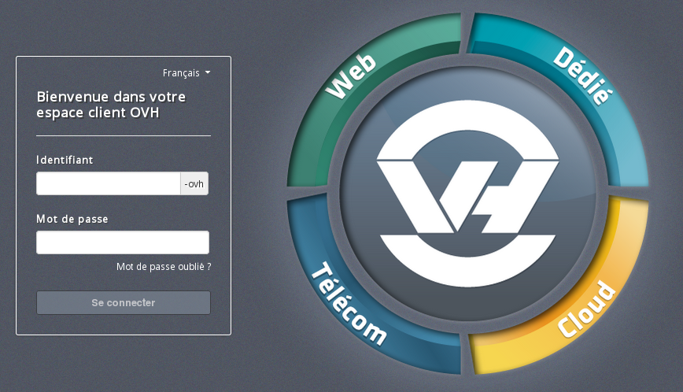{.thumbnail}

## 
Vous arrivez ainsi sur l'accueil de l'espace client télécom, où sont listés vos services.

{.thumbnail}

## 
Rendez-vous ensuite dans la partie "Configuration" puis "xDSL".

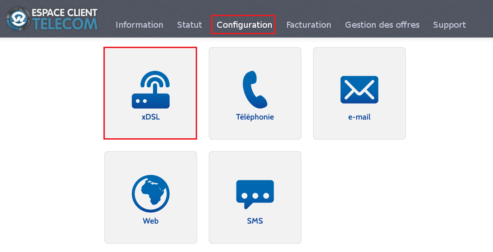{.thumbnail}

## Activer / désactiver la configuration du modem
Pour réaliser les opérations suivantes, activez au préalable la prise en main de votre [box internet](http://www.ovhtelecom.fr/adsl/modem-adsl.xml) depuis le manager.

Pour cela, cliquez sur "Configuration du modem" puis "Activer/Désactiver la configuration du modem".

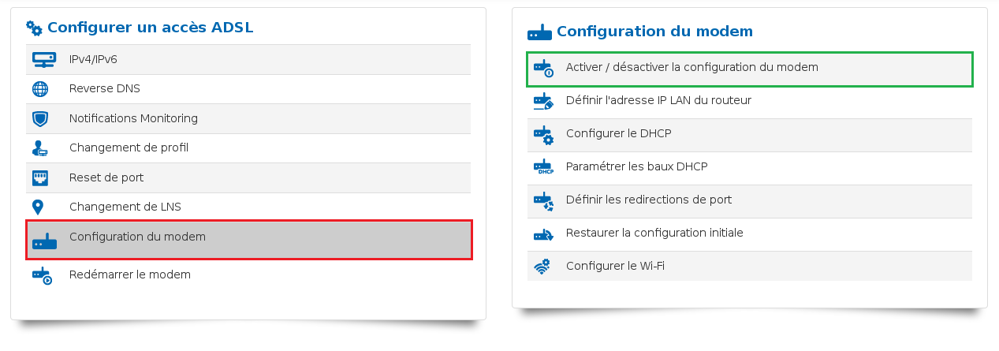{.thumbnail}

## 
Validez l'opération en cliquant sur "Oui".

{.thumbnail}

## 
La modification sera effective sous 20 minutes.
Une réinitialisation du modem sera automatiquement effectuée suite à cette opération.

{.thumbnail}

## Définir l'adresse IP LAN du routeur
Pour modifier l'adresse IP LAN de votre modem, cliquez sur "Configuration du modem" puis "Définir l'adresse IP LAN du routeur".

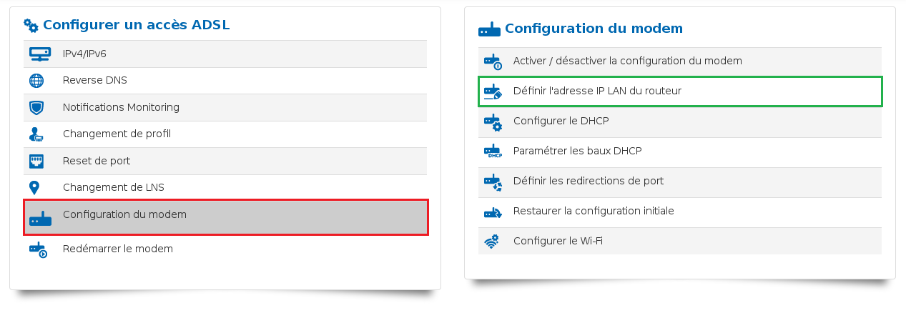{.thumbnail}

## 
Sélectionnez l'accès concerné dans la liste.

{.thumbnail}

## 
Passez le champ "Méthode de récupération d'adresse IP" sur "Static" et renseignez la nouvelle passerelle d'accès de votre modem.

Dans l'exemple nous passons la passerelle de 192.168.1.254 à 192.168.2.254

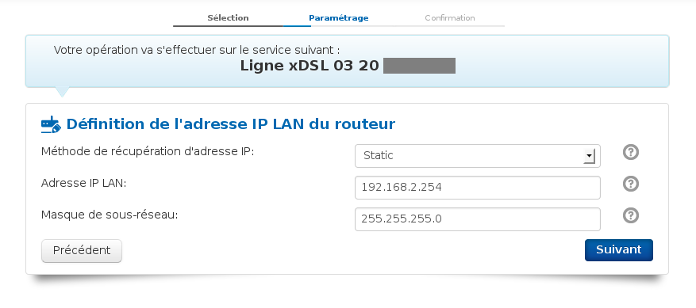{.thumbnail}

## 
La nouvelle passerelle de votre modem est donc visible dans le champ "Passerelle" (1)
Suite à cette modification il faut également changer la "Plage DHCP" (2) qui va être fournie par le modem.

Dans notre exemple, le modem fournira des IP locales allant de 192.168.2.64 à 192.168.2.253 aux périphériques connectés sur celui-ci. 

{.thumbnail}

## 
Il est possible ensuite de configurer des "baux DHCP" permettant l'association d'un périphérique via son adresse MAC à une IP fournie par le modem.
Si vous ne souhaitez pas effectuer cette configuration, cliquez sur suivant. Sinon, renseignez les valeurs demandées.
(Vous pouvez vous rendre sur la partie "Paramétrer les baux DHCP" pour obtenir un exemple).

{.thumbnail}

## 
Vous pouvez ensuite effectuer une "Redirection de port" vers une IP spécifique.

Si vous ne souhaitez pas effectuer cette configuration, cliquez sur suivant. Sinon renseignez les valeurs demandées.
(Vous pouvez vous rendre sur la partie "Définir les redirections de port" pour obtenir un exemple).

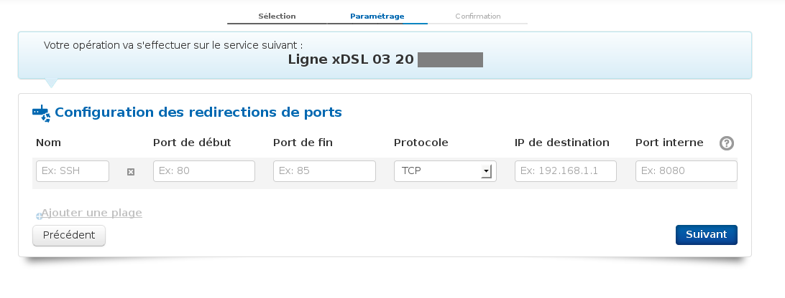{.thumbnail}

## 
Vous obtenez enfin un récapitulatif de la configuration qui sera injectée dans le modem.
Celle-ci sera effective sous 10 minutes.

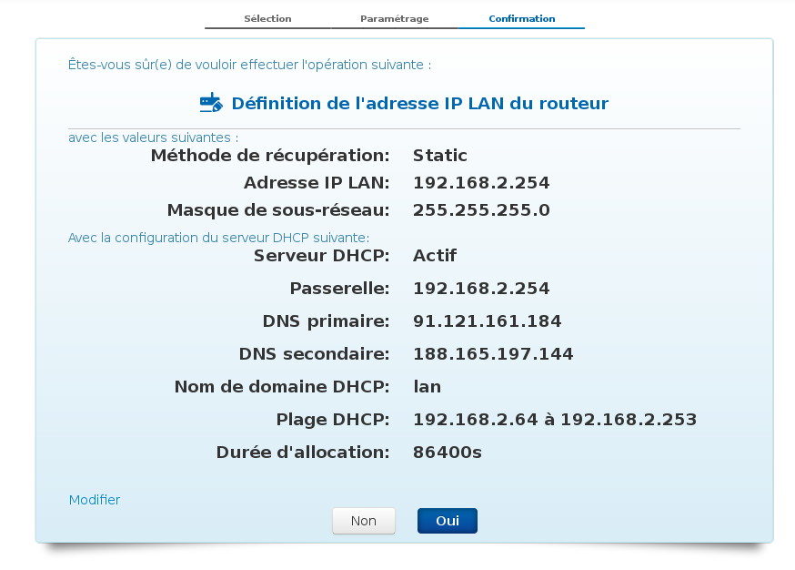{.thumbnail}

## Configurer le DHCP
Pour modifier le DHCP de votre modem, cliquez sur "Configuration du modem" puis "Configurer le DHCP".

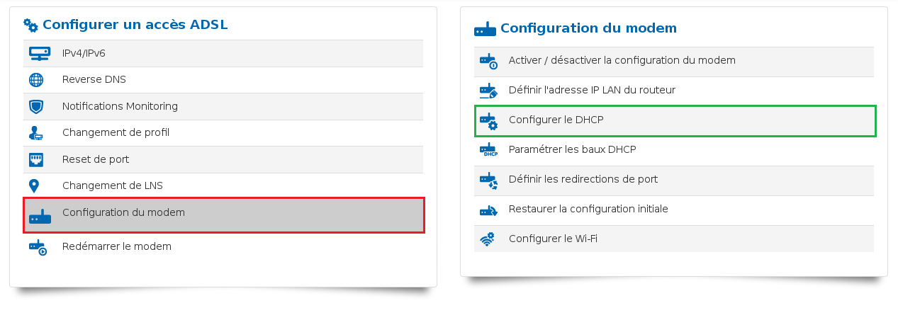{.thumbnail}

## 
Sélectionnez l'accès concerné dans la liste.

{.thumbnail}

## 
Renseignez la passerelle désirée dans le champ "Passerelle" (1).
Suite à cette modification il faut également changer la "Plage DHCP" (2) qui va être fournie par le modem.

Dans notre exemple, le modem fournira des IP locales allant de 192.168.2.64 à 192.168.2.253 aux périphériques connectés sur celui-ci. 

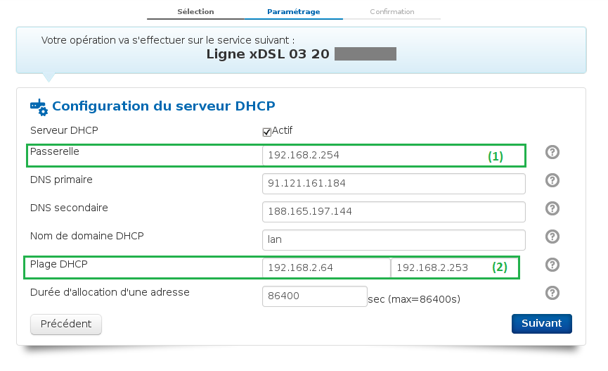{.thumbnail}

## 
Vérifiez le récapitulatif des informations, puis cliquez sur "Oui"
La modification sera effective sous 10 minutes.

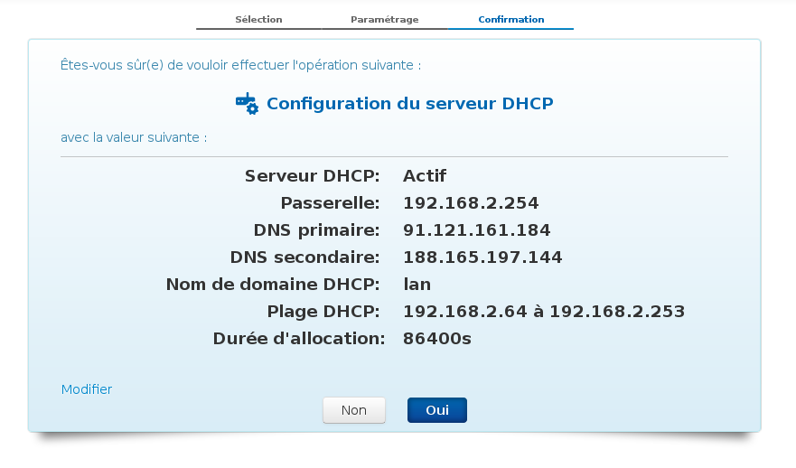{.thumbnail}

## Paramétrer les baux DHCP
Pour modifier les baux DHCP de votre modem, cliquez sur "Configuration du modem" puis "Paramétrer les baux DHCP".

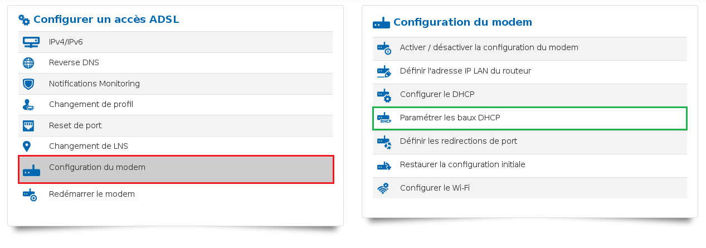{.thumbnail}

## 
Sélectionnez l'accès concerné dans la liste.

{.thumbnail}

## 
Renseignez les valeurs indiquées pour associer l'adresse MAC de votre périphérique à une IP fournie par votre modem (cette IP doit être comprise dans la plage DHCP du modem)

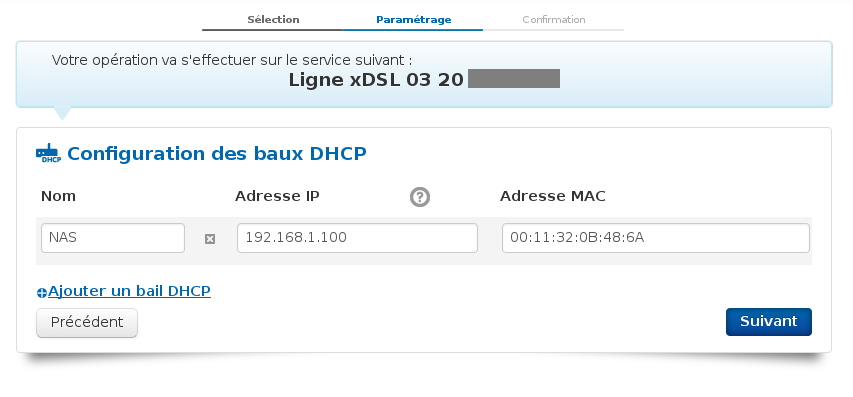{.thumbnail}

## 
Vérifiez le récapitulatif des informations, puis cliquez sur "Oui".
La modification sera effective sous 10 minutes.

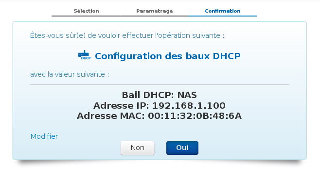{.thumbnail}

## Définir les redirections de port
Pour effectuez une redirection de port, cliquez sur "Configuration du modem" puis "Définir les redirections de port".

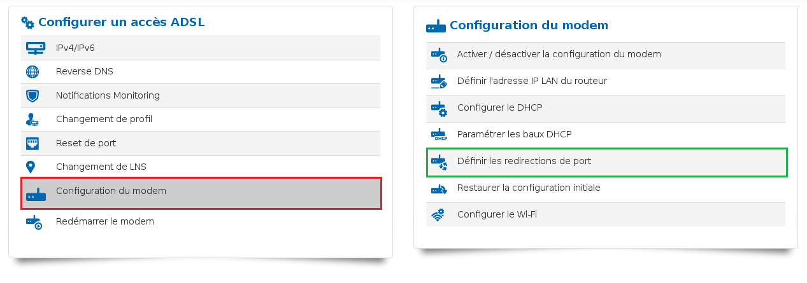{.thumbnail}

## 
Sélectionnez l'accès concerné dans la liste.

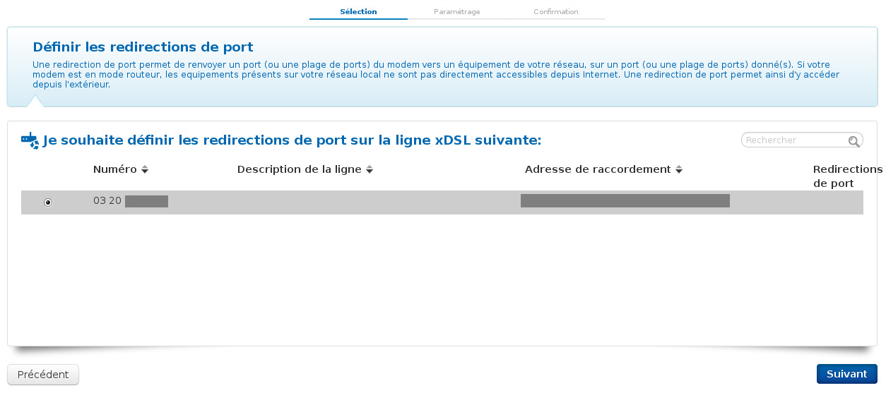{.thumbnail}

## 
Renseignez un nom à votre règle, indiquez le port ou la plage de ports à rediriger vers l'IP voulue et sélectionnez le protocole concerné.

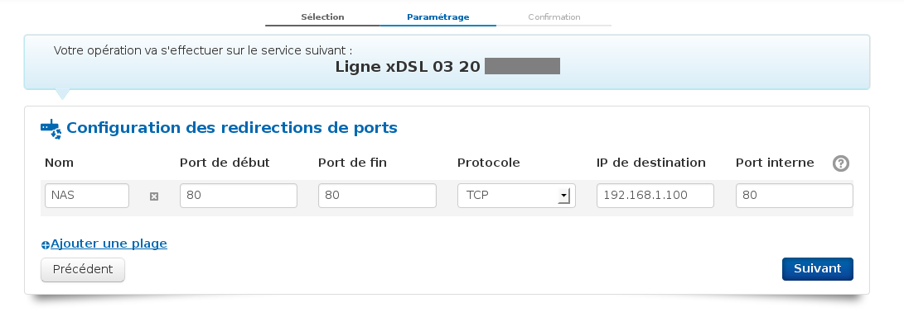{.thumbnail}

## 
Vérifiez le récapitulatif des informations, puis cliquez sur "Oui".
La modification sera effective sous 10 minutes.

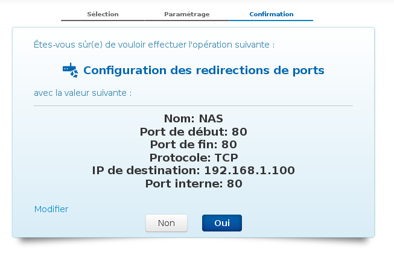{.thumbnail}

## Restaurer la configuration initiale
Pour effectuez une réinitialisation de votre modem, cliquez sur "Configuration du modem" puis "Restaurer la configuration initiale".

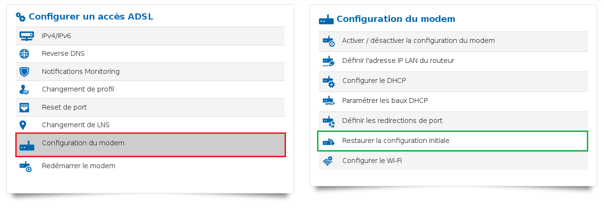{.thumbnail}

## 
Sélectionnez l'accès concerné dans la liste.

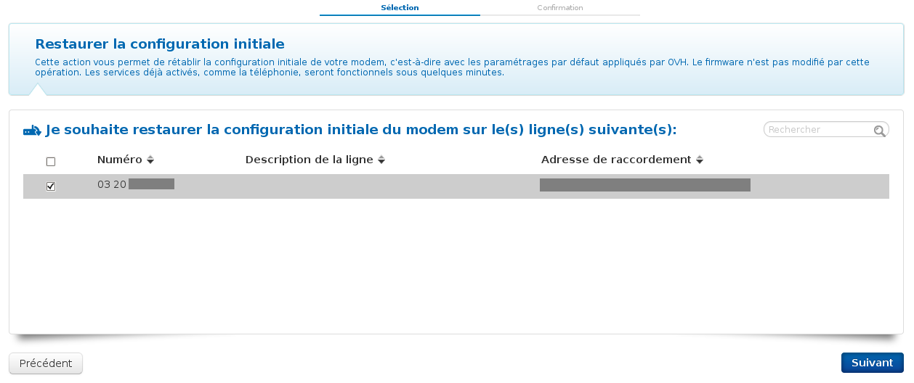{.thumbnail}

## 
Validez la demande de confirmation de réinitialisation de votre modem.
Celle-ci sera alors effective sous 10 minutes.

{.thumbnail}

## Configurer le Wi-Fi
Pour configurer votre Wi-Fi, cliquez sur "Configuration du modem" puis "Configurer le Wi-Fi".

{.thumbnail}

## 
Sélectionnez l'accès concerné dans la liste.

{.thumbnail}

## 
Renseignez les paramètres désirés.
Si vous effectuez une modification du type de cryptage Wi-Fi, cliquez sur "Valider" après avoir renseigné votre clé Wi-Fi pour  valider des modifications.

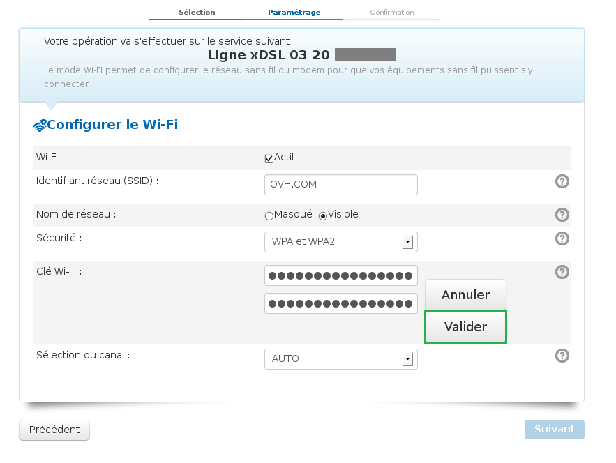{.thumbnail}

## 
Vous obtenez enfin un récapitulatif de la configuration qui sera injectée dans le modem.
Elle sera donc effective sous 10 minutes.

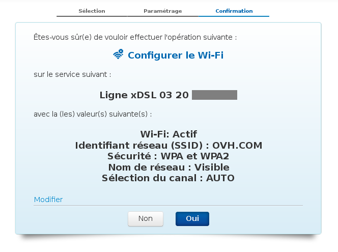{.thumbnail}

