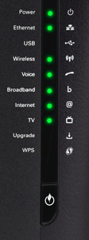
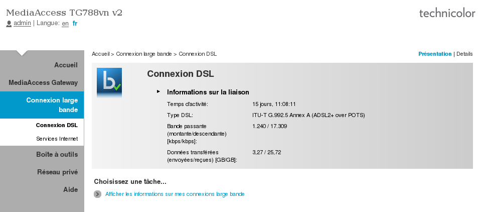
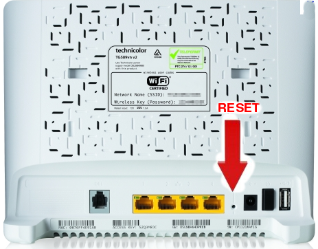

### Préambule {#préambule}

Il arrive qu'un accès xDSL soit touché par une interruption de service. Afin de dépanner votre connexion, il faut vous poser les bonnes questions : défaut de branchements ?, problème administratif ?, dysfonctionnement provenant de la ligne ?, etc.

**Sommaire :**

Niveau : Débutant

------------------------------------------------------------------------

### Prérequis {#prérequis}

-   Disposer d'un accès xDSL.
-   Votre accès ne doit pas présenter d'impayé.

------------------------------------------------------------------------

### Synchronisation {#synchronisation}

**Comment le constater :**

Physiquement sur le modem :****

Les différents états possible du voyant**"Broadband"** :

-   **Fixe** : synchronisation établie ;
-   **Clignotant** : pas de synchronisation ;
-   **Éteint** : dysfonctionnement matériel ou aucun signal provenant de la ligne.

{.thumbnail}

Via l'interface WEB :

Tapez dans la barre d'adresse de votre navigateur l'adresse <http://192.168.1.254> et cliquez sur "**Connexion large bande**", "**Connexion DSL**" :

{.thumbnail}

------------------------------------------------------------------------

**Quelle(s) vérification(s) devez-vous effectuer ?**

-   ****Avez-vous été démarché ou avez-vous entrepris des démarches auprès d'un autre fournisseur d'accès internet ? Si oui, suivez le guide [Écrasement de ligne xDSL]({legacy}7962640).
-   Vérifiez votre desserte interne ([La desserte interne]({originalUrl}/display/CRXDSL/La+desserte+interne)) :

    → Vérifie**z la propreté et l'état des câbles** et de vos prises téléphoniques (les fils ne doivent pas être écrasés/endommagés ou oxydés).

    → Changez/testez avec un autre câblage (filtre ADSL, câble RJ11).

    → Recherche de parasites : domotiques raccordés sur la ligne téléphonique (interphone, alarme, parafoudre, etc.).

    → Si **dégroupage partiel** : prenez contact avec votre opérateur de ligne analogique afin de demander un**test Mirabel.** Ce test permet de tester la continuité électrique de votre ligne analogique. Même si votre ligne semble fonctionnelle, ce test est primordial pour la résolution de votre problème.

    → Testez sur une autre prise téléphonique, sans rallonge et/ou directement sur la prise dti/test.

    → Effectuez un **test croisé**. Ce test consiste à vérifier le bon fonctionnement de votre équipement. Au choix :

    -   soit tester un autre modem de type ADSL sur votre prise téléphonique. Si la synchronisation s’établit, alors nous orienterons le diagnostique sur un défaut matériel.

    -   soit tester votre modem OVH sur un autre lien ADSL, quel que soit l'opérateur. Le voyant "**broadband**" doit s'allumer de manière **fixe**.

→ Redémarrer l'équipement et lancez une **réinitialisation** si nécessaire.

**{.thumbnail} Attention, une réinitialisation de l'équipement entraînera la perte de la configuration actuelle du modem** (règle NAT, changement d'adresse IP du modem, DHCP, etc.).

-   Événement extérieur : le câble téléphonique a-t-il subit des dommages ? (ex : câble arraché suite à la chute d'un arbre, câble sectionné, poteau téléphonique endommagé). Dans ce cas de figure, vous pouvez déclarer le dommage directement sur <http://assistance.orange.fr/1013-dommage-reseau.php>. Événement climatique ? (Orage, vents forts).

Si malgré toutes ces vérifications, le défaut de synchronisation est toujours présent, nous vous invitons à prendre contact au **1007** (gratuit depuis un poste fixe - Du**lundi au vendredi de 8h à 20h et le samedi de 9h à 17h**).

------------------------------------------------------------------------

### Connexion {#connexion}

Comment différencier un défaut de synchronisation d'un défaut de connexion ?

Tout d'abord, vérifiez la réaction de votre voyant "**Broadband**". Celui-ci doit être fixe. Si celui-ci se met à clignoter, nous nous orienterons sur un diagnostic de perte de synchronisation (aussi appelé "**bagot**") → cf. paragraphe [**Synchronisation**](#Interruptiondeservice-synchro).

Ensuite, vérifiez l'état du voyant "internet" :

-   Le voyant est **rouge** : connexion non établie.
-   Le voyant est**vert fixe/clignotant** : connexion établie.

Avant d'effectuer des tests, posez-vous les questions suivantes :

-   Avez-vous été démarché ou entrepris des démarches auprès d'un autre fournisseur d'accès internet ?
-   Avez-vous effectué une modification au niveau de votre réseau local ou sur la configuration du modem ?

Nous vous invitons à effectuer dans un premier temps un redémarrage de votre modem. Si cela reste sans effet, effectuez une réinitialisation de votre équipement.

**{.thumbnail} Attention, une réinitialisation de l'équipement entraînera la perte de la configuration actuelle du modem** (règle NAT, changement d'adresse IP du modem, DHCP, etc.).

Réinitialisation de votre modem OVH :

{.thumbnail}

Pour effectuer une réinitialisation de votre modem, restez appuyé sur le bouton "Reset" à l'aide d'un trombone jusqu'à ce que votre voyant "**Upgrade**" s'allume en bleu. Sur certaines versions de modems, ça sera le voyant "**Power**" qui passera à l'orange. Pour plus de détails, veuillez suivre le guide suivant : [Réinitialisation du modem]({legacy}18121042)

Si malgré toutes ces vérifications le défaut de connexion persiste, nous vous invitons à prendre contact au **1007** (gratuit depuis un poste fixe - Du**lundi au vendredi de 8h à 20h et le samedi de 9h à 17h**).

------------------------------------------------------------------------

### SDSL {#sdsl}

1) Synchronisation :

Sur les accès SDSL, les tests à effectuer sont moindres que sur les liens ADSL/VDSL.

Pour constater la synchronisation sur votre modem SDSL : vérifiez l'état de votre voyant "**Broadband**" ou "**DSL**" :

-   le voyant est fixe : synchronisation établie ;
-   le voyant clignotte continuellement : plus de synchronisation.

Test à effectuer :

-   Testez avec un autre câble RJ11.
-   Si votre paire est raccordée sur une prise gigogne (en "T"), changez le filtre ADSL en plus du câble RJ11.
-   Si le raccordement a été effectué par vos soins à la mise en service, sachez que le type de câble préconisé pour le raccordement doit être de **catégorie 5E**.
-   Vérifiez votre connectique ainsi que la propreté de vos câbles.
-   Testez avec un autre modem SDSL si vous en avez la possibilité.

2) Connexion :

*Opérateur de collecte* :

Si votre accès est raccordé sur des équipements appartenant à l'opérateur de collecte : l'authentification s'effectue à l'aide du protocole PPPoE.

Que faire si votre modem est synchronisé mais non connecté :

-   Votre modem est-il synchronisé ? Si oui, vérifiez dans un premier temps le type de configuration que vous souhaitez : configuration **routeur** ou en **pont** ("bridge").

    Le fonctionnement basique du modem (donc par défaut) est le mode **routeur**.

    Pour effectuer la configuration de votre modem, rendez-vous sur son interface web (<http://192.168.1.254>) -&gt; "Thomson gateway" -&gt; "configuration" -&gt; "setup my thomson gateway".Ensuite, pour établir une connexion PPPoE sur le modem (ou sur votre routeur), récupérez vos identifiants de connexion PPPoE reçus par e-mail lors de l'activation de votre accès ou sur demande au le support (1007) puis, dans l'interface web, rendez-vous dans la rubrique "Broadband connexion" -&gt; "internet service" et renseignez les identifiants. (Si bridge, effectuez la connexion directement sur l'interface de votre routeur).

-   Votre modem n'est pas synchronisé : reportez-vous au premier point du paragraphe SDSL**.**

*OVH* :

Sur les équipements OVH, nous utilisons le protocole IPoE pour établir la connexion. Cela veut dire que l'on attribue une adresse IP publique à l'équipement qui tente de se connecter.

Pour configurer le modem OVH en bridge ou en mode routeur, récupérez un fichier de configuration directement sur : <ftp://ftp.ovh.net/made-in-ovh/xdsl/modems/>.

Ensuite, rendez-vous sur l'interface web de votre modem <http://192.168.1.254> -&gt; Cliquez sur Thomson gateway -&gt; configuration -&gt; "save or restore my thomson gateway" et chargez le fichier .ini récupéré via le FTP.

Si malgré toutes ces vérifications le défaut de synchronisation ou de connexion persiste, nous vous invitons à prendre contact au **1007** (gratuit depuis un poste fixe - Du**lundi au vendredi de 8h à 20h et le samedi de 9h à 17h**).

------------------------------------------------------------------------

