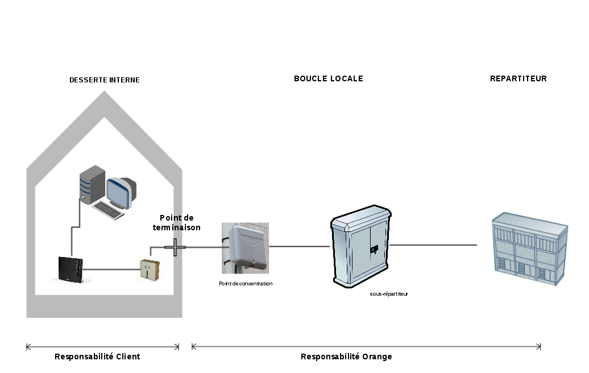
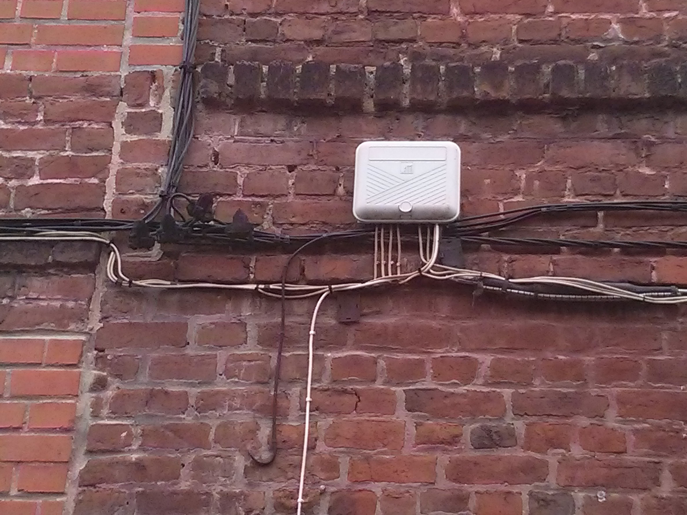
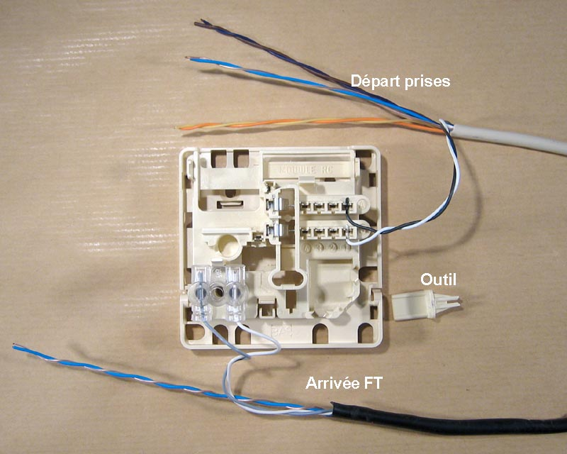
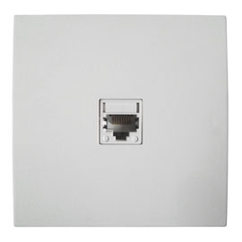
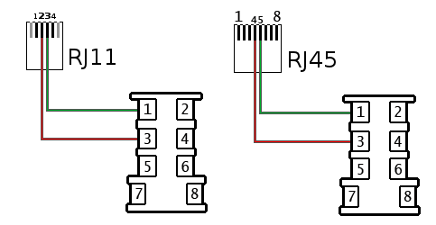

### Préambule {#préambule}

La desserte interne correspond à la prolongation de la ligne téléphonique depuis la tête France Telecom jusqu'aux parties privatives de l'abonné. Cette partie de ligne est sous la responsabilité de l'abonné ou du propriétaire des lieux.

**Sommaire :**

Niveau : Débutant

------------------------------------------------------------------------

{.thumbnail}

Nous allons détailler ici la partie point de concentration et desserte interne.

1.  Point de concentration
2.  Point de terminaison
3.  DTI Test
4.  Prise gigogne et RJ11/45
5.  Module RC

------------------------------------------------------------------------

### **Point de concentration** {#point-de-concentration}

****

Le point de concentration, aussi dit "**PC**", est représenté par un boîtier situé soit en façade, soit sur un poteau téléphonique ou électrique. D'un côté, le boîtier est raccordé jusqu'au sous-répartiteur par des**câbles dits de distribution** et de l'autre, ils raccordent les abonnés.

Le PC peut également être éloigné de l'habitation. Dans ce cas, un câble appelé **entrée de poste** ("EP") est utilisé pour le raccordement jusqu'à l'habitation.

Il peut être directement raccordé à la première prise téléphonique de l'habitation, la prise DTI ou un boîtier de dérivation.

Certaines habitations ne possèdent pas de point de concentration car la distribution s'effectue de manière souterraine.

Voici quelques exemples de PC :

{.thumbnail}{.thumbnail}{.thumbnail}

------------------------------------------------------------------------

### Point de terminaison {#point-de-terminaison}

Le point de terminaison de ligne correspond au **premier point d'accès physique** du réseau installé par Orange. Il est généralement situé chez l'abonné. Le point de terminaison permet de séparer la ligne de la boucle locale (cf. schéma) de l'habitation ou des locaux de l'abonné.

Ce point est matérialisé des façons suivantes :

-   par un dispositif appelé**Dispositif de Terminaison Intérieur** (DTI) (cf. paragraphe 3) ;
-   par la première prise téléphonique sur l'installation téléphonique ;
-   par un **boîtier de dérivation**.

{.thumbnail}

**La responsabilité en amont du point de terminaison revient à Orange**

------------------------------------------------------------------------

### DTI **: Dispositif de Terminaison Intérieur** {#dti-dispositif-de-terminaison-intérieur}

Cet appareil est installé en amont de votre réseau interne. Il a l'avantage de pouvoir tester la ligne en entrée tout en isolant votre réseau.

Voici plusieurs type de prise DTI :

{.thumbnail}

Exemple de branchement d'un DTI :

{.thumbnail}

En aucun cas le DTI n'est prévu pour y brancher un téléphone.

------------------------------------------------------------------------

### Prise gigogne et RJ45/11 {#prise-gigogne-et-rj4511}

La prise gigogne est une prise utilisant un type de connecteur téléphonique formant un "T". Elle permet de brancher des équipements tel que : téléphone, filtre ADSL, fax, etc.

Présentation d'une prise gigogne :

{.thumbnail}

Prise RJ45/11 :

Les prises avec connecteurs RJ45/11 remplacent dans les nouvelles installations téléphoniques la prise gigogne. Elles sont généralement raccordés sur les DTI.

Présentation et explication branchement :

{.thumbnail}

{.thumbnail}

------------------------------------------------------------------------

### Module RC {#module-rc}

Le**module RC**, également dit "**condensateur**", est un petit boîtier de la taille d'un sucre qui était installé dans les prises téléphoniques. Ce boitier permettait à Orange de vérifier si une ligne était opérationnelle.

Il existe deux versions de modules :**deux ou trois pattes**. La version trois pattes peut perturber le signal XDSL. Il est alors préconisé de le retirer. La version deux pattes n'occasionne pas de perturbation du signal DSL sauf si celui-ci a été endommagé.

Le module RC peut être présent dans un boitier de dérivation, une prise gigogne et/ou le DTI.

**

