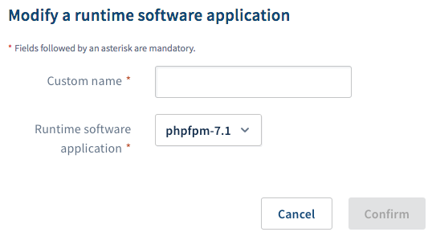
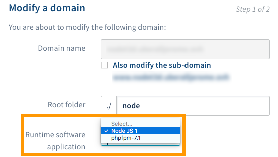

**Última atualização: 11/04/2019**

## Sumário

O alojamento Cloud Web oferece a possibilidade de construir um projeto em diferentes linguagens de programação. De facto, para concretizar um projeto, é possível que tenha de utilizar um motor de execução específico.

**Saiba como gerir os motores de execução do seu alojamento Cloud Web.**

## Requisitos

- Ter um serviço de alojamento [Cloud Web](https://www.ovh.pt/alojamento-partilhado/cloud-web.xml).
- Ter acesso à [Área de Cliente OVH](https://www.ovh.com/auth/?action=gotomanager), na secção `Web`{.action}.

## Instruções

Para melhor se adaptar ao seu projeto, o Cloud Web permite-lhe dispor de um ou vários motores de execução. A utilização de um ou outro motor de execução dependerá das necessidades específicas de cada projeto. 

Desta forma, em primeiro lugar, **certifique-se de que o seu projeto é tecnicamente compatível com o seu alojamento Cloud Web**. Pode consultar as linguagens compatíveis na seguinte ligação: <https://www.ovh.pt/alojamento-partilhado/cloud-web.xml> 

Depois de escolher os motores de execução que pretende utilizar, pode efetuar as seguintes ações:

### 1 - Aceder à gestão dos motores de execução

Para aceder aos motores de execução do seu alojamento Cloud Web, aceda à [Área de Cliente](https://www.ovh.com/auth/?action=gotomanager){.external}. Clique em `Alojamentos`{.action} na barra à esquerda e, em seguida, selecione o alojamento Cloud Web correspondente. Por fim, clique no separador `Aplicativos de software em tempo de execução`{.action}.

A tabela que aparece indica os motores de execução que foram adicionados ao alojamento Cloud Web. Ao instalar um alojamento, um motor será automaticamente criado.

{.thumbnail}

### 2 - Gerir os motores de execução

A gestão dos motores de execução do seu alojamento Cloud Web realiza-se de várias formas:

- [adicionar ou alterar um motor de execução](./#21-adicionar-ou-alterar-um-motor-de-execucao){.external} (o número máximo de motores depende do seu plano Cloud Web);
- definir um motor enquanto escolha predefinida;
- eliminar um motor de execução.

#### 2.1 Adicionar ou alterar um motor de execução

> [!primary]
>
> Antes de alterar um motor de execução, certifique-se de que essa ação não causará a indisponibilidade dos seus sites ou aplicações que utilizam o motor. Para isso, consulte a coluna `Número de sites relacionados` do motor em questão. Na janela `Multi-site`, poderá também consultar o motor de execução que utiliza cada domínio na coluna Aplicativos de software em tempo de execução.
> 

Para adicionar ou alterar um motor de execução, aceda à janela `Aplicativos de software em tempo de execução`{.action} do alojamento Cloud Web em questão. A partir daí:

- **se pretender adicionar um motor**: clique em `Ações`{.action} na parte superior da tabela e em `Adicionar um tempo de execução para o aplicativo de software`{.action};
- **se pretender alterar um motor**: clique no botão `...`{.action} à direita do motor e, a seguir, em `Alterar`{.action}.

{.thumbnail}

Na nova janela que aparecerá, preencha as informações necessárias e prossiga em função do motor de execução selecionado:

- [PHP](./#php){.external}
- [Node.js](./#nodejs){.external}

##### PHP

|Informação|Descrição| 
|---|---| 
|Nome personalizado|Insira um nome que lhe permita reconhecer este motor do resto dos motores na sua Área de Cliente OVH.|  
|Motor de execução|Escolha o novo motor de execução desejado.|  

Concluída esta etapa, clique no botão `Validar`{.action}. Certifique-se de que este motor de execução está a ser utilizado pelos multi-sites pretendidos. Para isso, passe para a etapa “[3 - Associar o motor de execução a um multi-site](./#3-associar-o-motor-de-execucao-a-um-multi-site_2){.external}”.

{.thumbnail}

##### Node.js

|Informação|Descrição| 
|---|---| 
|Nome personalizado|Insira um nome que lhe permita reconhecer este motor do resto dos motores na sua Área de Cliente OVH.|
|Motor de execução|Escolha o novo motor de execução desejado.|
|Caminho para a pasta pública|Indique o diretório no qual ficará alojado o conteúdo estático (o motor não executará este conteúdo).|
|Ambiente da aplicação|Indique se se trata de um ambiente de “produção”, de “teste” ou de “desenvolvimento”. Tenha em conta que este último tem um comportamento diferente e apresenta erros diretamente na interface web. Utilize-o com precaução.|
|Script de lançamento da aplicação|Indique o script que chamará a tecnologia Node.js.|

Concluída esta etapa, clique no botão `Validar`{.action}. Certifique-se de que este motor de execução está a ser utilizado pelos multi-sites pretendidos. Para isso, passe para a etapa “[3 - Associar o motor de execução a um multi-site](./#-3-associar-o-motor-de-execucao-a-um-multi-site_2){.external}”.

{.thumbnail}

### 3 - Associar o motor de execução a um multi-site

Uma vez que dispõe dos motores de execução necessários para o seu projeto, certifique-se de que estes estão corretamente associados aos seus multi-sites. Para isso, aceda ao separador `Multi-site`{.action} do alojamento Cloud Web em questão. 

Na tabela que aparece, consulte a coluna "Aplicativos de software em tempo de execução" para verificar que o motor de execução associado ao domínio é o correto. Os nomes que aparecem correspondem ao “nome personalizado” que definiu.

{.thumbnail}

Se pretender alterar o motor de execução associado a um multi-site, clique no ícone em forma de roda dentada no final da linha correspondente ao domínio e selecione a opção `Alterar`{.action}.

{.thumbnail}

De seguida, selecione o motor certo junto da opção `Aplicativos de software em tempo de execução` na janela que irá aparecer. Lembrete: os nomes que aparecem correspondem ao “nome personalizado” que definiu. É imperativo que o website ou a aplicação acessível a partir do domínio em questão seja compatível com o motor de execução escolhido. 

Depois de selecionado, siga os passos até ao fim.

{.thumbnail}

## Quer saber mais?

Fale com a nossa comunidade de utilizadores em [https://community.ovh.com/en/](https://community.ovh.com/en/){.external}