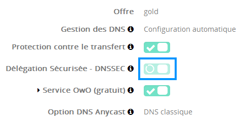

## Vaatimukset

- Verkkotunnuksesi täytyy olla rekisteröitynä OVH:n toimesta. Tämä on tekninen vaatimus DNS-tietueiden päivitystä varten rekisteröijäpäässä.
- Verkkotunnuksella täytyy olla joku seuraavista päätteistä: co.uk, .com, .net, .eu, .fr, .be .pl, .re, .pm, .yt, .wf, .tf, .info, .li, .ch, .biz, .de, .sx, .org, .se, .nl, .in, .us, .at, .nu, .la, .ac, .cz, .me, .sh, .io, .uk, .me.uk, .org.uk, tai mikä tahansa muu uusi pääte kuten .london, .club, .xyz, .wiki, .ink ja kaikki muut Donuts-päätteet.


## Kaksi esimerkkiä

- Isännöit verkkotunnustasi joko itse tai 3. osapuolen toimesta (dedikoitu palvelin, tai muu vastaava laite). tässä tapauksessa katso ohje [ohjeet.ovh-hosting.fi](http://ohjeet.ovh-hosting.fi), joka selventää kuinka luoda avaimet, allekirjoittaa DNS-tietue ja lähettää OVH:lle ns. julkinen avain jolla hallitaan DS-tietueiden päivitystä rekisteröijäpäästä.

- Tai käytät OVH:n jaettua nimipalvelinta, joka on esimerkkikohteena tässä oppaassa. Seuravaaksi hallinnoidaan avaimia, niiden jaksoittaista kiertoa, DS-tietueen päivitystä sekä alueen allekirjoitusta läpinäkyvällä tavalla.


- Jos olet vielä epäileväinen, voit tarkistaa kirjautumalla [hallintapaneeliin](https://www.ovh.com/manager/web) ja sen jälkeen valitsemalla verkkotunnuksesi kohdalta "Nimipalvelinten hallinta". Jos listatut nimipalvelimet ovat muotoa 
nsXX.ovh.net,
dnsXX.ovh.nettai
Xns200.anycast.me niin ne ovat oikeat.


## Aktivointi

- Kirjaudu ensin hallintapaneeliin[](https://www.ovh.com/manager/web).

- Valitse seuraavaksi haluamasi verkkotunnus hallintapaneelin osiosta "Verkkotunnukset".


{.thumbnail}

- Voit tarkistaa, että käytät todella OVH:n nimipalvelimia kohdassa "Nimipalvelinten hallinta".


{.thumbnail}

- Kun nimipalvelinten tarkistus on tehty, klikkaa DNSSEC-aktivoimispainiketta


{.thumbnail}

- Aukeaa ponnahdusikkuna toimenpiteen vahvistamista varten. Siinä ilmoitetaan, että toimenpide voi kestää jopa 24 tuntia.


{.thumbnail}

- Aktivointipainike aktivoituu kun vahvistus on tapahtunut.


{.thumbnail}

- Voit seuraavaksi tarkistaa kuvakkeesta "Käynnissä olevat toimenpiteet", että toimenpide on varmasti käynnistynyt.


{.thumbnail}


## Deaktivointi
Deaktivoimiseksi valitse uudestaan verkkotunnuksesi ja klikkaa "deaktivointinappia". Tämän jälkeen aukeaa uusi ponnahdusikkuna toimenpiteen vahvistamista varten.
Huomioi että aktivoinnin aikana sinun pitää odottaa siihen asti että operaatio on suoritettu loppuun asti (nappi muuttuu tämän jälkeen harmaaksi).

{.thumbnail}


## Tapa 1: Firefoxin tai Chromen käyttäminen
Voit asentaa Firefox-laajennuksen jonka avulla voit tarkistaa onko vierailemasi verkkosivusto suojattu DNSSECin avulla ja jos on, mikä on tarkistuksen tulos. Tämä laajennus on saatavilla osoitteesta [www.dnssec-validator.cz](http://www.dnssec-validator.cz). Asennuksen jälkeen näet osoitepalkin vasemmalla puolella selaimessasi avaimen. Silloin kun avain muuttuu vihreäksi vierailemallasi sivustolla, verkkotunnus on suojattu DNSSECillä.

{.thumbnail}
Jos avain on oranssi, tämä tarkoittaa sitä, että rekursiivinen palveluntarjoajasi nimipalvelin ei tue DNSSECiä. Ei hätää, voit silti käyttää vaihtoehtoisia nimipalvelimia DNSSEC-tarkistukselle. Firefox-moduuli tarjoaa listan, jonka voit hakea klikkaamalla avainta oikealla napilla ja valitsemalla "Ominaisuudet" ("Preferences").

Alphaversio tästä laajennuksesta on myös saatavilla Chromelle [this page](https://chrome.google.com/webstore/detail/hpmbmjbcmglolhjdcbicfdhmgmcoeknm).


## Tapa 2: Konsolitila (Linux, Unix) ja juuriavaimen ennakkotoimitusta
Tarkistaaksesi, onko DNSSEC asennettu oikein, voit käyttää dig-työkalua. DNSSECin vahvistus tarvii julkisen juuriavaimen (jonka kanssa on allekirjoitettu avain, joka puolestaan allekirjoitti root-alueen "."). Tämä avain on saatavilla useista lähteistä eri puolilla Internetiä. Yksinkertaistettuna, jäljennämme avaimen alla ja voit kopioida sen tiedostoon /etc/trusted-key.key (kaikki tiedot pitää olla samalla rivillä):


```
. 172717 IN DNSKEY 257 3 8 AwEAAagAIKlVZrpC6Ia7gEzahOR+9W29euxhJhVVLOyQbSEW0O8gcCjF
FVQUTf6v58fLjwBd0YI0EzrAcQqBGCzh/RStIoO8g0NfnfL2MTJRkxoX
bfDaUeVPQuYEhg37NZWAJQ9VnMVDxP/VHL496M/QZxkjf5/Efucp2gaD
X6RS6CXpoY68LsvPVjR0ZSwzz1apAzvN9dlzEheX7ICJBBtuA6G3LQpz
W5hOA2hzCTMjJPJ8LbqF6dsV6DoBQzgul0sGIcGOYl7OyQdXfZ57relS
Qageu+ipAdTTJ25AsRTAoub8ONGcLmqrAmRLKBP1dfwhYB4N7knNnulq
QxA+Uk1ihz0=
```


Huomaa, että sinun ei pitäisi kopioida avainta ilman sen aitouden tarkistamista DNSSECin avulla, koska jokaisessa salausavaimeen pohjautuvassa järjestelmässä juurikohteen tärkein ominaisuus on avaimen luotettavuus. Avaintiedoston virallinen jakelulinkki on [IANA](https://data.iana.org/root-anchors) ja itse tiedosto on allekirjoitettu GPG-avaimella.
Komennolla jonka ajamme seuraavaksi, tarkistamme DNS-nimen www.eurid.eu:

```
$ dig +sigchase www.eurid.eu
;; RRset to chase:
www.eurid.eu. 544 IN CNAME eurid.eu.
[...]
;; WE HAVE MATERIAL, WE NOW DO VALIDATION
;; VERIFYING DS RRset for eu. with DNSKEY:55231: success
;; OK We found DNSKEY (or more) to validate the RRset
;; Ok, find a Trusted Key in the DNSKEY RRset: 19036
;; VERIFYING DNSKEY RRset for . with DNSKEY:19036: success

;; Ok this DNSKEY is a Trusted Key, DNSSEC validation is ok: SUCCESS
```


Viimeinen rivi tarkoittaa sitä että tarkistus onnistui koska ns. luotettu merkkijono nousi esiin onnistuneesti juuritietueen julkista avainta vasten ja kaikki on tätä myöten hyvin.


## Tapa 3: Konsolitila ilman juuriavaimen ennakkotoimitusta
Jos et voi ladata julkista avainta (kuten alla), voit turvautua kolmannen osapuolen nimipalvelimeen tarkistusta varten. Jotkut rekursiiviset nimipalvelimet vastaavat tarkoituksellisesti koko Internetiin DNSSEC-tarkistusta varten. Huomaa että alla on esimerkki tarkistuksesta jonka suoritamme [DNS-OARC](https://www.dns-oarc.net/oarc/services/odvr)-palvelun avulla, jolla pyrimme varmistamaan DNS-nimen www.eurid.eu:


```
$ dig +dnssec www.eurid.eu @149.20.64.21

; <<>> DiG 9.7.3 <<>> +dnssec www.eurid.eu @149.20.64.21
;; global options: +cmd
;; Got answer:
;; ->>HEADER<<- opcode: QUERY, status: NOERROR, id: 26117
;; flags: qr rd ra ad; QUERY: 1, ANSWER: 6, AUTHORITY: 7, ADDITIONAL: 16
[...]
```


Yllä olevassa esimerkissä on näkyvillä flagi 'ad' joka osoittaa että dig-kysely palautti vastauksen jonka mukaan DNS-nimi www.eurid.eu on vahvistettu rekursiivisen nimipalvelimen toimesta.

