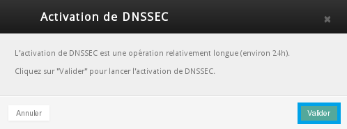

## Prerequisiti
Il tuo dominio:

- deve essere registrato in OVH. È una condizione tecnica necessaria per mantenere i record DS aggiornati nel Registry.
- deve contenere una di queste estensioni: .fr, .com, .be, .net, .eu, .pl, .re, .pm, .yt, .wf, .tf, .info, .li, .ch, .biz, .de, .sx, .org, .se, .nl, .in, .us, .at, .nu, .la, .ac, .cz, .me, .sh, .io, .uk, .co.uk, .me.uk, .org.uk, o una nuova estensione come .paris, .club, .xyz, .wiki, .ink, o tutte le estensioni di Donuts (in arrivo anche altre estensioni).


## I due casi d'uso

- Per il tuo dominio utilizzi server DNS terzi (il tuo server dedicato o altre macchine: consulta [questa guida](http://guida.ovh.it/dnssec) per scoprire come generare le tue chiavi, definire la tua zona e fornire a OVH la chiave pubblica che permette di aggiornare i record DS presso il Registro.

- Per il tuo dominio utilizzi i DNS condivisi di OVH: in questo caso, sarà OVH a gestire in modo totalmente trasparente le chiavi, la loro rotazione periodica, l'aggiornamento dei record DS e la definizione della tua zona.


Per verificare quali server DNS utilizzi, accedi al tuo [Spazio Cliente OVH](https://www.ovh.com/manager/web), seleziona il tuo dominio nella sezione "Domini" e clicca sul tab "Gestione DNS". Se il formato dei server DNS elencati è di tipo nsXX.ovh.net, dnsXX.ovh.net o Xns200.anycast.me, significa che stai utilizzando i server DNS OVH.


## Attivazione

- Accedi al tuo [Spazio Cliente OVH](https://www.ovh.com/manager/web).

- Seleziona il tuo dominio nella sezione Domini.


{.thumbnail}

- Clicca sul tab Gestione DNS per verificare i server DNS utilizzati.


{.thumbnail}

- A questo punto, clicca sul tasto di attivazione del DNSSEC.


{.thumbnail}

- Si apre una finestra pop-up per la conferma dell'operazione. L'attivazione del DNSSEC può richiedere fino a 24 ore.


{.thumbnail}

- Una volta confermata l'attivazione, il tasto diventa verde.


{.thumbnail}

- Clicca sul tab Task recenti per verificare il corretto avvio dell'operazione.


{.thumbnail}


## Disattivazione
Per disattivare l'opzione DNSSEC, seleziona il tuo dominio e clicca sul tasto di disattivazione. Si apre una nuova finestra pop-up per confermare l'operazione. Se è in corso un'attivazione dovrai attendere che questa operazione sia terminata, in modo che la configurazione DNSSEC del tuo dominio non rimanga in uno stato intermedio.

{.thumbnail}


## Metodo 1: con Firefox o Chrome
Puoi installare un'estensione per Firefox che ti permette di verificare se i siti che visiti sono protetti tramite DNSSEC e, in questo caso, qual è il risultato della conferma. L'estensione è [disponibile qui](http://www.dnssec-validator.cz/). Una volta installata, visualizzi una chiave a sinistra della barra degli indirizzi del browser. Per i dominio sui quali la chiave è verde, l'IP del sito è stato verificato da DNSSEC.

{.thumbnail}
Se la chiave è arancione, significa che il server DNS non è compatibile con DNSSEC. In questo caso, è necessario utilizzare server DNS alternativi per effettuare la convalida. Per accedere all'elenco proposto dal modulo Firefox, clicca sulla chiave con il tasto destro e seleziona "Preferenze".

Con Chrome, puoi trovare una versione alfa di questa estensione su [questa pagina](https://chrome.google.com/webstore/detail/hpmbmjbcmglolhjdcbicfdhmgmcoeknm).


## Metodo 2: in modalità console, con dichiarazione preventiva della chiave primaria
Per verificare la corretta configurazione del DNSSEC del tuo dominio, puoi utilizzare il comando dig. Per farlo, però, è necessario disporre della chiave pubblica con cui è stata firmata la chiave primaria della tua zona. Se non è già presente, copia questo testo nel file /etc/trusted-key.key (su un'unica riga):


```
. 172717 IN DNSKEY 257 3 8 AwEAAagAIKlVZrpC6Ia7gEzahOR+9W29euxhJhVVLOyQbSEW0O8gcCjF
FVQUTf6v58fLjwBd0YI0EzrAcQqBGCzh/RStIoO8g0NfnfL2MTJRkxoX
bfDaUeVPQuYEhg37NZWAJQ9VnMVDxP/VHL496M/QZxkjf5/Efucp2gaD
X6RS6CXpoY68LsvPVjR0ZSwzz1apAzvN9dlzEheX7ICJBBtuA6G3LQpz
W5hOA2hzCTMjJPJ8LbqF6dsV6DoBQzgul0sGIcGOYl7OyQdXfZ57relS
Qageu+ipAdTTJ25AsRTAoub8ONGcLmqrAmRLKBP1dfwhYB4N7knNnulq
QxA+Uk1ihz0=
```


Ricordati di verificare l'autenticità del testo prima di copiarlo: con il DNSSEC, come con tutti i sistemi che utilizzano la crittografia, la sicurezza delle informazioni e l'integrità dei dati è fondamentale. Il servizio di distribuzione ufficiale è lo [IANA](https://data.iana.org/root-anchors/) e lo stesso file è firmato da GPG.
Esegui questo comando (nel nostro esempio, per verificare l'IP del sito www.eurid.eu):

```
$ dig +sigchase www.eurid.eu
;; RRset to chase:
www.eurid.eu. 544 IN CNAME eurid.eu.
[...]
;; WE HAVE MATERIAL, WE NOW DO VALIDATION
;; VERIFYING DS RRset for eu. with DNSKEY:55231: success
;; OK We found DNSKEY (or more) to validate the RRset
;; Ok, find a Trusted Key in the DNSKEY RRset: 19036
;; VERIFYING DNSKEY RRset for . with DNSKEY:19036: success

;; Ok this DNSKEY is a Trusted Key, DNSSEC validation is ok: SUCCESS
```


L'ultima riga indica che l'operazione di verifica è avvenuta correttamente, perché il rislutato corrisponde alla chiave primaria pubblica della zona.

Se dig non individua la chiave primaria nel file /etc/trusted-key.key, viene restituito questo risultato:

```
$ dig +sigchase www.eurid.eu
No trusted keys present
```


## Metodo 3: in modalità console, senza dichiarazione preventiva della chiave primaria
In questo caso, utilizza un client DNS (chiamato resolver) per effettuare la verifica del DNSSEC al tuo posto. Molti enti mettono a disposizione alcuni server DNS ricorsivi, come [DNS-OARC](https://www.dns-oarc.net/oarc/services/odvr), che abbiamo utilizzato nel nostro esempio per verificare l'IP del sito www.eurid.eu:


```
$ dig +dnssec www.eurid.eu @149.20.64.21

; <<>> DiG 9.7.3 <<>> +dnssec www.eurid.eu @149.20.64.21
;; global options: +cmd
;; Got answer:
;; ->>HEADER<<- opcode: QUERY, status: NOERROR, id: 26117
;; flags: qr rd ra ad; QUERY: 1, ANSWER: 6, AUTHORITY: 7, ADDITIONAL: 16
[...]
```


In questo caso, il flag ad indica che le informazioni sono state verificate da un resolver.

