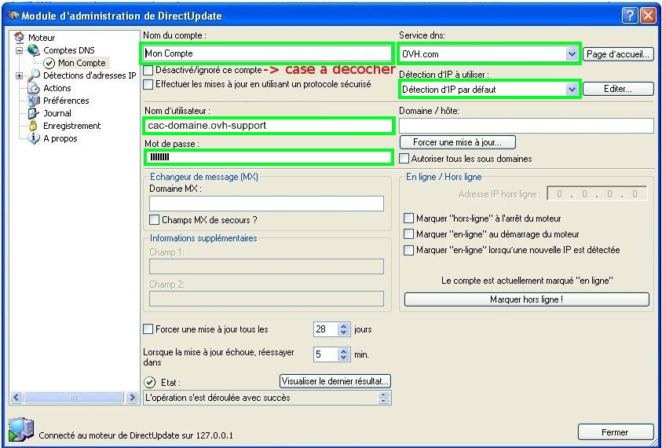

## Requisitos

- Disponer de un dominio registrado en OVH. 
- Utilizar los servidores DNS compartidos de OVH para su dominio.

## Definiciones

- Dirección IP

En internet, los ordenadores se comunican entre sí gracias al protocolo TCP/IP que permite identificar a cada dispositivo de red y a cada ordenador en forma de dirección con el siguiente formato: xxx.xxx.xxx.xxx.

- DNS

Los usuarios se comunican mediante direcciones IP, pero para hacerlo más fácil, estas direcciones IP se definen como nombres de estación o direcciones más fáciles de recordar: son los DNS (Domain Name System).

## ¿Para qué sirve la opción DynHost?
Si dispone de conexión a internet, la IP desde la que se conecta podría cambiar cada vez que vuelva a conectarse. La opción DynHost le permite hacer que su dominio o subdominio apunte a una dirección IP de conexión y, si esta cambia, actualizarla en tiempo real con su ID de cliente y contraseña.

## Conexión al área de cliente
Conéctese al [área de cliente](https://www.ovh.com/manager/web) con su ID de cliente y contraseña. 

Haga clic en «Login» para acceder.

{.thumbnail}

## Selección del dominio
En la columna izquierda, acceda a la sección «Dominios» y seleccione el dominio para el que quiera crear un DynHost.

{.thumbnail}

## Gestión de los accesos
Abra la pestaña «DynHost» y haga clic en el botón «Gestionar los accesos».

{.thumbnail}
A continuación, haga clic en «Crear un usuario».

{.thumbnail}
Introduzca la información en los campos: 

- Sufijo del usuario
- Subdominio
- Contraseña
- Repetir contraseña

A continuación, haga clic en «Aceptar».

{.thumbnail}
Una vez creado el usuario, podrá ver la cuenta que acaba de crear y el subdominio asociado. 

Haga clic en la flecha situada sobre la tabla para volver.

{.thumbnail}

## Adición de un DynHost
Haga clic en «Añadir un DynHost».

{.thumbnail}
Introduzca la siguiente información: 

- El subdominio en el que desea crear el DynHost
- La dirección IP de destino actual

A continuación, haga clic en «Aceptar».

{.thumbnail}
Atención: Este registro tarda 24 horas en crearse.
Una vez creado el registro DynHost, podrá visualizarlo con el subdominio y su dirección IP.

{.thumbnail}
Atención: La creación del registro de tipo A en la zona DNS es automática. No debe crearlo manualmente ni antes ni después de crear el DynHost.

## Bali Dynamic DNS (freeware)
En Bali Dynamics DNS, introduzca la información que se indica en la imagen con un recuadro de color verde y haga clic en «Update IP in database if necessary».

{.thumbnail}
Se mostrará el siguiente estado: «IP changed», indicando que la dirección IP se ha actualizado correctamente.

{.thumbnail}

## Direct Update (shareware)
En Direct Update, introduzca la información que se indica en la imagen con un recuadro de color verde y desmarque la casilla «Disable/ignore this account».

{.thumbnail}

