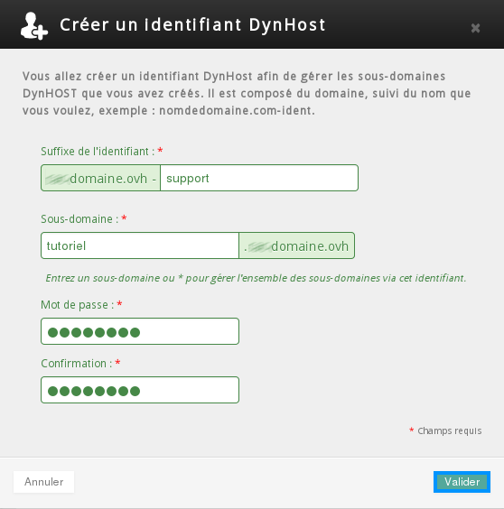

## Reikalavimai

- Jūsų domenas įregistruotas OVH;
- Jūsų domenui naudojami OVH svetainių talpinimo plano DNS serveriai.

## Sąvokos

- IP adresas

Kompiuteriai gali tarpusavyje komunikuoti internetu naudojant TCP/IP protokolą, identifikuotantį kiekvieną tinklo serverį ir kompiuterį, pagal adresą: xxx.xxx.xxx.xxx.

- DNS

Naudotojai komunikuoja su IP adresais, tačiau siekiant supaprastinti įsiminimą, IP adresams suteikiami darbinių stočių ar adresų pavadinimai: tai DNS (Domain Name System).

## Kam skirta DynHOST parinktis?
Jeigu jūsų interneto jungtis neturi fiksuoto prisijungimo IP adreso, kiekvieną kartą jungiantis iš naujo jums bus suteikiamas naujas IP adresas.
DynHOST jums leidžia nukreipti domeną ar subdomeną į prisijungimo IP adresą ir, jeigu IP adresas yra dinaminis, atnaujinti šį adresą realiu laiku naudojant identifikatorių bei slaptažodį.
Taip galite teikti talpinimo paslaugas naudodami nuosavą interneto jungtį.

## Prisijungimas prie valdymo sąsajos

- Prisijunkite prie [valdymo sąsajos](https://www.ovh.com/manager/web) su savo kliento ID bei slaptažodžiu.

- Spauskite Prisijungti operacijai patvirtinti.

{.thumbnail}

## Domeno pasirinkimas

- Kairiajame meniu pasirinkite Domenai ir savo domeną, kuriam pageidaujate sukurti DynHost.

{.thumbnail}

## Prieigos valdymas

- Spauskite langelį DynHost ir Prieigos valdymas.

{.thumbnail}

- Spauskite Sukurti identifikatorių.

{.thumbnail}

- Atsidariusiame lange pateikite reikiamus duomenis:

- Identifikatorių;
- Subdomeną;
- Slaptažodį;

- Spauskite Patvirtinti.

{.thumbnail}
Jūs galėsite peržiūrėti sukurtą paskyrą ir jai priskirtą subdomeną.

- Po to spauskite Return.

{.thumbnail}

## DynHost kūrimas

- Spauskite Pridėti DynHost.

{.thumbnail}
Nurodykite:

- subdomeną, kuriame įdiegsite DynHost;
- aktualų paskirties IP adresą;
- spauskite Patvirtinti.

{.thumbnail}
Dėmesio:

- Šio lauko kūrimas gali užtrukti iki 24 val.

- Po to galėsite peržiūrėti savo DynHost su domenu ir IP.

{.thumbnail}
Dėmesio:

- A tipo įrašo kūrimas jūsų DNS zonoje yra automatinis. Taigi jo nereikia kurti rankiniu būdu nei prieš, nei po DynHost kūrimo.

## Bali Dynamic DNS (nemokamai)

- Naudodami Bali Dynamic DNS užpildykite žalia spalva pažymėtus būtinus laukus ir spauskite Update IP in database if necessary.

{.thumbnail}

- Matysite IP changed būseną: jūsų IP adresas sėkmingai atnaujintas.

{.thumbnail}

## Direct Update (Shareware)

- Naudodami Direct Update užpildykite žalia spalva pažymėtus būtinus laukus ir nuimkite žymėjimą Išjungti/ignoruoti šią paskyrą.

{.thumbnail}

